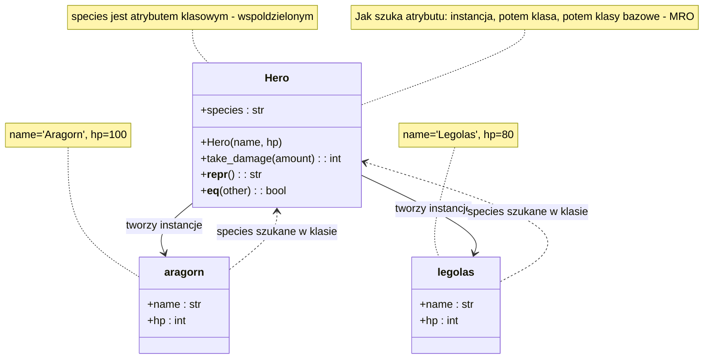
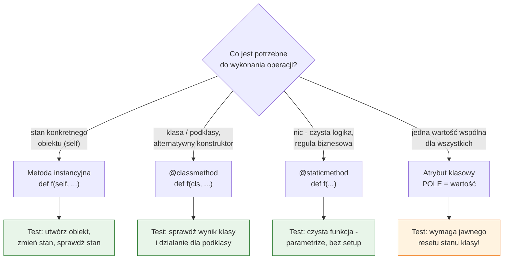

# Temat 01 - Klasa a obiekt (instancja)

> Moduł: [01-OOP](../README.md) · Poprzedni: *(brak)* · Następny: [02-encapsulation-property](../02-encapsulation-property/README.md)

## Cel

Zrozumieć różnicę między **klasą** (przepisem/projektem) a **obiektem** (konkretną
instancją) oraz świadomie wybierać trzy rodzaje składowych klasy:

- **instancyjne** (pola i metody z `self`) - dla stanu pojedynczego obiektu,
- **klasowe** (`@classmethod`, atrybuty klasowe) - dla stanu i operacji na całej rodzinie obiektów,
- **statyczne** (`@staticmethod`) - dla funkcji czystych, powiązanych tematycznie z klasą.

Po temacie student powinien umieć odpowiedzieć na pytanie: *„co dokładnie
testuję - stan instancji, regułę klasy czy czystą funkcję?”*, bo od tej
odpowiedzi zależy konstrukcja testu (i to, czy testy będą wzajemnie niezależne).

## Wymagania wstępne

- podstawy Pythona: funkcje, wyjątki, listy i słowniki,
- umiejętność uruchomienia skryptu `python plik.py` oraz pracy w VS Code,
- brak wiedzy o frameworkach testowych - `pytest` pojawia się dopiero w części B.

## Teoria

### 1. Klasa to przepis, obiekt to wyrób

Klasa definiuje **strukturę** (jakie pola) i **zachowanie** (jakie metody).
Obiekt (instancja) to konkretny egzemplarz z własnymi wartościami pól:

```python
class Hero:
    species = "human"                 # atrybut klasowy (wspólny)

    def __init__(self, name, hp=100):
        self.name = name              # atrybut instancyjny
        self.hp = hp

aragorn = Hero("Aragorn")             # instancja
legolas = Hero("Legolas", hp=80)      # inna, niezależna instancja
```

Trzy fakty warte zapamiętania:

1. **Klasa sama jest obiektem** - instancją metaklasy `type`. Dlatego
   `type(Hero)` zwraca `<class 'type'>`, a `Hero.__name__` to `'Hero'`.
2. **Obiekt jest instancją klasy**, sprawdzamy to przez `isinstance(aragorn, Hero)`.
3. **Instancje mają własny słownik atrybutów** - `aragorn.__dict__`,
   widoczny także przez `vars(aragorn)`.

Model pamięci pokazuje diagram
[`diagrams/01-class-vs-object.mmd`](diagrams/01-class-vs-object.mmd):



### 2. Pola i metody instancyjne

- **Pole instancyjne** powstaje przez przypisanie `self.costam = wartość`
  (najczęściej w `__init__`).
- **Metoda instancyjna** ma pierwszy parametr `self` i „widzi” stan obiektu.

```python
def take_damage(self, amount: int) -> int:
    self.hp = max(0, self.hp - amount)
    return self.hp
```

To najprostszy i najczęstszy przypadek. W testach oznacza to, że
**każdy test tworzy własny obiekt** (Arrange) i sprawdza jego stan po
operacji (Assert) - bez stanu współdzielonego między testami.

### 3. Składowe klasowe i statyczne

| Składowa | Pierwszy argument | Dostęp do stanu | Kiedy używać |
|---|---|---|---|
| metoda instancyjna | `self` | instancja + klasa | operacje na konkretnym obiekcie |
| `@classmethod` | `cls` | klasa (i podklasy) | alternatywne konstruktory, liczniki, rejestry |
| `@staticmethod` | *(brak)* | brak | reguły biznesowe, walidacje, funkcje czyste |
| atrybut klasowy | - | wspólny dla wszystkich | stałe (`MAX_HP`), liczniki, cache |

```python
class Hero:
    MAX_HP = 200
    _population = 0

    def __init__(self, name: str, hp: int = 100) -> None:
        self.name, self._hp = name, hp
        Hero._population += 1            # stan klasy: aktualizujemy PRZEZ KLASĘ

    @classmethod
    def from_wounded(cls, name: str) -> "Hero":
        """Alternatywny konstruktor - ``cls`` działa też dla podklas."""
        return cls(name, hp=25)

    @classmethod
    def reset_population(cls) -> None:
        """Zerowanie licznika = izolacja stanu w testach."""
        cls._population = 0

    @staticmethod
    def is_valid_name(name: str) -> bool:
        """Reguła biznesowa: nie wymaga obiektu ani klasy."""
        return bool(name) and name[0].isupper()
```

Diagram [`diagrams/02-instance-vs-static.mmd`](diagrams/02-instance-vs-static.mmd)
podsumowuje, jak wybrać właściwy rodzaj składowej:



**Wniosek dla testowalności:** metody statyczne testuje się najprzyjemniej
(bez setupu), metody instancyjne są w porządku (świeży obiekt na test), a
atrybut klasowy to jedyne miejsce, gdzie trzeba **jawnie zadbać o izolację
testów** (np. fixture zerującą licznik).

### 4. `__repr__` i `__eq__` - dlaczego to nie jest kosmetyka

Bez `__repr__` komunikat porażki testu wygląda tak:

```text
assert <__main__.Hero object at 0x000001F2A0> == <__main__.Hero object at 0x000001F2B40>
```

Z `__repr__`:

```text
assert Hero(name='Aragorn', hp=70) == Hero(name='Aragorn', hp=60)
```

`__eq__` porównuje stan logiczny obiektów, a `__repr__` skraca czas
diagnozy błędu z minut do sekund. Zwrócenie `NotImplemented` dla obcego
typu (a nie `False`) jest poprawnym wzorcem, który warto sprawdzić testem.

## Diagramy

- [`diagrams/01-class-vs-object.mmd`](diagrams/01-class-vs-object.mmd) - klasa,
  instancje i sposób wyszukiwania atrybutów,
- [`diagrams/02-instance-vs-static.mmd`](diagrams/02-instance-vs-static.mmd) -
  drzewo decyzyjne: jaką składową wybrać i jak ją testować.

Pliki `.mmd` renderuje VS Code (rozszerzenie *Markdown Preview Mermaid Support*)
lub skrypt [`../generate_diagrams.py`](../generate_diagrams.py) (Mermaid → PNG).

## Przykłady kodu

### Przykład 1 - klasa jako obiekt i niezależność instancji

Plik: [`examples/01_hero_class_vs_object.py`](examples/01_hero_class_vs_object.py)

```python
class Hero:
    species: str = "human"

    def __init__(self, name: str, hp: int = 100) -> None:
        self.name = name
        self.hp = hp

    def take_damage(self, amount: int) -> int:
        if amount < 0:
            raise ValueError("amount must be non-negative")
        self.hp = max(0, self.hp - amount)
        return self.hp

    def __repr__(self) -> str:
        return f"Hero(name={self.name!r}, hp={self.hp})"

    def __eq__(self, other: object) -> bool:
        if not isinstance(other, Hero):
            return NotImplemented
        return (self.name, self.hp) == (other.name, other.hp)
```

Co pokazuje skrypt: `type(Hero)` (klasa jest obiektem), różne `id()`
instancji, brak `species` w `a.__dict__` (dziedziczone z klasy),
zmianę stanu jednej instancji bez wpływu na drugą oraz równość logiczną
dwóch różnych obiektów o tym samym stanie.

**Wyjaśnienie:** to minimalny model, na którym widać, że test instancji
odpowiada na pytanie „co stało się z **tym** obiektem”, a test klasy -
„jaka reguła obowiązuje **wszystkie** obiekty”.

### Przykład 2 - instancyjne, klasowe i statyczne składowe razem

Plik: [`examples/02_hero_instance_vs_class_members.py`](examples/02_hero_instance_vs_class_members.py)

```python
class Hero:
    MAX_HP: int = 200
    _population: int = 0

    def __init__(self, name: str, hp: int = 100) -> None:
        if not self.is_valid_name(name):
            raise ValueError(f"invalid hero name: {name!r}")
        if not 0 <= hp <= self.MAX_HP:
            raise ValueError(f"hp must be in range 0..{self.MAX_HP}, got {hp}")
        self.name = name
        self._hp = hp
        Hero._population += 1

    @property
    def is_alive(self) -> bool:
        return self._hp > 0

    @classmethod
    def from_wounded(cls, name: str) -> "Hero":
        return cls(name, hp=25)

    @classmethod
    def population(cls) -> int:
        return cls._population

    @classmethod
    def reset_population(cls) -> None:
        cls._population = 0

    @staticmethod
    def is_valid_name(name: str) -> bool:
        return bool(name) and name[0].isupper()
```

**Wyjaśnienie:** ten sam obiekt demonstruje trzy poziomy abstrakcji.
`is_valid_name` jest statyczna, bo jej wynik nie zależy od żadnego stanu
(pure function) - to kandydat na testy z `parametrize`. `from_wounded` jest
metodą klasową, bo tworzy obiekt i powinna działać również dla podklas.
Licznik `_population` żyje w klasie, więc **wymaga jawnego resetu między
testami** - dlatego istnieje `reset_population`.

### Przykład 3 - walidacja w konstruktorze (fail fast)

```python
for name, hp in (("aragorn", 100), ("Aragorn", 999)):
    try:
        Hero(name, hp)
    except ValueError as exc:
        print(f"Hero({name!r}, hp={hp}) -> ValueError: {exc}")
```

**Wyjaśnienie:** konstruktor, który odrzuca niepoprawny stan, jest łatwiejszy
w testowaniu niż ten, który „jakoś” przyjmuje dane. Testujemy wtedy dwa
scenariusze: ścieżkę poprawną oraz ścieżkę wyjątku (`pytest.raises`).

## Mini-lab (10 minut, na zajęciach)

1. Uruchom `python examples/01_hero_class_vs_object.py` i odszukaj w wyjściu
   linię `a.__dict__` - przekonaj się, że `species` w niej **nie ma**
   (atrybut jest dziedziczony z klasy, nie kopiowany do instancji).
2. Dodaj do klasy `Hero` atrybut klasowy `guild = "Fellowship"` i sprawdź,
   co pokaże `vars(a)`.
3. Dopisz do klasy metodę `@staticmethod def is_valid_name(name)` i wywołaj ją
   **przed** utworzeniem jakiegokolwiek obiektu.
4. Zmień `Hero._population` o 1 ręcznie (bez tworzenia obiektu) i sprawdź,
   dlaczego to „psuje” licznik - to dokładnie ten problem, który w testach
   rozwiązują fixture'y.

## Zadania do samodzielnego wykonania

Pliki: [`exercises/tasks_01.py`](exercises/tasks_01.py) (szkielety),
[`exercises/solutions_01.py`](exercises/solutions_01.py) (rozwiązania),
[`exercises/test_solutions_01.py`](exercises/test_solutions_01.py) (testy).

### Zadanie 1 - pola i metody instancyjne *(2 pkt)*

Zaimplementuj klasę `Ammo(caliber: str, rounds: int)` z metodą `spend(n)`,
`__repr__` i `__eq__`.

**Podpowiedzi:**

- format `__repr__` łatwo odtworzyć, kopiując wzorzec z klasy `Hero`
  (`f"...{self.attr!r}..."`),
- `__eq__` powinno zwracać `NotImplemented` dla innych typów - dzięki temu
  Python spróbuje porównania po prawej stronie,
- walidację rób **na początku** metody, przed zmianą stanu (inaczej obiekt
  zostanie w niespójnym stanie po błędzie).

### Zadanie 2 - składowe klasowe i statyczne *(3 pkt)*

Dodaj licznik `total_created`, metody klasowe `created_count()` i
`reset_counter()` oraz statyczną walidację `is_valid_caliber()`.

**Podpowiedzi:**

- wzorzec kalibru: `re.fullmatch(r"\d+(?:\.\d+)?(?:mm|cal)?|\.\d+(?:mm|cal)?", value)`,
- w metodzie klasowej używaj `cls`, a nie nazwy `Ammo` - wtedy licznik działa
  także dla podklas (jest na to test!),
- `reset_counter()` to metoda „dla testów” - nie wstydź się takiego API,
  to standardowy wzorzec (fixture + reset).

### Zadanie 3 - naprawa pułapki *(2 pkt)*

Klasa `Inventory` ma atrybut `items: list[str] = []` w ciele klasy. Napraw ją
i uzasadnij decyzję komentarzem `# DLACZEGO:`.

**Podpowiedzi:**

- mutowalny atrybut klasowy jest **jeden** dla wszystkich instancji,
- rozwiązanie: `self.items = []` w `__init__`,
- sprawdź testem: `a, b = Inventory(), Inventory(); a.add("sword"); assert b.items == []`.

### Zadanie 4 (dla chętnych) - funkcja czysta *(1 pkt)*

Napisz `only_valid(*calibers) -> tuple[str, ...]`, która filtruje i usuwa
duplikaty z zachowaniem kolejności.

**Podpowiedź:** `tuple(dict.fromkeys(c for c in calibers if Ammo.is_valid_caliber(c)))`

- `dict` od Pythona 3.7 pamięta kolejność wstawiania.

## Jak uruchomić, skompilować i zdebugować

```bash
# 1. Sprawdzenie składni bez uruchamiania (kompilacja do bajtkodu)
python -m compileall src/01-OOP/01-class-vs-object

# 2. Uruchomienie przykładów
python src/01-OOP/01-class-vs-object/examples/01_hero_class_vs_object.py
python src/01-OOP/01-class-vs-object/examples/02_hero_instance_vs_class_members.py

# 3. Uruchomienie własnego rozwiązania (demonstracja w __main__)
python src/01-OOP/01-class-vs-object/exercises/solutions_01.py

# 4. Testy sprawdzające
python -m pytest src/01-OOP/01-class-vs-object/exercises/test_solutions_01.py -v
```

### Debugowanie w Visual Studio Code

1. Otwórz plik `examples/02_hero_instance_vs_class_members.py`.
2. Ustaw breakpoint w linii `Hero._population += 1` (kliknij na lewym marginesie).
3. Naciśnij `F5` → wybierz **Python File** (lub `Ctrl+F5` bez debugowania).
4. W panelu *Run and Debug* podejrzyj zmienne: `self`, `cls`, `Hero._population`.
5. W *Debug Console* sprawdź wyrażenia:
   `Hero.population()`, `vars(self)`, `self.is_valid_name("x")`.

Gotowa konfiguracja `launch.json` (istotny fragment):

```json
{
  "version": "0.2.0",
  "configurations": [
    {
      "name": "Python: bieżący plik",
      "type": "debugpy",
      "request": "launch",
      "program": "${file}",
      "console": "integratedTerminal",
      "justMyCode": false
    },
    {
      "name": "Python: pytest (moduł 01-OOP)",
      "type": "debugpy",
      "request": "launch",
      "module": "pytest",
      "args": ["src/01-OOP", "-c", "src/01-OOP/pytest.ini", "-v"],
      "console": "integratedTerminal"
    }
  ]
}
```

> `justMyCode: false` pozwala wejść debuggerem do wnętrza `pytest` - przydaje
> się, gdy chcemy zobaczyć, kiedy naprawdę wykonywana jest fixture.

## Typowe błędy

| Objaw | Przyczyna | Poprawka |
|---|---|---|
| `AttributeError: 'Hero' object has no attribute 'hp'` | pole nigdy nie przypisane w `__init__` | przypisz **wszystkie** pola w `__init__` |
| licznik „przecieka” między testami | mutowalny/klasowy stan współdzielony | fixture z resetem albo `self.x = ...` w `__init__` |
| `assert <Hero object at 0x...>` | brak `__repr__` | dodaj `__repr__` |
| `NotImplemented` widoczne jako wynik | brak zwrotki w `__eq__` | `return NotImplemented` (nie `return False`) |
| `TypeError: is_valid_name() takes 1 positional argument but 2 were given` | wywołanie metody statycznej przez instancję z jawnym `self` w sygnaturze | usuń `self` (użyj `@staticmethod`) |

## Pytania kontrolne

1. Czym różni się `type(aragorn)` od `type(Hero)`?
2. Dlaczego przypisanie `self.species = "elf"` **nie** zmienia `Hero.species`?
3. Kiedy `@classmethod` daje przewagę nad metodą instancyjną?
4. Dlaczego metodę statyczną nazywamy funkcją czystą i jak to wpływa na testy?
5. Jak sprawdzić, że stan klasy wymaga izolacji w testach?

## Literatura i źródła

- Python Docs - *9. Classes*: <https://docs.python.org/3/tutorial/classes.html>
- Python Docs - *3.2. The standard type hierarchy / Data model*: <https://docs.python.org/3/reference/datamodel.html>
- Python Docs - `staticmethod`: <https://docs.python.org/3/library/functions.html#staticmethod>
- Python Docs - `classmethod`: <https://docs.python.org/3/library/functions.html#classmethod>
- Python Docs - `object.__repr__` / `object.__eq__`: <https://docs.python.org/3/reference/datamodel.html#object.__repr__>
- Real Python - *Object-Oriented Programming (OOP) in Python 3*: <https://realpython.com/python3-object-oriented-programming/>
- PEP 8 - *Naming conventions*: <https://peps.python.org/pep-0008/#naming-conventions>
- Mark Lutz, *Learning Python*, 5th ed., O'Reilly, 2013 (rozdz. 26-27).
