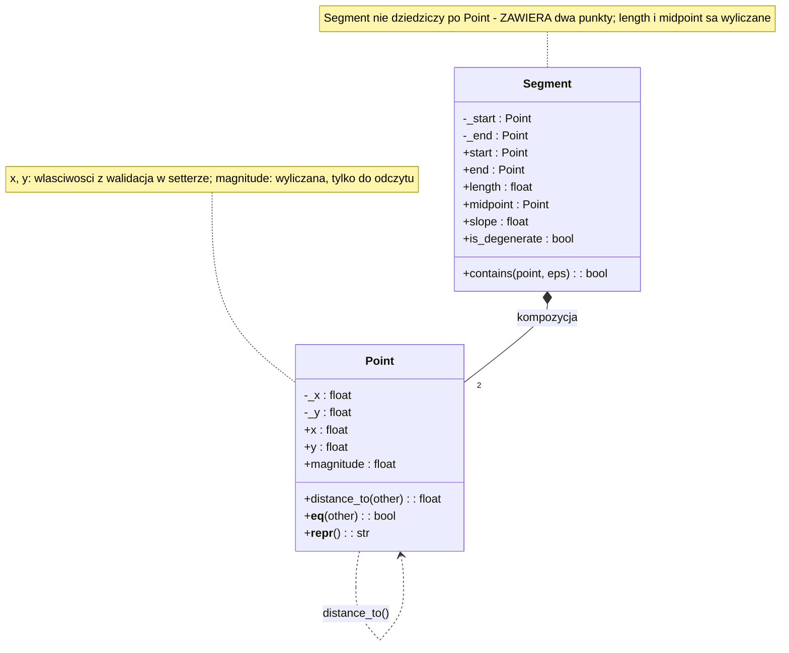
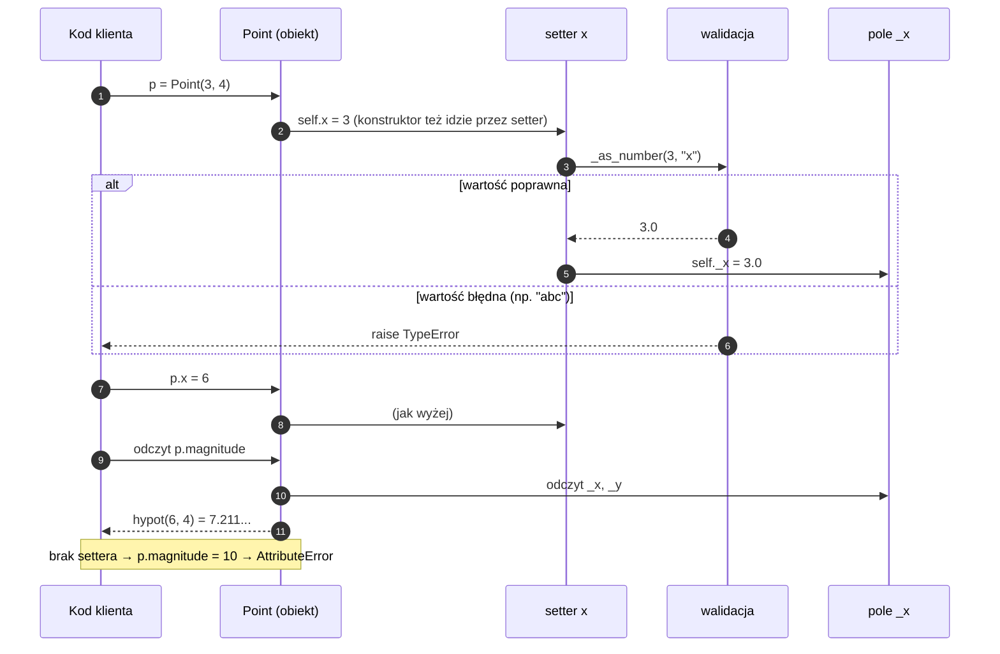

# Temat 02 - Hermetyzacja i `@property` (`Point`, `Segment`)

> Moduł: [01-OOP](../README.md) · Poprzedni: [01-class-vs-object](../01-class-vs-object/README.md) · Następny: [03-composition](../03-composition/README.md)

## Cel

Nauczyć się w Pythonie **kontrolować dostęp do stanu obiektu** za pomocą
konwencji nazewniczych (`_x`, `__x`) i dekoratora `@property`, tak aby:

- obiekt **nigdy** nie wchodził w niepoprawny stan (walidacja w setterze),
- wartości *pochodne* (długość, pole, temperatura w kelwinach) były liczone
  **na żądanie**, więc nie mogły „rozjechać się” ze stanem,
- część atrybutów była **tylko do odczytu**, bo nie mają sensu jako wejście.

Efekt dla testów: liczba możliwych stanów obiektu jest mała i dobrze
zdefiniowana, więc testy są krótkie, deterministyczne i skupione na
*regułach*, a nie na *sprzecznych stanach*.

## Wymagania wstępne

- temat [01 - klasa a obiekt](../01-class-vs-object/README.md) (`self`, atrybuty
  instancyjne, metody),
- umiejętność posługiwania się wyjątkami (`raise`, `try/except`).

## Teoria

### 1. Ile prywatności ma Python?

Python nie ma modyfikatorów `private`/`protected`. Ma **konwencje**:

| Zapis | Znaczenie | Czy można obejść? |
|---|---|---|
| `x` | część API publicznego | — |
| `_x` | szczegół implementacyjny („nie dotykaj z zewnątrz”) | tak, ale świadomie |
| `__x` | *name mangling*: zmienia się w `_Klasa__x` | tak, przez zmanipulowaną nazwę |
| `__x__` | metoda specjalna (protokół języka) | nie dotykać bez powodu |

Wniosek: hermetyzacja w Pythonie jest **umową społeczną wspartą narzędziami**
(`@property`, `__slots__`, `dataclass(frozen=True)`), a nie barierą kompilatora.
Ale i tak warto jej przestrzegać — bo to narzędzie *projektowania* API,
a nie zabezpieczenie przed „hakierem”.

### 2. `@property` - getter, setter, właściwości tylko do odczytu

```python
class Point:
    def __init__(self, x: float, y: float) -> None:
        self.x = x          # ← wywołuje SETTER (walidacja działa też tutaj!)
        self.y = y

    @property
    def x(self) -> float:
        return self._x

    @x.setter
    def x(self, value: float) -> None:
        self._x = Point._as_number(value, "x")

    @property
    def magnitude(self) -> float:      # brak settera = tylko do odczytu
        return math.hypot(self._x, self._y)
```

Trzy konsekwencje:

1. `p.x` wygląda jak zwykły atrybut, ale wykonuje kod (getter) —
   kod klienta się nie zmienia, gdy zmieniamy implementację.
2. `p.x = 5` przechodzi przez walidację (setter) — nie ma drugiej ścieżki
   ustawiania stanu, więc nie ma „zapomnianej” walidacji.
3. `p.magnitude = 10` kończy się `AttributeError`, bo właściwość jest tylko
   do odczytu. Wartość pochodna jest **zawsze** spójna ze stanem.

Diagram [`diagrams/01-encapsulation.mmd`](diagrams/01-encapsulation.mmd):



### 3. Kolejność zdarzeń przy `property`

Diagram [`diagrams/02-property-lifecycle.mmd`](diagrams/02-property-lifecycle.mmd)
pokazuje, co dzieje się przy odczycie i zapisie:



### 4. Właściwości wyliczane a `@cached_property`

`@cached_property` (Python 3.8+) liczy wartość raz i zapamiętuje ją.

| Sytuacja | Zwykłe `@property` | `@cached_property` |
|---|---|---|
| obiekt niemutowalny | OK (tanie) | OK i szybsze |
| obiekt mutowalny, wartość zależna od pól | **wymagane** | ❌ zwróci nieaktualną wartość |
| kosztowna operacja na stałym stanie | powtarza koszt | ✅ właściwy wybór |

Test, który to wykrywa, jest bardzo prosty: zmień pole, sprawdź wartość
pochodną. Dlatego w `Segment.length` **nie** używamy cachowania — końce
odcinka są mutowalne.

### 5. Hermetyzacja a testowalność

| Bez hermetyzacji | Z hermetyzacją |
|---|---|
| trzeba testować „co się stanie, gdy ktoś wpisze bzdurę w pole” | wystarczy przetestować setter raz |
| wiele kombinacji niespójnych stanów | stan zawsze spełnia niezmiennik |
| testy muszą ustawiać pole na 3 sposoby (atrybut, `__dict__`, metoda) | jedna ścieżka: property |

**Niezmiennik** (*invariant*) to zdanie zawsze prawdziwe o obiekcie, np.
`0 <= hp <= MAX_HP` albo „długość odcinka ≥ 0”. Test niezmiennika to jeden
z najtańszych i najskuteczniejszych testów, jakie można napisać.

## Przykłady kodu

### Przykład 1 - `NaivePoint` vs `Point`

Plik: [`examples/01_point_property.py`](examples/01_point_property.py)

```python
class NaivePoint:
    def __init__(self, x, y):
        self.x = x
        self.y = y
        # naive.x = "nie liczba" -> klasa nie protestuje

class Point:
    def __init__(self, x, y):
        self.x = x                # przez setter
        self.y = y

    @property
    def x(self) -> float:
        return self._x

    @x.setter
    def x(self, value) -> None:
        self._x = self._as_number(value, "x")

    @staticmethod
    def _as_number(value, name: str) -> float:
        if isinstance(value, bool) or not isinstance(value, (int, float)):
            raise TypeError(f"{name} must be a real number, got {type(value).__name__}")
        if not math.isfinite(value):
            raise ValueError(f"{name} must be finite, got {value!r}")
        return float(value)
```

**Wyjaśnienie:** walidacja jest wydzielona do jednej statycznej metody
(`_as_number`), więc obie współrzędne mają *identyczną* regułę — i wystarczy
ją przetestować raz. Zwróć uwagę na jawne odrzucenie `bool`: `True` jest
`int`-em o wartości 1, więc `Point(True, False)` „przeszłoby” walidację typu
i dało `(1.0, 0.0)`. To klasyczny przypadek brzegowy z testów.

### Przykład 2 - właściwości wyliczane w `Segment`

Plik: [`examples/02_segment_derived_properties.py`](examples/02_segment_derived_properties.py)

```python
class Segment:
    def __init__(self, start: Point, end: Point) -> None:
        self._start, self._end = start, end

    @property
    def length(self) -> float:
        return self._start.distance_to(self._end)

    @property
    def midpoint(self) -> Point:
        return Point((self._start.x + self._end.x) / 2,
                     (self._start.y + self._end.y) / 2)

    @property
    def slope(self) -> float | None:
        dx = self._end.x - self._start.x
        return None if dx == 0 else (self._end.y - self._start.y) / dx
```

**Wyjaśnienie:** `Segment` **nie ma** własnych pól liczbowych — cała
geometria wynika z dwóch punktów. `midpoint` zwraca *nowy* `Point`, więc
zmiana zwróconego obiektu nie psuje segmentu (brak aliasingu — jest na to
test w `examples/`). `slope` zwraca `None` dla odcinka pionowego: alternatywą
byłby wyjątek, ale `None` jest tu wygodniejsze i łatwiejsze w testach
(`assert seg.slope is None`).

### Przykład 3 - niezmiennik w klasie `Player`

```python
class Player:
    MAX_HP = 100

    def __init__(self, name: str, hp: int = 100) -> None:
        self.name = name
        self.hp = hp                 # przez setter -> niezmiennik od pierwszej chwili

    @property
    def hp(self) -> int:
        return self._hp

    @hp.setter
    def hp(self, value: int) -> None:
        if not 0 <= value <= self.MAX_HP:
            raise ValueError(f"hp out of range 0..{self.MAX_HP}: {value}")
        self._hp = value

    def take_damage(self, amount: int) -> int:
        self._hp = max(0, self._hp - amount)   # nasycenie, bez wyjątku
        return self._hp
```

**Wyjaśnienie:** setter pilnuje **niezmiennika** `0 <= hp <= MAX_HP`.
Operacje `take_damage`/`heal` mogą za to *nasycać* wartość (`clamp`), bo dla
gracza „leczenie ponad maksimum” nie jest błędem, tylko brakiem efektu.
Rozróżnienie „setter = błąd, operacja = nasycenie” to decyzja projektowa,
którą w tym module ćwiczymy jako Zadanie 3.

## Mini-lab (10 minut)

1. Uruchom `python examples/01_point_property.py`, znajdź w wyjściu
   `p.magnitude = 10 -> AttributeError`. Dlaczego `x.setter` istnieje,
   a `magnitude.setter` nie?
2. Dodaj do `Point` właściwość tylko do odczytu `is_origin` zwracającą
   `True`, gdy obie współrzędne są zerem.
3. Dodaj `Point.translate(dx, dy)` — czy powinna **mutować** obiekt, czy
   zwracać nowy? Sprawdź oba warianty i zapisz jedno zdanie uzasadnienia.
4. W `Segment` zmień `length` na `@cached_property` i udowodnij testem, że
   to błąd (zmień `end`, sprawdź `length`).

## Zadania do samodzielnego wykonania

Pliki: [`exercises/tasks_02.py`](exercises/tasks_02.py),
[`exercises/solutions_02.py`](exercises/solutions_02.py),
[`exercises/test_solutions_02.py`](exercises/test_solutions_02.py).

### Zadanie 1 - `Temperature` *(3 pkt)*

Właściwość `celsius` z walidacją (liczba, nie poniżej zera absolutnego),
wyliczane tylko do odczytu `kelvin` i `fahrenheit`, `__eq__` z tolerancją.

**Podpowiedzi:**

- w `__init__` przypisuj `self.celsius = celsius`, nigdy `self._celsius = ...`
  (chcesz, aby walidacja zadziałała także przy tworzeniu),
- porównanie `float` rób przez `math.isclose`, nigdy `==`,
- wartość brzegowa `-273.15` **musi** być akceptowana — testy brzegów to
  najczęstsze źródło błędów w setterach (`<` czy `<=`?).

### Zadanie 2 - `Rectangle` *(3 pkt)*

Właściwości `width`/`height` z walidacją dodatniości, wyliczane `area`,
`perimeter`, `is_square`, metoda `scale(factor)` zwracająca nowy obiekt.

**Podpowiedzi:**

- `area` bez settera ⇒ `rect.area = 10` podnosi `AttributeError` (to test!),
- `scale` zwraca `Rectangle(...)` zamiast modyfikować `self` — łatwiej
  testować, bo stan wejściowy pozostaje znany,
- walidację wspólną dla `width` i `height` wydziel do jednej metody
  (`_positive`), tak jak `Point._as_number`.

### Zadanie 3 - niezmiennik `Player` *(2 pkt)*

Refaktoryzacja klasy z publicznym `hp`; setter z wyjątkiem, `take_damage` i
`heal` z nasycaniem, `is_alive` tylko do odczytu.

**Podpowiedzi:**

- komunikat wyjątku ma zawierać `"hp out of range"` (testy używają `match=`),
- nasycanie: `self._hp = max(0, self._hp - amount)` oraz `min(MAX_HP, ...)`,
- w komentarzu `# DECYZJA:` uzasadnij, dlaczego setter rzuca wyjątek, a
  operacje nasycają — to jest pytanie egzaminacyjne.

### Zadanie 4 (dla chętnych) - `FrozenPoint` *(2 pkt)*

Obiekt niemutowalny: `__slots__`, właściwości bez setterów, `__hash__`,
metoda `shift` zwracająca nowy punkt.

**Podpowiedzi:**

- `__slots__ = ("_x", "_y")` likwiduje `__dict__`; test:
  `assert not hasattr(point, "__dict__")`,
- `__hash__` jest potrzebny, żeby punkt mógł być kluczem słownika lub
  elementem zbioru (i to też jest test),
- porównaj z `@dataclass(frozen=True, slots=True)` — 2 linie zamiast 30.

## Jak uruchomić, skompilować i zdebugować

```bash
python -m compileall src/01-OOP/02-encapsulation-property
python src/01-OOP/02-encapsulation-property/examples/01_point_property.py
python src/01-OOP/02-encapsulation-property/examples/02_segment_derived_properties.py
python src/01-OOP/02-encapsulation-property/exercises/solutions_02.py
python -m pytest src/01-OOP/02-encapsulation-property/exercises/test_solutions_02.py -v
```

### Debugowanie

1. Ustaw breakpoint w `Point._as_number` (linia z `raise TypeError`).
2. `F5` → *Python File*, a następnie w *Debug Console* wpisz
   `Point("abc", 0)` — debugger zatrzyma się w miejscu walidacji.
3. W panelu *Variables* rozwiń `self`, `_x`, `_y` — zobaczysz, że pole
   `_x` istnieje tylko wtedy, gdy walidacja się powiodła.
4. Debugowanie testów: ustaw breakpoint w `test_below_absolute_zero_is_rejected`,
   wybierz konfigurację *Python: pytest (moduł 01-OOP)* i `F5`.

## Typowe błędy

| Objaw | Przyczyna | Poprawka |
|---|---|---|
| `RecursionError: maximum recursion depth exceeded` | getter `x` odwołuje się do `self.x` | używaj pola `self._x` |
| walidacja „nie działa” przy tworzeniu | `__init__` przypisuje `self._x = ...` | przypisuj `self.x = ...` (przez setter) |
| `AttributeError: can't set attribute` | brak settera | dodaj `@x.setter` albo świadomie zostaw tylko do odczytu |
| `@cached_property` zwraca stare wartości | obiekt mutowalny + cache | zwykłe `@property` lub unieważnianie cache |
| `Point(True, False) == Point(1, 0)` | `bool` jest podklasą `int` | jawnie odrzuć `bool` w walidacji |
| test brzegu `-273.15` nie przechodzi | `<` zamiast `<=` w warunku | ustal semantykę brzegu i pokryj ją testem |

## Pytania kontrolne

1. Czym różni się `_x` od `__x`? Kiedy `__x` faktycznie coś daje?
2. Dlaczego konstruktor powinien ustawiać pola przez setter?
3. Dlaczego `magnitude` nie ma settera i co to daje w testach?
4. Kiedy `@cached_property` jest bezpieczne, a kiedy niebezpieczne?
5. Sformułuj niezmiennik dla klasy `Rectangle` i napisz test, który go sprawdza.
6. Dlaczego `rect.area = 10` podnosi `AttributeError`, a nie `ValueError`?

## Literatura i źródła

- Python Docs - `property`: <https://docs.python.org/3/library/functions.html#property>
- Python Docs - *Descriptor HowTo Guide*: <https://docs.python.org/3/howto/descriptor.html>
- Python Docs - `functools.cached_property`: <https://docs.python.org/3/library/functools.html#functools.cached_property>
- Python Docs - `dataclasses`: <https://docs.python.org/3/library/dataclasses.html>
- Python Docs - `__slots__` (Data model): <https://docs.python.org/3/reference/datamodel.html#slots>
- Real Python - *Python's property(): Add Managed Attributes to Your Classes*: <https://realpython.com/python-property/>
- PEP 8 - *Designing for inheritance*: <https://peps.python.org/pep-0008/#designing-for-inheritance>
- Wikipedia - *Encapsulation (computer programming)*: <https://en.wikipedia.org/wiki/Encapsulation_%28computer_programming%29>
