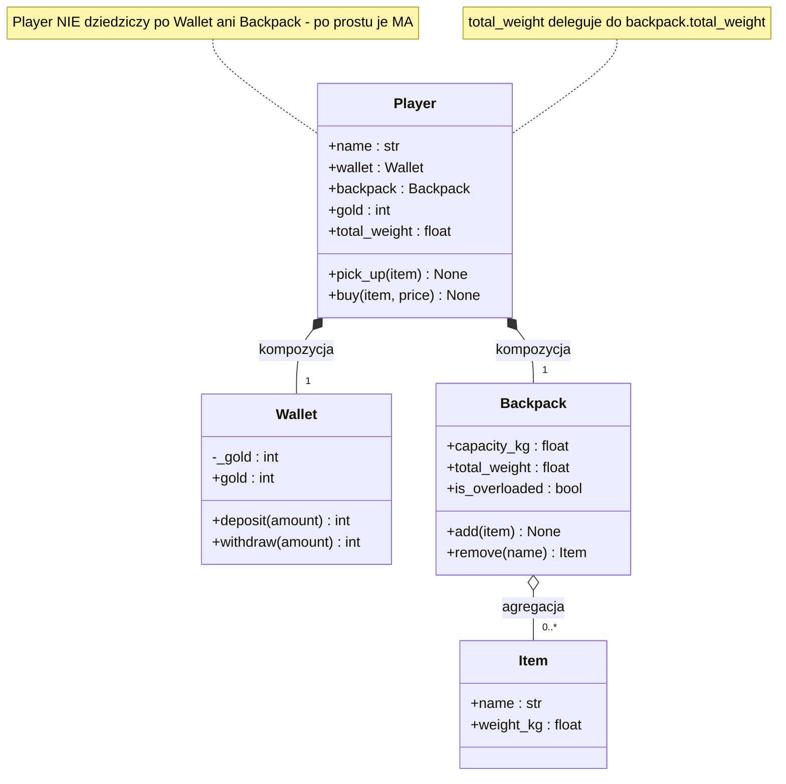
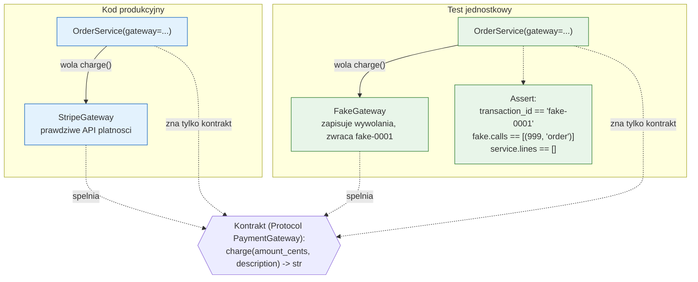

# Temat 03 - Kompozycja

> Moduł: [01-OOP](../README.md) · Poprzedni: [02-encapsulation-property](../02-encapsulation-property/README.md) · Następny: [04-inheritance-polymorphism](../04-inheritance-polymorphism/README.md)

## Cel

Nauczyć się budować klasy, które **zawierają** instancje innych klas
(relacja *has-a*), delegować do nich odpowiedzialność i - co najważniejsze dla
tego kursu - **wstrzykiwać zależności** zamiast tworzyć je w środku.

Po temacie student powinien umieć:

- odróżnić kompozycję (`Player` *ma* `Wallet`) od dziedziczenia (`Dog` *jest* `Animal`),
- zastosować delegację, aby nie duplikować logiki,
- rozpoznać w kodzie zależność tworzoną „na sztywno” (`self.client = HttpClient()`)
  i zastąpić ją parametrem konstruktora,
- napisać **ręczną atrapę** (test double) i sprawdzić nią *interakcję*
  („czy i z czym zawołano współpracownika”).

## Wymagania wstępne

- tematy [01](../01-class-vs-object/README.md) i [02](../02-encapsulation-property/README.md),
- podstawy typowania strukturalnego: `typing.Protocol` (wprowadzamy go tutaj
  w minimalnym zakresie).

## Teoria

### 1. Kompozycja vs dziedziczenie

| | Dziedziczenie (*is-a*) | Kompozycja (*has-a*) |
|---|---|---|
| Przykład | `Dog(Animal)` - pies **jest** zwierzęciem | `Car(Engine)` - samochód **ma** silnik |
| Zaleta | współdzielenie interfejsu i zachowania | luźne powiązanie, wymienialne części |
| Wada | sztywna hierarchia, krucha klasa bazowa | więcej „przekazywania” (delegacji) |
| Testy | trzeba testować całą hierarchię | zależność podmieniamy na atrapę |

Zasada praktyczna: **najpierw kompozycja, dziedziczenie tylko gdy relacja
naprawdę jest typu „jest”** i gdy polimorfizm daje wymierną korzyść
(zobaczysz to w [temacie 04](../04-inheritance-polymorphism/README.md)).

### 2. Delegacja - czyli „nie licz tego sam”

```python
class Player:
    def __init__(self, name: str, wallet: Wallet | None = None,
                 backpack: Backpack | None = None) -> None:
        self.name = name
        self.wallet = wallet if wallet is not None else Wallet()
        self.backpack = backpack if backpack is not None else Backpack()

    @property
    def total_weight(self) -> float:
        return self.backpack.total_weight      # delegacja, zero duplikacji
```

Reguła „jeden właściciel logiki”: wagę przedmiotów zna **tylko** `Backpack`.
Gdyby `Player` liczył wagę po swojemu, każda zmiana reguły wymagałaby zmian
w dwóch miejscach - a dwa miejsca to dwa miejsca, w których można się pomylić.

Diagram [`diagrams/01-composition.mmd`](diagrams/01-composition.mmd):



### 3. Wstrzykiwanie zależności (dependency injection)

**Antywzorzec** (kod nietestowalny w izolacji):

```python
class OrderService:
    def __init__(self) -> None:
        self.gateway = StripeGateway(os.environ["STRIPE_KEY"])   # zależność w środku
```

**Wzorzec** (kod testowalny):

```python
class OrderService:
    def __init__(self, gateway: PaymentGateway) -> None:
        self.gateway = gateway        # zależność wstrzyknięta z zewnątrz
```

Korzyści widoczne w testach:

| Problem z „twardą” zależnością | Po wstrzyknięciu |
|---|---|
| test wykonuje żądanie sieciowe (wolno, niestabilnie, kosztuje) | atrapa odpowiada natychmiast i zawsze tak samo |
| nie da się wywołać błędu płatności na życzenie | `FakeGateway(fail_with="karta odrzucona")` |
| testy padają bez Internetu / na CI | testy działają offline |
| nie wiadomo, czy serwis poprawnie przekazał argumenty | atrapa **zapisuje wywołania** (`fake.calls`) |

Nie potrzebujemy żadnego frameworka DI: w Pythonie wystarczy parametr
konstruktora (+ ewentualnie wartość domyślna). To dlatego `Player` w przykładzie
przyjmuje `wallet`/`backpack`, choć sam potrafi utworzyć je domyślnie.

Diagram [`diagrams/02-dependency-injection.mmd`](diagrams/02-dependency-injection.mmd):



### 4. `Protocol` - interfejs bez wspólnego przodka

```python
@runtime_checkable
class PaymentGateway(Protocol):
    def charge(self, amount_cents: int, description: str) -> str: ...
```

`Protocol` to *typing strukturalny*: liczy się **kształt** obiektu (metody),
a nie to, z czego dziedziczy. Dzięki temu `StripeGateway` i `FakeGateway`
spełniają kontrakt bez wspólnej klasy bazowej, a `isinstance(fake, PaymentGateway)`
działa (przy `@runtime_checkable`).

### 5. Rodzaje obiektów zastępczych (test doubles)

| Nazwa | Co robi | Kiedy używać |
|---|---|---|
| **dummy** | nic, wypełnia parametr | gdy argument nie jest używany w danym teście |
| **stub** | zwraca ustalone odpowiedzi | gdy testujemy *wynik* zależny od odpowiedzi |
| **fake** | prosta działająca implementacja | `FakeHttpClient`, `InMemoryRepository` |
| **spy** | zapisuje wywołania, potem je sprawdzamy | `RecordingNotifier` |
| **mock** | sam ustala oczekiwania (biblioteka `unittest.mock`) | złożone interakcje, temat 06-07 |

W tym temacie używamy **fake** i **spy** pisanych ręcznie - są czytelniejsze
dla początkujących i nie wymagają magii biblioteki.

## Przykłady kodu

### Przykład 1 - `Player`, `Wallet`, `Backpack`

Plik: [`examples/01_player_composition.py`](examples/01_player_composition.py)

```python
class Backpack:
    def __init__(self, capacity_kg: float = 20.0) -> None:
        self.capacity_kg = capacity_kg
        self._items: list[Item] = []

    @property
    def total_weight(self) -> float:
        return sum(item.weight_kg for item in self._items)

    def add(self, item: Item) -> None:
        if self.total_weight + item.weight_kg > self.capacity_kg:
            raise ValueError(f"backpack would be overloaded by {item.name!r}")
        self._items.append(item)


class Player:
    def __init__(self, name, wallet=None, backpack=None) -> None:
        self.name = name
        self.wallet = wallet if wallet is not None else Wallet()
        self.backpack = backpack if backpack is not None else Backpack()

    def buy(self, item: Item, price: int) -> None:
        self.wallet.withdraw(price)          # może podnieść ValueError
        try:
            self.backpack.add(item)
        except ValueError:
            self.wallet.deposit(price)       # wycofanie transakcji
            raise
```

**Wyjaśnienie:** `Player.buy` to przykład operacji z **wieloma krokami**.
Testujemy tu trzy scenariusze: sukces, brak monet oraz brak miejsca
w plecaku. Trzeci scenariusz wymaga sprawdzenia, że **wycofaliśmy transakcję** -
i to jest naprawdę wartościowy test (pokazuje brak zmiany stanu po błędzie).

### Przykład 2 - `OrderService` z bramką płatności

Plik: [`examples/02_dependency_injection.py`](examples/02_dependency_injection.py)

```python
@dataclass
class OrderService:
    gateway: PaymentGateway
    lines: list[OrderLine] = field(default_factory=list)

    @property
    def total_cents(self) -> int:
        return sum(line.total_cents for line in self.lines)

    def checkout(self) -> str:
        if not self.lines:
            raise ValueError("cannot checkout an empty order")
        transaction_id = self.gateway.charge(self.total_cents, "order")
        self.lines.clear()
        return transaction_id
```

**Wyjaśnienie:** `checkout` ma dokładnie jedną linię „świata zewnętrznego” -
`self.gateway.charge(...)`. Cała reszta to logika własna, którą testujemy bez
żadnej infrastruktury. W teście piszemy:

```python
def test_checkout_charges_total_and_clears_cart():
    fake = FakeGateway()
    service = OrderService(gateway=fake)
    service.add_line(OrderLine("książka", 4999, quantity=2))

    transaction = service.checkout()

    assert transaction == "fake-0001"              # wartość zwrócona
    assert fake.calls == [(9998, "order")]         # INTERAKCJA z zależnością
    assert service.lines == []                     # stan po operacji
```

### Przykład 3 - zależność „zła” i „dobra” obok siebie

```python
class HttpWeatherService:                    # ❌ trudne w testach
    def __init__(self, api_url: str) -> None:
        self.client = HttpClient()           # zależność utworzona w środku

class WeatherService:                        # ✅ testowalne
    def __init__(self, client: HttpClientPort) -> None:
        self._client = client
```

**Wyjaśnienie:** obie klasy mają identyczną logikę odczytu temperatury.
Różnica jest wyłącznie w miejscu *powstania* klienta HTTP - a to właśnie ta
jedna decyzja decyduje, czy testy będą działać offline i w milisekundach.

## Mini-lab (10 minut)

1. Uruchom `python examples/02_dependency_injection.py` i odszukaj linię
   z `fake.calls`. Dopisz w `demo_test_wiring()` własną asercję
   `assert service.lines == []` i sprawdź, czy działa.
2. Dodaj do `FakeGateway` licznik wywołań `charge_count` i wypisz go.
3. Zmień `OrderService.checkout`, aby **nie** czyścił koszyka przy błędzie
   płatności i napisz dwa zdania: dlaczego to lepsze zachowanie.
4. W `examples/01_player_composition.py` zmień `Backpack.capacity_kg` na `1.0`
   i sprawdź, że zakup „zbroi” wycofuje monety (`gold` bez zmian).

## Zadania do samodzielnego wykonania

Pliki: [`exercises/tasks_03.py`](exercises/tasks_03.py),
[`exercises/solutions_03.py`](exercises/solutions_03.py),
[`exercises/test_solutions_03.py`](exercises/test_solutions_03.py).

### Zadanie 1 - `Engine` + `Car` *(3 pkt)*

Kompozycja z delegacją: `Car` przyjmuje silnik, liczy `range_km` z jego zużycia,
`drive()` nie zmienia stanu przy błędzie.

**Podpowiedzi:**

- zapotrzebowanie na paliwo: `km * consumption / 100`,
- „nie zmieniaj stanu przy błędzie” = policz **najpierw**, a przypisz **potem**,
- porównania `float` zawsze z tolerancją (`pytest.approx`).

### Zadanie 2 - `AlertService` + `RecordingNotifier` *(3 pkt)*

Wstrzyknięty notifier, formatowanie komunikatów, `history` zwracające **kopię**
listy, atrapa zapisująca wywołania.

**Podpowiedzi:**

- `history` bez kopii = wyciek stanu wewnętrznego (test: dopisz coś do wyniku
  i sprawdź, że `service.history` się nie zmieniło),
- atrapa to zwykła klasa z metodą `send` i listą `sent`,
- asercja `notifier.sent == [...]` sprawdza *interakcję*, a nie tylko wynik.

### Zadanie 3 - refaktoryzacja do DI *(3 pkt)*

`WeatherService` z wstrzykiwanym `HttpClientPort` (Protocol) i `FakeHttpClient`.

**Podpowiedzi:**

- `Protocol` z jedną metodą `get(path: str) -> str` wystarczy,
- brak pola `"temp_c"` → `ValueError("temp_c missing")` (testy używają `match=`),
- w komentarzu `# DLACZEGO:` napisz o determinizmie i braku sieci w testach.

### Zadanie 4 (dla chętnych) - `Playlist` *(2 pkt)*

Agregacja wielu `Track` z `total_duration_s`, `longest_track`, `by_artist`,
`__len__` i `__iter__`.

**Podpowiedzi:**

- `max(..., key=..., default=None)` obsługuje pustą playlistę bez `if`-a,
- `__iter__` daje `for track in playlist` i `list(playlist)` w testach,
- `sum(track.duration_s for track in self._tracks)` - nawiasy okrągłe
  (generator), nie kwadratowe.

## Jak uruchomić, skompilować i zdebugować

```bash
python -m compileall src/01-OOP/03-composition
python src/01-OOP/03-composition/examples/01_player_composition.py
python src/01-OOP/03-composition/examples/02_dependency_injection.py
python src/01-OOP/03-composition/exercises/solutions_03.py
python -m pytest src/01-OOP/03-composition/exercises/test_solutions_03.py -v
```

### Debugowanie

1. Ustaw breakpoint w `OrderService.checkout` w linii wywołania
   `self.gateway.charge(...)`.
2. Uruchom debugowanie przykładu `02_dependency_injection.py`.
3. W *Variables* rozwiń `self.gateway` - zobaczysz, że jest to **atrapa**,
   mimo że kod wygląda identycznie jak produkcyjny. To esencja DI.
4. W *Debug Console* wywołaj `self.gateway.calls` po wykonaniu kroku - zobaczysz
   zapis interakcji.

## Typowe błędy

| Objaw | Przyczyna | Poprawka |
|---|---|---|
| `AttributeError: 'NoneType' object has no attribute ...` | zależność domyślna `None` bez utworzenia obiektu | `self.x = x if x is not None else X()` |
| testy przechodzą tylko z Internetem | zależność utworzona w środku klasy | wstrzyknij ją przez konstruktor |
| zmiana listy z `history` psuje serwis | zwrócono referencję do listy wewnętrznej | `return list(self._history)` |
| `TypeError: unsupported operand` przy `sum()` | `sum([...])` na obiektach, nie liczbach | dodaj `__add__` lub sumuj atrybut |
| test „sukcesu” przechodzi też przy błędzie | brak asercji na interakcję/stan | dodaj `assert fake.calls == [...]` |

## Pytania kontrolne

1. Kiedy `Player` powinien dziedziczyć po `Wallet`, a kiedy go zawierać?
2. Co to znaczy „delegacja” i jaką klasę błędów eliminuje?
3. Dlaczego `OrderService` nie powinien tworzyć `StripeGateway` samodzielnie?
4. Czym różni się **fake** od **spy**? Podaj po jednym przykładzie z tego tematu.
5. Dlaczego `Protocol` wystarcza za „interfejs” bez wspólnej klasy bazowej?
6. Jak przetestować, że nieudana operacja **nie** zmieniła stanu obiektu?

## Literatura i źródła

- Python Docs - `typing.Protocol`: <https://docs.python.org/3/library/typing.html#typing.Protocol>
- Python Docs - `dataclasses`: <https://docs.python.org/3/library/dataclasses.html>
- Python Docs - *Composition* w sekcji *Classes*: <https://docs.python.org/3/tutorial/classes.html#inheritance>
- Real Python - *Inheritance and Composition: A Python OOP Guide*: <https://realpython.com/inheritance-composition-python/>
- Martin Fowler - *Inversion of Control*: <https://martinfowler.com/bliki/InversionOfControl.html>
- Martin Fowler - *Mocks Aren't Stubs*: <https://martinfowler.com/articles/mocksArentStubs.html>
- Martin Fowler - *Test Double*: <https://martinfowler.com/bliki/TestDouble.html>
- E. Gamma i in., *Design Patterns* (zasada „favor composition over inheritance”), Addison-Wesley, 1994.
