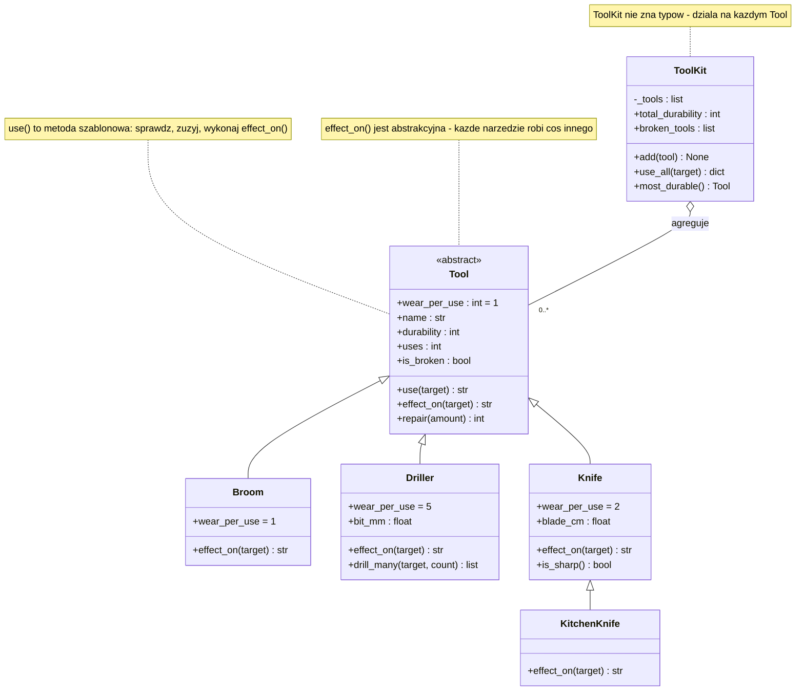
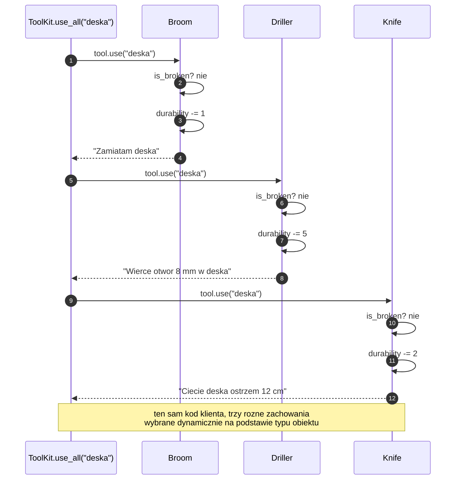

# Temat 04 - Dziedziczenie i polimorfizm (`Tool`, `Broom`, `Driller`, `Knife`)

> Moduł: [01-OOP](../README.md) · Poprzedni: [03-composition](../03-composition/README.md) · Następny: [05-aaa-pattern](../05-aaa-pattern/README.md)

## Cel

Zbudować hierarchię klas, w której **jedna instrukcja wywołuje różne
zachowania**: `tool.use(target)` dla `Broom`, `Driller` i `Knife`. Po temacie
student powinien umieć:

- zaprojektować klasę abstrakcyjną (`ABC` + `@abstractmethod`) jako interfejs
  narzędzia i umieścić w niej **wspólną logikę** (metoda szablonowa `use`),
- wykorzystać polimorfizm do napisania **klienta, który nie zna typów**
  (`ToolKit.use_all`),
- odróżnić polimorfizm od rozgałęziania `if isinstance(...)`,
- zastosować `typing.Protocol` do kontraktu *strukturalnego* (duck typing),
- rozpoznać **naruszenie zasady podstawienia Liskov** i naprawić je,
- napisać **test kontraktu**, który uruchamia ten sam zestaw asercji na
  wszystkich podklasach.

## Wymagania wstępne

- tematy [01](../01-class-vs-object/README.md), [02](../02-encapsulation-property/README.md), [03](../03-composition/README.md),
- podstawy dziedziczenia i `super()`.

## Teoria

### 1. Dziedziczenie po klasie abstrakcyjnej

```python
class Tool(ABC):
    wear_per_use: int = 1

    def __init__(self, name: str, durability: int = 100) -> None:
        self.name = name
        self._durability = durability
        self._uses = 0

    @abstractmethod
    def effect_on(self, target: str) -> str:
        """Zwraca opis efektu - każda podklasa robi to po swojemu."""

    def use(self, target: str) -> str:          # metoda szablonowa
        if self.is_broken:
            raise ToolBrokenError(f"{self.name} is broken and cannot be used")
        self._uses += 1
        self._durability = max(0, self._durability - self.wear_per_use)
        return self.effect_on(target)
```

`ABC` + `@abstractmethod` daje dwie rzeczy:

1. **Nie da się utworzyć obiektu klasy abstrakcyjnej** (`TypeError`) - kontrakt
   jest wymuszony przez interpreter, nie przez dokumentację.
2. **Nie da się zapomnieć** o implementacji: podklasa bez `effect_on` pozostaje
   abstrakcyjna i też rzuci `TypeError` przy tworzeniu.

### 2. Metoda szablonowa (`Template Method`)

Wzorzec projektowy, który już tu stosujemy: metoda bazowa ustala **szkielet
algorytmu**, a podklasy dostarczają tylko **zmienny krok**:

| Krok algorytmu `use()` | Gdzie zdefiniowany | Zmienny? |
|---|---|---|
| sprawdź, czy narzędzie nie jest zużyte | `Tool.use` | nie |
| zwiększ licznik użyć | `Tool.use` | nie |
| odejmij `wear_per_use` od wytrzymałości | `Tool.use` | nie (`wear_per_use` nadpisują podklasy) |
| wykonaj właściwy efekt | podklasa: `effect_on` | **tak** |

Ta konstrukcja to duża oszczędność także w testach: kroki wspólne testujemy
**raz**, a podklasy mają do przetestowania tylko swój `effect_on`.

### 3. Polimorfizm w praktyce

```python
class ToolKit:
    def use_all(self, target: str) -> dict[str, str]:
        results = {}
        for tool in self._tools:          # nie wiemy, co to za typ!
            if tool.is_broken:
                continue
            results[tool.name] = tool.use(target)
        return results
```

Diagram [`diagrams/01-tool-hierarchy.mmd`](diagrams/01-tool-hierarchy.mmd):



Diagram [`diagrams/02-polymorphic-dispatch.mmd`](diagrams/02-polymorphic-dispatch.mmd)
pokazuje, jak wygląda wybór implementacji w czasie wykonania:



### 4. Antywzorzec: `if isinstance(...)`

```python
def describe(tool) -> str:                       # ❌
    if isinstance(tool, Broom):
        return "miotła"
    if isinstance(tool, Driller):
        return "wiertarka"
    if isinstance(tool, Knife):
        return "nóż"
    return "nieznane"
```

Każde nowe narzędzie wymaga edycji tej funkcji (i wszystkich podobnych).
Co gorsza, `ToolKit` zależałby od listy typów znanych w momencie pisania.
Wersja polimorficzna: klasa sama wie, jak się opisać (`describe()`), a klient
po prostu woła metodę.

### 5. `ABC` czy `Protocol`?

| | `ABC` (`abc.ABC`) | `Protocol` (`typing.Protocol`) |
|---|---|---|
| Wymusza implementację | tak (`TypeError` przy tworzeniu) | nie (tylko typowanie statyczne) |
| Wymaga dziedziczenia | tak | nie |
| Działa z klasami z bibliotek | nie (trzeba opakować) | tak (typing strukturalny) |
| `isinstance` | tak | tak, ale tylko z `@runtime_checkable` |
| Kiedy wybrać | własna hierarchia, wspólny stan i logika | kontrakt dla obcych obiektów, wstrzykiwanie zależności |

W praktyce: **`ABC` dla hierarchii własnych** (`Tool` → `Broom`), **`Protocol`
dla zależności i interfejsów zewnętrznych** (`PaymentGateway` z tematu 03).

### 6. Zasada podstawienia Liskov (LSP)

> Obiekt podklasy musi móc zastąpić obiekt klasy bazowej, nie psując programu.

Klasyczne naruszenia w Pythonie (i to, jak je rozpoznać w testach):

| Naruszenie | Objaw w kodzie klienckim | Jak naprawić |
|---|---|---|
| zmiana typu zwracanego (`str` → `None`) | `AttributeError: 'NoneType' has no attribute ...` | zwracaj zawsze obiecany typ albo zgłoś wyjątek |
| rzucenie wyjątku spoza kontraktu (`RuntimeError`) | klient łapie `ToolError` i nie łapie błędu | używaj wyjątków z jednej rodziny |
| wzmocnienie warunków wstępnych („target musi mieć ≥ 3 znaki”) | działa w klasie bazowej, wybucha w podklasie | osłabiaj warunki, nie wzmacniaj |
| osłabienie warunków końcowych („nic nie robię”) | cichy brak efektu | zawsze wykonuj obiecaną operację |

Test kontraktu, który to wychwytuje (jest w `test_solutions_04.py`):

```python
@pytest.mark.parametrize("factory", TOOL_FACTORIES)
def test_tool_contract_effect_is_non_empty_string(factory):
    effect = factory().use("deska")
    assert isinstance(effect, str) and effect.strip() != ""
```

## Przykłady kodu

### Przykład 1 - hierarchia `Tool` → `Broom`, `Driller`, `Knife`

Plik: [`examples/01_tools_polymorphism.py`](examples/01_tools_polymorphism.py)

```python
class Driller(Tool):
    wear_per_use = 5

    def __init__(self, name: str, bit_mm: float, durability: int = 50) -> None:
        super().__init__(name, durability)
        if bit_mm <= 0:
            raise ValueError(f"bit_mm must be positive, got {bit_mm}")
        self.bit_mm = float(bit_mm)

    def effect_on(self, target: str) -> str:
        return f"Wiercę otwór {self.bit_mm:g} mm w {target}"

    def drill_many(self, target: str, count: int) -> list[str]:
        return [self.use(target) for _ in range(count)]


class KitchenKnife(Knife):
    def effect_on(self, target: str) -> str:
        return f"{super().effect_on(target)} (deska kuchenna)"
```

**Wyjaśnienie:** `Driller` dodaje **własny stan** (`bit_mm`) i **własną
metodę** (`drill_many`), ale kontrakt `use()`/`effect_on()` pozostaje ten sam.
`KitchenKnife` rozszerza zachowanie wywołaniem `super()` - to wzorcowy sposób
„dodania czegoś” bez duplikowania kodu rodzica. W `effects = kit.use_all(...)`
widać polimorfizm: słownik wyników powstaje z różnych klas, a pętla nie
zawiera ani jednego `isinstance`.

### Przykład 2 - `Protocol`, duck typing i obiekt „z zewnątrz”

Plik: [`examples/02_protocols_and_duck_typing.py`](examples/02_protocols_and_duck_typing.py)

```python
@runtime_checkable
class ToolLike(Protocol):
    name: str
    def use(self, target: str) -> str: ...


class LegacyScrewdriver:              # nie dziedziczy po niczym naszym
    def __init__(self, size: str = "PH2") -> None:
        self.size = size
        self.name = f"śrubokręt {size}"

    def use(self, target: str) -> str:
        return f"Wkręcam śrubę {self.size} w {target}"


def use_tool(tool: ToolLike, target: str) -> str:
    return tool.use(target)
```

**Wyjaśnienie:** `use_tool` akceptuje obiekt, którego **nie da się** zmienić
(pochodzi z biblioteki), bo liczy się tylko kształt: atrybut `name` i metoda
`use`. To *duck typing* w wersji formalnej. Jednocześnie przykład pokazuje
pułapkę `ABC.register`: rejestracja wirtualnej podklasy to *obietnica*
programisty, której ABC nie weryfikuje - brak `describe()` nie zostanie
wykryty aż do wywołania.

### Przykład 3 - `use_many` i lista jednorodna pod względem kontraktu

```python
tools: list[ToolLike] = [LegacyScrewdriver(), Screwdriver("T15")]
for effect in use_many(tools, "szafa"):
    print(effect)
```

**Wyjaśnienie:** adnotacja `list[ToolLike]` mówi typującemu statycznie
(Pylance/mypy), że o elementach wiemy tylko tyle, ile mówi protokół. To
dokładnie ta informacja, której potrzebuje test: „wszystkie elementy zwracają
niepusty `str` z metody `use`”. Dzięki temu możemy napisać **jeden** test
kontraktu dla całej listy.

## Mini-lab (10 minut)

1. Uruchom `python examples/01_tools_polymorphism.py`; znajdź wypis
   `broken_tools` i wyjaśnij, dlaczego wiertło o wytrzymałości 10 przestało
   działać po dwóch użyciach.
2. Dodaj klasę `Screwdriver(Tool)` z `wear_per_use = 1` i efektem
   `"Wkręcam śrubę w {target}"`. **Nie zmieniaj** `ToolKit` - przekonaj się,
   że `use_all` działa od razu (to miara dobrego projektu!).
3. Dodaj do `Tool` metodę `describe()` zwracającą `type(self).__name__`
   i wypisz opisy wszystkich narzędzi w pętli.
4. W `examples/02_protocols_and_duck_typing.py` dopisz klasę naruszającą LSP
   (zwraca `None` dla krótkiego `target`) i sprawdź, który test by to złapał.

## Zadania do samodzielnego wykonania

Pliki: [`exercises/tasks_04.py`](exercises/tasks_04.py),
[`exercises/solutions_04.py`](exercises/solutions_04.py),
[`exercises/test_solutions_04.py`](exercises/test_solutions_04.py).

### Zadanie 1 - nowa podklasa `Hammer` *(2 pkt)*

Młotek o zadanej masie, `wear_per_use = 3`, metoda `nail(target, count)`.

**Podpowiedzi:**

- `f"{self.weight_kg:g}"` daje `2` zamiast `2.0` (sprawdź w REPL-u),
- `nail` to ta sama konstrukcja co `Driller.drill_many` z przykładu,
- podklasa **nie może** wymagać zmian w klasie bazowej - jeśli czujesz taką
  potrzebę, prawdopodobnie projekt jest zły.

### Zadanie 2 - `ToolKit` *(3 pkt)*

Klient polimorficzny z agregatami i `use_all`.

**Podpowiedzi:**

- `use_all` powinien najpierw sprawdzić, czy cokolwiek działa
  (`ToolError("no working tools")`),
- `broken_tools` zwraca **nazwy**, nie obiekty (wygodniejsze w asercjach),
- `sum(...)`, `max(..., default=None)` - patrz wzorce z tematu 03.

### Zadanie 3 - naprawa LSP w `FancySaw` *(3 pkt)*

Podklasa zwraca `None` i rzuca `RuntimeError`; przepisz ją tak, aby
przestrzegała kontraktu.

**Podpowiedzi:**

- nieobsługiwany materiał → `ToolError("unsupported material")` (wyjątek jest
  częścią kontraktu, `None` nie jest),
- krótkie `target` muszą działać - podklasa nie może **wzmacniać** warunków
  wstępnych,
- komentarz `# LSP:` z uzasadnieniem (1-2 zdania).

### Zadanie 4 (dla chętnych) - `MultiTool` i `use_anything` *(2 pkt)*

Obiekt spełniający protokół bez dziedziczenia + funkcja sprawdzająca kontrakt
w czasie wykonania.

**Podpowiedzi:**

- `isinstance(thing, ToolLike)` działa dla protokołów z
  `@runtime_checkable` (sprawdza obecność metod),
- nie używaj `isinstance(thing, Tool)` - celem jest duck typing,
- `TypeError("... does not implement ToolLike")` - komunikat ma znaczenie dla
  czytelności porażki testu.

## Jak uruchomić, skompilować i zdebugować

```bash
python -m compileall src/01-OOP/04-inheritance-polymorphism
python src/01-OOP/04-inheritance-polymorphism/examples/01_tools_polymorphism.py
python src/01-OOP/04-inheritance-polymorphism/examples/02_protocols_and_duck_typing.py
python src/01-OOP/04-inheritance-polymorphism/exercises/solutions_04.py
python -m pytest src/01-OOP/04-inheritance-polymorphism/exercises/test_solutions_04.py -v
```

### Debugowanie

1. Ustaw breakpoint w `Tool.use` (linia z `return self.effect_on(target)`).
2. Uruchom `examples/01_tools_polymorphism.py` w debuggerze.
3. Przy każdym zatrzymaniu sprawdź `type(self).__name__` w *Watch* - zobaczysz,
   jak ta sama linia kodu obsługuje kolejne klasy.
4. Wejdź krokiem *Step Into* (`F11`) w `effect_on` - debugger trafi do
   implementacji właściwej klasy.
5. W *Debug Console* wywołaj `self.__class__.__mro__` - to lista klas, po
   których Python szuka metod (Method Resolution Order).

## Typowe błędy

| Objaw | Przyczyna | Poprawka |
|---|---|---|
| `TypeError: Can't instantiate abstract class` | podklasa nie implementuje `effect_on` | zaimplementuj metodę abstrakcyjną |
| `TypeError: super() argument 1 must be type` | `super()` w metodzie statycznej | `super()` ma sens tylko w metodzie instancyjnej/klasowej |
| efekt `None` w wynikach `use_all` | podklasa zwróciła `None` | naruszenie LSP - zwróć obiecany `str` |
| `AttributeError` na polu podklasy w kliencie | klient „wiedział”, że to `Driller` | pracuj na kontrakcie `Tool`, nie na typie konkretnym |
| test kontraktu nie obejmuje nowej klasy | fabryki narzędzi nie zaktualizowane | dodaj nowy `pytest.param(...)` do `TOOL_FACTORIES` |

## Pytania kontrolne

1. Co robi `@abstractmethod` i jaki błąd dostaniemy bez niego?
2. Jak nazywa się wzorzec zastosowany w `Tool.use` i co zyskują testy?
3. Dlaczego `if isinstance(...)` jest gorszy od polimorfizmu? Podaj przykład.
4. Kiedy `Protocol` jest lepszy od `ABC`? A kiedy odwrotnie?
5. Podaj dwa konkretne naruszenia LSP i sposób ich wykrycia testem.
6. Dlaczego dodanie nowej podklasy nie wymaga zmian w `ToolKit`?

## Literatura i źródła

- Python Docs - `abc` - *Abstract Base Classes*: <https://docs.python.org/3/library/abc.html>
- Python Docs - `typing.Protocol`: <https://docs.python.org/3/library/typing.html#typing.Protocol>
- Python Docs - `typing.runtime_checkable`: <https://docs.python.org/3/library/typing.html#typing.runtime_checkable>
- Python Glossary - *duck-typing*: <https://docs.python.org/3/glossary.html#term-duck-typing>
- Python Docs - *Inheritance* i MRO: <https://docs.python.org/3/tutorial/classes.html#multiple-inheritance>
- Real Python - *Inheritance and Composition: A Python OOP Guide*: <https://realpython.com/inheritance-composition-python/>
- Refactoring Guru - *Template Method*: <https://refactoring.guru/design-patterns/template-method>
- B. Liskov, J. Wing, *A Behavioral Notion of Subtyping*, ACM TOPLAS, 1994.
- E. Gamma i in., *Design Patterns* (podrozdział „Template Method”), Addison-Wesley, 1994.
