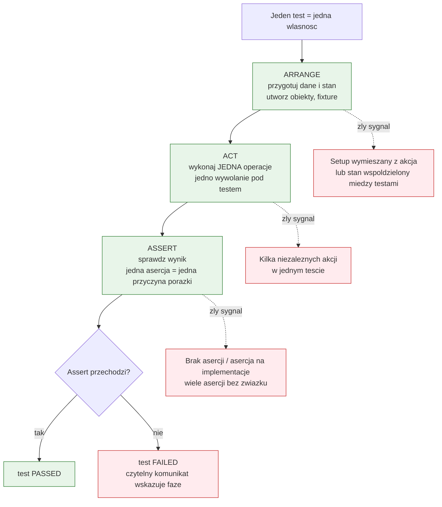
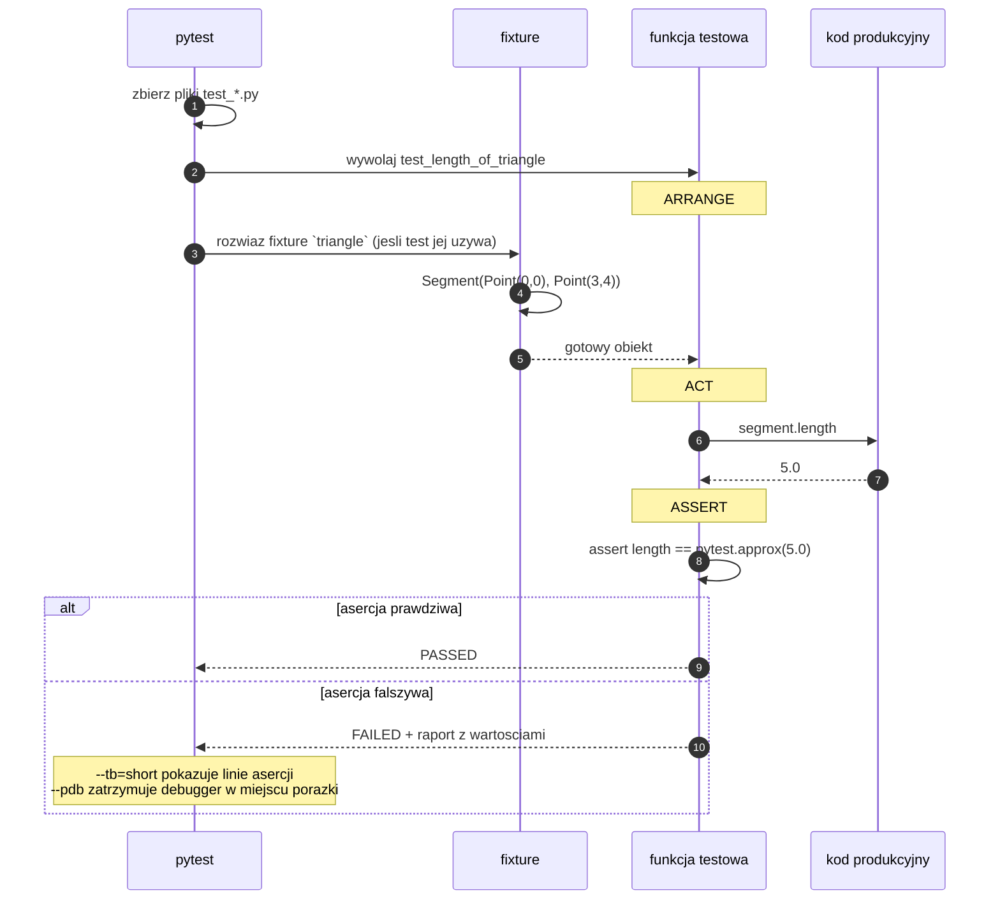

# Temat 05 - Struktura AAA (Arrange - Act - Assert)

> Moduł: [01-OOP](../README.md) · Poprzedni: [04-inheritance-polymorphism](../04-inheritance-polymorphism/README.md) · Następny: [06-unit-test-anatomy](../06-unit-test-anatomy/README.md)

## Cel

Nauczyć się pisać test, który **czytelnie odpowiada na trzy pytania**: co mam
na wejściu, co robię, czego oczekuję. Po temacie student powinien umieć:

- podzielić test na sekcje **Arrange / Act / Assert** i uzasadnić ten podział,
- rozpoznać typowe wady testu: brak Arrange, kilka aktów w jednym teście,
  asercje na implementację, brak asercji, stan współdzielony,
- zapisać ścieżkę błędu w AAA (`pytest.raises` w sekcji Act+Assert),
- użyć fixture jako *nazwanego Arrange*,
- użyć parametrów testu jako źródła danych dla Arrange,
- zdebugować test w Visual Studio Code i w trybie `--pdb`.

## Wymagania wstępne

- tematy [01](../01-class-vs-object/README.md) - [04](../04-inheritance-polymorphism/README.md) (kod do testowania),
- podstawy uruchamiania `pytest` (poznasz je tutaj od zera).

## Teoria

### 1. Trzy fazy testu

| Faza | Pytanie | Co wolno zrobić | Czego nie wolno |
|---|---|---|---|
| **Arrange** | *Co mam na wejściu?* | tworzyć obiekty, ustawiać stan, przygotować dane, rozwiązać fixture | wołać testowanej metody „na próbę” |
| **Act** | *Co testuję?* | **jedno** wywołanie metody/funkcji | łączyć kilku niezależnych akcji |
| **Assert** | *Czego oczekuję?* | sprawdzić wynik i/lub stan po operacji | powtarzać logiki implementacji we własnym kodzie |

Diagram [`diagrams/01-aaa-structure.mmd`](diagrams/01-aaa-structure.mmd):



### 2. Ten sam test: bez AAA i z AAA

**❌ Bez struktury:**

```python
def test_bez_aaa():
    p = Point(3, 4)
    assert p.magnitude == 5 and p.x == 3 and p.distance_to(Point(0, 0)) == 5
    p.x = 6
    assert p.magnitude == pytest.approx(7.2111025509)
```

**✅ Z AAA:**

```python
def test_z_aaa():
    # Arrange
    point = Point(x=3, y=4)

    # Act
    magnitude = point.magnitude

    # Assert
    assert magnitude == pytest.approx(5.0)
```

Różnice, które przekładają się na czas diagnozy błędu:

| Wersja bez AAA | Wersja z AAA |
|---|---|
| 4 asercje połączone `and` - nie wiadomo, która padła | jedna asercja na własność |
| brak nazwy dla wyniku (magiczna liczba) | `magnitude` mówi, co porównujemy |
| druga akcja (`p.x = 6`) w tym samym teście | osobny test na zmianę stanu |
| dwie rzeczy naraz: konstrukcja i mutacja | jedno zachowanie na test |

### 3. Co się dzieje po uruchomieniu testu?

Diagram [`diagrams/02-aaa-in-pytest.mmd`](diagrams/02-aaa-in-pytest.mmd):



### 4. AAA dla ścieżki błędu

Dla sytuacji „operacja ma zawieść” sekcje Act i Assert naturalnie się łączą:

```python
def test_aaa_dla_sciezki_bledu():
    # Arrange
    rectangle = Rectangle(width=2, height=3)

    # Act + Assert
    with pytest.raises(ValueError, match="positive"):
        rectangle.width = 0

    # Assert (stan po nieudanej operacji)
    assert rectangle.width == pytest.approx(2.0)
```

Trzy elementy, których brakuje w naiwnej wersji:

1. **typ wyjątku** (`ValueError`) - nie „cokolwiek poleciało”,
2. **`match=`** - fragment komunikatu, czyli powód błędu,
3. **stan po błędzie** - operacja, która zawiodła, nie może zmienić obiektu.

### 5. Fixture = nazwane Arrange

```python
@pytest.fixture
def triangle() -> Segment:
    return Segment(start=Point(0, 0), end=Point(3, 4))


def test_length_of_pythagorean_triangle(triangle):
    # Arrange - wykonane przez fixture
    # Act
    length = triangle.length
    # Assert
    assert length == pytest.approx(5.0)
```

Kiedy używać fixture, a kiedy tworzyć obiekt w teście?

| Sytuacja | Wybór |
|---|---|
| 1-2 testy potrzebują tego stanu | Arrange inline w teście |
| 3+ testy potrzebują tego samego stanu | fixture |
| stan wymaga sprzątania (pliki, połączenia) | fixture z `yield` |
| potrzebnych jest kilka wariantów stanu | fixture parametryzowana lub `parametrize` |

Szczegółowa anatomia fixture i `conftest.py` - w [temacie 06](../06-unit-test-anatomy/README.md).

### 6. AAA a debugowanie

Sekcje AAA to gotowa mapa dla debuggera:

| Objaw porażki | W której sekcji szukać przyczyny |
|---|---|
| `AttributeError`, `TypeError` przy tworzeniu obiektu | **Arrange** - złe dane wejściowe |
| brak wyjątku, którego oczekiwano | **Act** - zła metoda/argumenty |
| wynik niezgodny z oczekiwaniem | **Act** (co wołamy) albo **Assert** (czego oczekujemy) |
| test przechodzi, gdy zmienię kolejność uruchamiania | stan współdzielony - **Arrange** do naprawy |

## Przykłady kodu

### Przykład 1 - ten sam test w trzech wersjach

Plik: [`examples/test_aaa_basics.py`](examples/test_aaa_basics.py)

```python
def test_z_aaa_i_komentarzem_dlaczego():
    """Długość wektora (3, 4) to 5 - trójka pitagorejska."""

    # Arrange
    point = Point(x=3, y=4)

    # Act
    magnitude = point.magnitude

    # Assert
    assert magnitude == pytest.approx(5.0)
```

**Wyjaśnienie:** docstring mówi *dlaczego* oczekujemy 5 (trójka pitagorejska) -
dzięki temu test jest dokumentacją intencji, a nie tylko kodem. `pytest.approx`
obsługuje porównanie liczb zmiennoprzecinkowych, bo `0.1 + 0.2 != 0.3`.

### Przykład 2 - Arrange przeniesione do fixture

Plik: [`examples/test_aaa_with_fixtures.py`](examples/test_aaa_with_fixtures.py)

```python
@pytest.fixture
def triangle() -> Segment:
    """Odcinek 3-4-5: odcinek (0,0)-(3,4) ma długość 5."""
    return Segment(start=Point(0, 0), end=Point(3, 4))


def test_midpoint_lies_halfway(triangle):
    # Arrange - fixture `triangle`
    # Act
    midpoint = triangle.midpoint
    # Assert
    assert midpoint == Point(1.5, 2.0)
```

**Wyjaśnienie:** fixture nie ukrywa Arrange - **nazywa** je. Nazwa `triangle`
mówi wprost, co jest przygotowane. Fixture parametryzowana
(`@pytest.fixture(params=[...])`) pozwala uruchomić jeden test na trzech
różnych zestawach danych, zachowując jedną własność pod testem.

### Przykład 3 - AAA i `parametrize`

```python
@pytest.mark.parametrize(("sides", "expected_area"),
                         [((1, 1), 1.0), ((2, 3), 6.0), ((2.5, 4), 10.0)])
def test_area_of_rectangle(sides, expected_area):
    # Arrange
    width, height = sides
    rectangle = Rectangle(width=width, height=height)
    # Act
    area = rectangle.area
    # Assert
    assert area == pytest.approx(expected_area)
```

**Wyjaśnienie:** dane przypadków testowych są częścią Arrange, ale żyją na
zewnątrz funkcji - dzięki temu ciało testu pozostaje krótkie, a dodanie
przypadku to jedna linia. W raporcie pytest zobaczysz osobny wynik dla każdego
zestawu parametrów (`test_area_of_rectangle[2.5-4-10.0]`), co znowu ułatwia
diagnozę.

## Mini-lab (10 minut)

1. Uruchom `python -m pytest src/01-OOP/05-aaa-pattern/examples/test_aaa_basics.py -v`
   i zwróć uwagę na nazwy przypadków w nawiasach kwadratowych.
2. Rozbij `test_bez_aaa` na trzy osobne testy zgodne z AAA.
3. Dodaj test na `Point.distance_to`, używając dokładnie jednej asercji.
4. Wprowadź celowy błąd w asercji (`assert magnitude == 6.0`) i przeczytaj
   raport pytest: spróbuj wskazać, w której sekcji jest błąd - tylko na
   podstawie komunikatu.

## Zadania do samodzielnego wykonania

W tym temacie **kod produkcyjny dostajesz gotowy**, a Twoim zadaniem jest
napisanie testów.

Pliki: [`exercises/shopping_cart.py`](exercises/shopping_cart.py) (kod do
testowania), [`exercises/tasks_05.py`](exercises/tasks_05.py) (treść zadania
i przykłady złych testów),
[`exercises/test_solutions_05.py`](exercises/test_solutions_05.py) (wzorcowe
rozwiązanie - zestaw testów).

### Zadanie 1 - podstawowe AAA *(3 pkt)*

Napisz testy dla `ShoppingCart.add` i właściwości `subtotal_cents`:
nowa pozycja, dwie różne pozycje, scalanie tego samego `sku`, pusty koszyk.

**Podpowiedzi:**

- każdy test tworzy **własny** koszyk (żadnych obiektów globalnych!),
- w Act zapisuj wynik do zmiennej (`subtotal = cart.subtotal_cents`),
- kwoty są w groszach, więc porównania są dokładne (`==`, bez `approx`).

### Zadanie 2 - ścieżki błędów *(3 pkt)*

Testy dla `remove` nieznanego `sku`, `add` z ujemną ceną i `quantity <= 0`,
rabatu spoza zakresu. Zawsze sprawdzaj **stan po błędzie**.

**Podpowiedzi:**

- `with pytest.raises(KeyError, match="pear"):` - `match` to wyrażenie
  regularne, więc `"pear"` wystarczy,
- po `pytest.raises` dodaj trzeci blok `# Assert` na stanie koszyka,
- „nieudana operacja nic nie zmienia” to jedna z najczęściej pomijanych
  asercji w studenckich testach.

### Zadanie 3 - rabat i podatek *(2 pkt)*

Rabat 10% i 100%, podatek naliczany **po** rabacie.

**Podpowiedzi:**

- wybierz ceny, dla których wynik jest całkowity (np. 100 000 groszy),
- test na podatek to test „pułapki”: napisz obok wersję bez rabatu, żeby
  pokazać różnicę (23 000 vs 20 700 groszy).

### Zadanie 4 - czysta funkcja z `parametrize` *(2 pkt)*

`parse_price`: wersje poprawne i odrzucane.

**Podpowiedzi:**

- `@pytest.mark.parametrize(("text", "expected"), [...])` - nazwy parametrów
  w jednej krotce, bo mają znaczenie w raporcie,
- pamiętaj o przypadkach brzegowych: `""`, `"0"`, `"12,999"`, `None`.

## Jak uruchomić, skompilować i zdebugować

```bash
# wszystkie testy tematu
python -m pytest src/01-OOP/05-aaa-pattern -c src/01-OOP/pytest.ini -v

# tylko testy rozwiązań zadań
python -m pytest src/01-OOP/05-aaa-pattern/exercises/test_solutions_05.py -v

# wybrany test po nazwie (fragment wystarczy)
python -m pytest src/01-OOP/05-aaa-pattern -k "discount" -v

# pokaż lokalne zmienne przy porażce (bez debuggera)
python -m pytest src/01-OOP/05-aaa-pattern --showlocals

# zatrzymaj się w debuggerze w miejscu porażki
python -m pytest src/01-OOP/05-aaa-pattern -x --pdb

# pokrycie kodu testami (ile procent kodu wykonują testy)
python -m pytest src/01-OOP/05-aaa-pattern --cov=src/01-OOP/05-aaa-pattern --cov-report=term-missing
```

### Debugowanie testów w VS Code

1. Otwórz `exercises/test_solutions_05.py`.
2. Ustaw breakpoint w sekcji **Act** wybranego testu.
3. Naciśnij `F5` i wybierz konfigurację *Python: pytest (moduł 01-OOP)*.
4. W *Variables* sprawdź stan obiektu przed asercją (`cart`, `subtotal`) -
   to najszybszy sposób na znalezienie różnicy między „co myślę” a „co jest”.
5. W *Debug Console* policz oczekiwaną wartość:
   `cart.subtotal_cents`, `cart.item_count`.

## Typowe błędy

| Objaw | Przyczyna | Poprawka |
|---|---|---|
| testy przechodzą pojedynczo, a padają razem | stan współdzielony (obiekt globalny, atrybut klasowy) | Arrange wewnątrz każdego testu |
| po dodaniu asercji nie wiadomo, co padło | kilka asercji bez związku w jednym teście | podziel test |
| test przechodzi zawsze, nawet po zepsuciu kodu | brak asercji albo asercja `is not None` | porównuj konkretną wartość |
| refaktoring kodu psuje testy | asercje na implementację (`cart._items`) | testuj przez API publiczne |
| `assert 0.1 + 0.2 == 0.3` zawodzi | arytmetyka zmiennoprzecinkowa | `pytest.approx` |
| `pytest.raises` „nie łapie” wyjątku | testowany kod nie rzuca wyjątku, a asercja jest poza blokiem `with` | sprawdź, czy operacja jest wewnątrz `with` |

## Pytania kontrolne

1. Jakie trzy pytania zadaje sobie autor testu w strukturze AAA?
2. Dlaczego Act powinien zawierać jedno wywołanie?
3. Jak zapisać w AAA operację, która ma zgłosić wyjątek?
4. Kiedy Arrange przenosimy do fixture, a kiedy zostawiamy w teście?
5. Dlaczego `assert result is not None` jest słabą asercją?
6. Co oznacza zasada „jedna przyczyna porażki na test”?

## Literatura i źródła

- pytest Docs - *Anatomy of a test* (Arrange, Act, Assert, Cleanup): <https://docs.pytest.org/en/stable/explanation/anatomy.html>
- pytest Docs - *How to write and report assertions in tests*: <https://docs.pytest.org/en/stable/how-to/assert.html>
- Martin Fowler - *GivenWhenThen*: <https://martinfowler.com/bliki/GivenWhenThen.html>
- pytest Docs - *Get Started*: <https://docs.pytest.org/en/stable/getting-started.html>
- pytest Docs - *How to write and report assertions*: <https://docs.pytest.org/en/stable/how-to/assert.html>
- pytest Docs - *How to use fixtures*: <https://docs.pytest.org/en/stable/how-to/fixtures.html>
- pytest Docs - *How to parametrize fixtures and test functions*: <https://docs.pytest.org/en/stable/how-to/parametrize.html>
- Real Python - *Testing Your Code With pytest*: <https://realpython.com/pytest-python-testing/>
- Kent Beck, *Test-Driven Development: By Example*, Addison-Wesley, 2002 (rozdz. o wzorcach testów).
