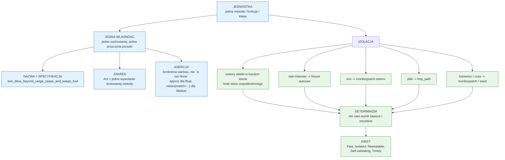
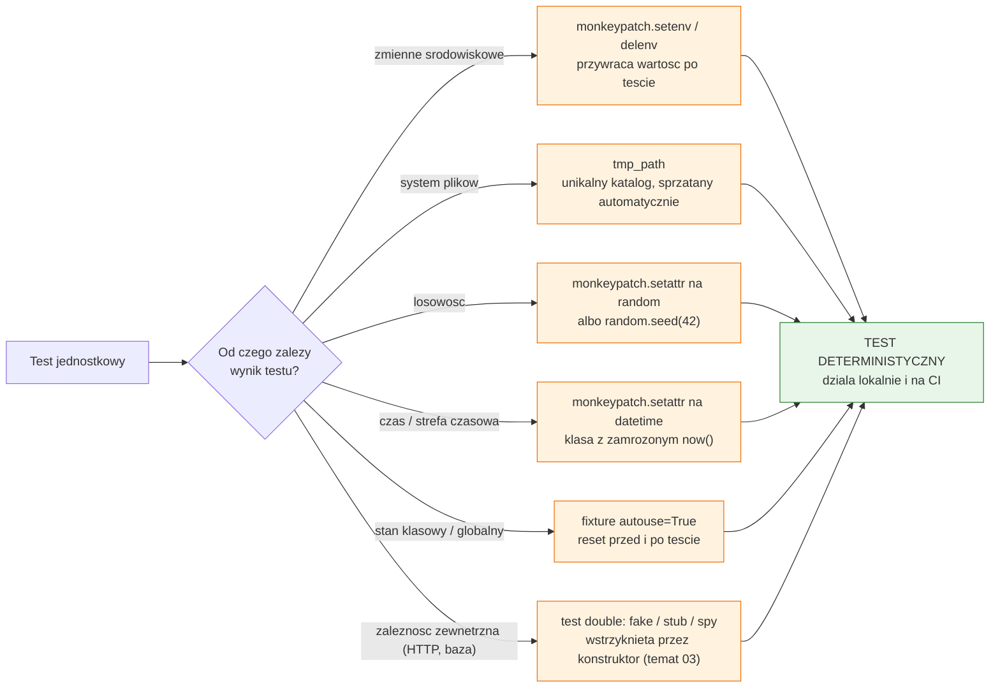

# Temat 06 - Sformułowanie testu jednostkowego

> Moduł: [01-OOP](../README.md) · Poprzedni: [05-aaa-pattern](../05-aaa-pattern/README.md) · Następny: [07-testing-frameworks](../07-testing-frameworks/README.md)

## Cel

Nauczyć się **precyzyjnie formułować** test jednostkowy: testować *pojedynczą
własność pojedynczej metody* i sprawić, żeby wynik testu nie zależał od niczego
poza testowanym kodem. Po temacie student powinien umieć:

- nazwać test tak, że nazwa jest specyfikacją zachowania,
- rozpoznać i rozbić test sprawdzający kilka własności naraz,
- rozpoznać testy zależne od kolejności, czasu, losowości i systemu plików,
- użyć narzędzi izolacji: `monkeypatch`, `tmp_path`, fixture `autouse=True`,
- ocenić test według kryteriów **FIRST**,
- napisać *test własności* (property test) zamiast wielu kopii tego samego testu.

## Wymagania wstępne

- tematy [01](../01-class-vs-object/README.md) - [05](../05-aaa-pattern/README.md),
- umiejętność uruchomienia `pytest` i czytania jego raportu.

## Teoria

### 1. Co to jest „jednostka”?

| Poziom testu | Co obejmuje | Przykład z tego modułu |
|---|---|---|
| **jednostkowy** | jedna metoda/funkcja, bez I/O | `Car.drive(100)` zużywa 5.5 l |
| integracyjny | kilka współpracujących klas | `OrderService` + `FakeGateway` |
| systemowy / E2E | cała aplikacja | `pytest` na całym module |

Ten temat dotyczy pierwszego poziomu. Test jednostkowy ma jedną, jasną
odpowiedzialność: **„ta metoda, dla tych danych, zwraca to i to”**.

### 2. Test pojedynczej własności

„Własność” to jedno zdanie prawdziwe o kodzie, np.:

- `Car.drive(100)` zmniejsza paliwo o `100 * consumption / 100`,
- `Car.drive` zwraca aktualny poziom paliwa,
- `Car.drive` z dystansem dłuższym niż zasięg **nie zmienia** stanu,
- licznik `Ammo.total_created` nie przecieka między testami.

Każde z tych zdań zasługuje na **osobny test**. Dlaczego?

| Jeden test, wiele własności | Wiele testów, jedna własność |
|---|---|
| porażka nie mówi, co naprawdę jest zepsute | nazwa padającego testu mówi wszystko |
| pierwsza padająca asercja ukrywa kolejne problemy | wszystkie problemy widoczne od razu |
| trudno ocenić pokrycie wymagań | każdy wymóg = jeden widoczny wynik |
| refaktoring trudno zweryfikować | łatwo zobaczyć, co przestało działać |

Diagram [`diagrams/01-test-anatomy.mmd`](diagrams/01-test-anatomy.mmd):



### 3. Nazwa testu jako specyfikacja

Wzorzec: `test_<jednostka>_<warunek>_<oczekiwanie>`

| ❌ Zła nazwa | ✅ Dobra nazwa |
|---|---|
| `test_drive_1` | `test_drive_100_km_consumes_5_5_liters` |
| `test_car` | `test_drive_beyond_range_raises_and_keeps_fuel` |
| `test_error` | `test_non_positive_distance_is_rejected` |
| `test_validate` | `test_caliber_with_letter_is_rejected` |

Efekt: `pytest -v` czyta się jak lista wymagań biznesowych.

### 4. Izolacja i determinizm

Test musi dawać **ten sam wynik** niezależnie od tego, co robiły inne testy,
jaki jest katalog roboczy, strefa czasowa i czy zmienna środowiskowa jest
ustawiona. Diagram [`diagrams/02-isolation-toolbox.mmd`](diagrams/02-isolation-toolbox.mmd):



Przykłady z [`examples/test_isolation.py`](examples/test_isolation.py):

```python
def test_read_timeout_reads_environment_variable(monkeypatch):
    # Arrange
    monkeypatch.setenv("APP_TIMEOUT", "12.5")
    # Act
    timeout = read_timeout()
    # Assert
    assert timeout == 12.5


def test_save_and_load_config_roundtrip(tmp_path):
    # Arrange
    path = tmp_path / "nested" / "config.json"
    # Act
    save_config(path, {"level": 3})
    # Assert
    assert load_config(path) == {"level": 3}


def test_session_id_is_deterministic_under_monkeypatch(monkeypatch):
    # Arrange
    monkeypatch.setattr(random, "choices", lambda alphabet, k: ["a"] * k)
    # Act + Assert
    assert new_session_id(length=5) == "aaaaa"


@pytest.fixture(autouse=True)
def reset_ammo_counter():
    Ammo.reset_counter()
    yield
    Ammo.reset_counter()
```

### 5. Kryteria FIRST

| Litera | Znaczenie | Test, który to łamie |
|---|---|---|
| **F**ast | milisekundy, nie sekundy | test łączący się z siecią |
| **I**solated | brak zależności od innych testów | `car` utworzony na poziomie modułu |
| **R**epeatable | ten sam wynik w każdym środowisku | porównanie z `datetime.now()` |
| **S**elf-validating | sam mówi „pass/fail” | test, który tylko wypisuje wartości |
| **T**imely | pisany blisko kodu, który sprawdza | test dopisany po roku, „na wszelki wypadek” |

### 6. Asercja: konkret, nie „jakoś”

| ❌ Asercja bez treści | ✅ Asercja z treścią |
|---|---|
| `assert result is not None` | `assert result == 44.5` |
| `assert len(items) > 0` | `assert len(items) == 3` |
| `assert car.fuel_l < car.tank_l` | `assert car.fuel_l == pytest.approx(44.5)` |
| `assert "error" in str(exc)` | `pytest.raises(ValueError, match="not enough fuel")` |
| `assert a == b == c` (łańcuch) | trzy testy albo `pytest.approx` |

Reguła: **jeśli wartość oczekiwana nie jest zapisana wprost, test nie
dokumentuje wymagania.**

### 7. Test własności (property test)

Zamiast kopiować test dla każdego zestawu danych, formułujemy **własność**:

```python
@pytest.mark.parametrize("count", [1, 3, 5])
def test_nail_increments_uses_by_count(hammer, count):
    hammer.nail("gwóźdź", count)
    assert hammer.uses == count
```

Trzy zalety: mniej kodu, więcej pokrycia, a komunikat porażki wskazuje
konkretny parametr (`test_nail_increments_uses_by_count[3]`).

## Przykłady kodu

### Przykład 1 - nazewnictwo i zakres

Plik: [`examples/test_naming_and_scope.py`](examples/test_naming_and_scope.py)

```python
def test_car_everything():            # ❌ 4 własności, 4 możliwe przyczyny porażki
    car = Car("Skoda", Engine(110, 5.5), tank_l=50)
    assert car.fuel_l == 50
    car.drive(100)
    assert car.fuel_l == pytest.approx(44.5)
    ...


def test_refuel_never_exceeds_tank_capacity():   # ✅ jedna własność
    car = Car("Skoda", Engine(110, 5.5), tank_l=50)
    car.drive(500)
    car.refuel(1000)
    assert car.fuel_l == pytest.approx(50.0)
```

**Wyjaśnienie:** pierwszy test jest de facto scenariuszem integracyjnym
schowanym w funkcji o nazwie nic nie mówiącej. Drugi dotyczy wyłącznie reguły
„bak nie przelewa się” - i gdy padnie, od razu wiadomo, że problem jest
w `refuel`.

### Przykład 2 - izolacja zasobów zewnętrznych

Plik: [`examples/test_isolation.py`](examples/test_isolation.py) (+ moduł
[`examples/config_reader.py`](examples/config_reader.py))

```python
class _FrozenDatetime(datetime):
    @classmethod
    def now(cls, tz=None):
        return cls(2026, 1, 2, 3, 4, 5, tzinfo=tz)


def test_utc_timestamp_is_frozen(monkeypatch):
    # Arrange
    monkeypatch.setattr(config_reader, "datetime", _FrozenDatetime)
    # Act + Assert
    assert utc_timestamp() == "2026-01-02T03:04:05+00:00"
```

**Wyjaśnienie:** podmiana atrybutu **w module produkcyjnym** (`config_reader.datetime`)
sprawia, że nie trzeba nic zmieniać w kodzie produkcyjnym - `utc_timestamp`
używa nazwy `datetime` z własnego modułu, więc widzi podstawioną klasę.
`monkeypatch` przywróci oryginał po teście, nawet gdy test padnie.

### Przykład 3 - izolacja stanu klasowego

```python
@pytest.fixture(autouse=True)
def reset_ammo_counter():
    """Zeruje licznik klasowy przed i po każdym teście w tym module."""
    Ammo.reset_counter()
    yield
    Ammo.reset_counter()
```

**Wyjaśnienie:** stan klasowy żyje tak długo, jak proces Pythona. Bez fixture
`test_counter_is_not_polluted_by_previous_test` przechodziłby tylko wtedy, gdy
nikt wcześniej nie tworzył obiektów `Ammo` - czyli zależałby od **kolejności**,
a to jeden z najczęstszych powodów „testów, które padają tylko na CI”.
`yield` dzieli fixture na część przed testem (setup) i po teście (teardown).

## Mini-lab (10 minut)

1. Uruchom
   `python -m pytest src/01-OOP/06-unit-test-anatomy/examples/test_isolation.py -v`
   i zwróć uwagę, że pliku konfiguracyjnego nigdzie nie zostaje - `tmp_path` go
   sprząta.
2. Zakomentuj fixture `reset_ammo_counter` i uruchom testy z `-p no:randomly`
   oraz w odwrotnej kolejności (`--ff`, potem `--lf`) - zobacz, które testy
   zaczynają padać (sprawdź też `assert Ammo.created_count() == 0`).
3. Dodaj test na `config_reader.read_timeout` z wartością ujemną - zastanów
   się, czy walidacja powinna być w kodzie produkcyjnym (i uzasadnij).
4. Zmień nazwę `test_car_1` na nazwę opisującą zachowanie i sprawdź raport
   `pytest -v`.

## Zadania do samodzielnego wykonania

Pliki: [`exercises/tasks_06.py`](exercises/tasks_06.py) (treść zadań
i przykłady złych testów),
[`exercises/test_solutions_06.py`](exercises/test_solutions_06.py)
(wzorcowe rozwiązanie).

### Zadanie 1 - `Car.drive`: jedna własność na test *(3 pkt)*

Pięć osobnych testów: zużycie paliwa, wartość zwracana, brak paliwa,
walidacja dystansu, przeliczenie zasięgu.

**Podpowiedzi:**

- aktualny poziom paliwa zapisz do zmiennej **przed** operacją
  (`fuel_before = car.fuel_l`), żeby asercja nie zależała od stałej,
- brak paliwa testuj razem ze sprawdzeniem stanu po błędzie,
- `pytest.approx` dla `float`, `match=` dla wyjątków.

### Zadanie 2 - izolacja licznika `Ammo` *(2 pkt)*

Trzy testy licznika + mechanizm izolacji + uzasadnienie w `# WYBÓR:`.

**Podpowiedzi:**

- `@pytest.fixture(autouse=True)` z `yield` = reset przed **i** po teście,
- test „nie przecieka” ma sens tylko dlatego, że inny test tworzy obiekty -
  to pokazuje wartość izolacji,
- uzasadnienie powinno wspominać o „niemożliwości zapomnienia” i o jednym
  miejscu odpowiedzialności.

### Zadanie 3 - test własności `Hammer.nail` *(2 pkt)*

`parametrize` dla `count`, trzy własności: liczba efektów, licznik użyć,
zużycie wytrzymałości.

**Podpowiedzi:**

- oddziel test na „nasycenie przy zerze” od testów z `parametrize`
  (dla dużego `count` narzędzie się zepsuje i poleci wyjątek),
- `Hammer.wear_per_use` czytaj z klasy, nie wpisuj `3` na sztywno - test
  przestanie kłamać po zmianie balansu gry.

### Zadanie 4 - determinizm losowości *(2 pkt)*

Testy `new_session_id`: długość, zbiór znaków, determinizm.

**Podpowiedzi:**

- `monkeypatch.setattr(random, "choices", lambda alphabet, k: ["a"] * k)`,
- alternatywa: `random.seed(42)` przed i po,
- nie porównuj dwóch losowych identyfikatorów (`assert new_session_id() != new_session_id()`) -
  to test statystyczny, który kiedyś padnie.

## Jak uruchomić, skompilować i zdebugować

```bash
python -m compileall src/01-OOP/06-unit-test-anatomy
python src/01-OOP/06-unit-test-anatomy/examples/config_reader.py
python -m pytest src/01-OOP/06-unit-test-anatomy -c src/01-OOP/pytest.ini -v
python -m pytest src/01-OOP/06-unit-test-anatomy --showlocals -ra

# Diagnoza testów zależnych od kolejności:
python -m pytest src/01-OOP/06-unit-test-anatomy -v --ff      # najpierw poprzednio padające
python -m pytest src/01-OOP/06-unit-test-anatomy -v -p no:cacheprovider   # bez stanu cache
```

### Debugowanie

1. Uruchom test z `--pdb` - pytest zatrzyma debugger **w miejscu porażki**.
2. W *Debug Console* sprawdź `monkeypatch`/`tmp_path`: `tmp_path`, `os.environ`.
3. Aby zobaczyć, co naprawdę widzi test, dodaj tymczasowo
   `print(car.__dict__)` albo użyj `pytest -s` (bez przechwytywania wyjścia).
4. W VS Code: breakpoint w fixture (`reset_ammo_counter`) + *Step Into* pokaże
   kolejność: fixture → test → teardown.

## Typowe błędy

| Objaw | Przyczyna | Poprawka |
|---|---|---|
| testy padają tylko przy pełnym przebiegu | stan współdzielony (moduł, klasa) | fixture + `autouse=True`, obiekty w teście |
| test pada tylko na CI | strefa czasowa, brak zmiennej środowiskowej, inny katalog | `monkeypatch`, `tmp_path`, jawna strefa |
| test „raz przechodzi, raz nie” | losowość bez ziarna / czas | `monkeypatch.setattr` albo `seed` |
| test przechodzi mimo zepsutego kodu | asercja `is not None` / brak asercji | konkretna wartość oczekiwana |
| raport nie mówi, co się stało | kilka własności w jednym teście | rozbij test |
| `monkeypatch` „nie działa” | patchujesz nazwę w innym module niż ta używana | patchuj atrybut w module, który go używa |

## Pytania kontrolne

1. Czym jest „własność” w kontekście testu jednostkowego? Podaj trzy przykłady.
2. Dlaczego jeden test powinien mieć jedną przyczynę porażki?
3. Jakie znasz narzędzia izolacji w pytest i co każde z nich izoluje?
4. Co oznacza akronim FIRST? Które kryterium najczęściej łamią studenci?
5. Dlaczego `assert result is not None` jest testem „pustym”?
6. Jak testować funkcję, która korzysta z `random` i `datetime.now()`?

## Literatura i źródła

- pytest Docs - *How to use fixtures*: <https://docs.pytest.org/en/stable/how-to/fixtures.html>
- pytest Docs - *How to monkeypatch/mock modules and environments*: <https://docs.pytest.org/en/stable/how-to/monkeypatch.html>
- pytest Docs - *The tmp_path fixture*: <https://docs.pytest.org/en/stable/how-to/tmp_path.html>
- pytest Docs - *How to parametrize*: <https://docs.pytest.org/en/stable/how-to/parametrize.html>
- pytest Docs - *How to invoke pytest* (opcje `-k`, `--ff`, `--pdb`): <https://docs.pytest.org/en/stable/how-to/usage.html>
- Python Docs - `unittest.mock`: <https://docs.python.org/3/library/unittest.mock.html>
- Python Docs - `random.seed`: <https://docs.python.org/3/library/random.html#random.seed>
- Real Python - *Understanding the Python Mock Object Library*: <https://realpython.com/python-mock-library/>
- M. Feathers, *Working Effectively with Legacy Code*, Prentice Hall, 2004 (rozdz. o testach izolujących).
