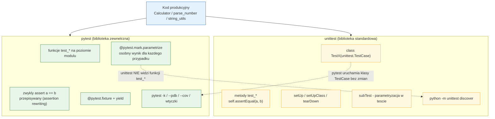
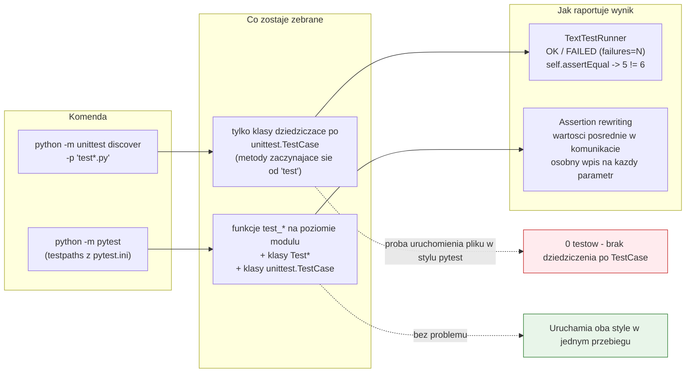

# Temat 07 - Porównanie frameworków: `unittest` i `pytest`

> Moduł: [01-OOP](../README.md) · Poprzedni: [06-unit-test-anatomy](../06-unit-test-anatomy/README.md) · Następny: *(koniec modułu)*

## Cel

Poznać **dwa frameworki testowe** dostępne w ekosystemie Pythona i umieć
świadomie wybrać jeden z nich (albo oba naraz). Po temacie student powinien
umieć:

- napisać ten sam zestaw testów w `unittest` (klasa `TestCase`, `assertEqual`,
  `setUp`, `subTest`) i w `pytest` (funkcje, `assert`, fixture, `parametrize`),
- wyjaśnić, dlaczego `assert` w pytest daje lepsze komunikaty porażki
  (*assertion rewriting*),
- uruchomić testy czterema sposobami: `unittest` w procesie, `unittest`
  z linii poleceń, `unittest discover`, `pytest`,
- wyjaśnić, dlaczego `pytest` uruchamia testy `unittest`, ale nie odwrotnie,
- zaplanować stopniową migrację istniejącego zestawu `TestCase` do `pytest`,
- wybrać narzędzie adekwatnie do ograniczeń projektu (np. brak prawa
  instalowania pakietów → `unittest`).

## Wymagania wstępne

- tematy [05](../05-aaa-pattern/README.md) i [06](../06-unit-test-anatomy/README.md),
- umiejętność czytania raportu `pytest`.

## Teoria

### 1. Dwa podejścia do tego samego zadania

Diagram [`diagrams/01-frameworks-comparison.mmd`](diagrams/01-frameworks-comparison.mmd):



### 2. `unittest` - standard biblioteczny

```python
class TestCalculatorArithmetic(unittest.TestCase):
    def setUp(self) -> None:
        self.calc = Calculator()            # świeży obiekt przed każdym testem

    def test_add_returns_sum(self) -> None:
        self.assertEqual(self.calc.add(2, 3), 5)

    def test_divide_by_zero_message_explains_the_reason(self) -> None:
        with self.assertRaisesRegex(ZeroDivisionError, "division by zero"):
            self.calc.divide(1, 0)
```

Zestaw asercji `unittest` (najważniejsze):

| Asercja | Odpowiednik w `pytest` |
|---|---|
| `assertEqual(a, b)` | `assert a == b` |
| `assertNotEqual(a, b)` | `assert a != b` |
| `assertTrue(x)` / `assertFalse(x)` | `assert x is True` / `assert x is False` |
| `assertIn(a, b)` / `assertNotIn` | `assert a in b` |
| `assertAlmostEqual(a, b, places=6)` | `assert a == pytest.approx(b)` |
| `assertRaises(T)` | `with pytest.raises(T):` |
| `assertRaisesRegex(T, "txt")` | `with pytest.raises(T, match="txt"):` |
| `self.subTest(...)` | `@pytest.mark.parametrize` |
| `@unittest.skip("powód")` | `@pytest.mark.skip("powód")` |
| `@unittest.expectedFailure` | `@pytest.mark.xfail` |

### 3. `pytest` - funkcje, `assert` i *assertion rewriting*

```python
@pytest.fixture
def calc() -> Calculator:
    return Calculator()


@pytest.mark.parametrize(("a", "b", "expected"), [(2, 3, 5), (-1, 1, 0)])
def test_add_returns_sum_for_multiple_pairs(calc, a, b, expected):
    assert calc.add(a, b) == pytest.approx(expected)
```

Przy porażce pytest pokazuje **wartości pośrednie**:

```text
>       assert calc.add(2, 3) == 5
E       assert 6 == 5
E        +  where 6 = calc.add(2, 3)
```

W `unittest` domyślnie otrzymujemy tylko `AssertionError: 6 != 5`, bez
informacji, *skąd* wzięła się „6”. To główny powód, dla którego nowe projekty
wybierają `pytest`.

### 4. Odkrywanie testów (discovery)

Diagram [`diagrams/02-discovery-and-run.mmd`](diagrams/02-discovery-and-run.mmd):



Reguły nazewnictwa:

| | `unittest` | `pytest` | Bezpieczna wspólna konwencja |
|---|---|---|---|
| pliki | `test*.py` | `test_*.py` lub `*_test.py` | **`test_*.py`** |
| funkcje | *(nie zbiera)* | `test_*` | **`test_*`** |
| klasy | `TestCase` (metody `test_*`) | `Test*` (bez `__init__`) | klasa `TestCase` |

### 5. Cztery sposoby uruchamiania

```bash
# 1. unittest - jeden plik (z katalogu examples)
cd src/01-OOP/07-testing-frameworks/examples
python -m unittest test_unittest_calculator -v
cd ../../../..

# 2. unittest - discover (cały katalog)
python -m unittest discover -s src/01-OOP/07-testing-frameworks/examples -v

# 3. unittest - pojedynczy test (identyfikator z kropkami)
python -m unittest test_unittest_calculator.TestCalculatorArithmetic.test_add_returns_sum

# 4. pytest - oba style naraz
python -m pytest src/01-OOP/07-testing-frameworks/examples -v
```

Skrypt [`examples/run_unittest_demo.py`](examples/run_unittest_demo.py) wykonuje
te warianty i pokazuje wynik każdego z nich, w tym próbę uruchomienia pliku
w stylu pytest przez `unittest` (`0 tests` - to oczekiwane!).

### 6. Podsumowanie praktyczne

| Kryterium | `unittest` | `pytest` |
|---|---|---|
| Instalacja | brak (biblioteka standardowa) | `pip install pytest` |
| Styl | klasy i metody | funkcje, opcjonalnie klasy |
| Asercje | metody `assertXxx` | `assert` z *rewriting* |
| Komunikat porażki | `5 != 6` | `5 != 6`, plus wartości pośrednie |
| Fixture'y | `setUp`/`tearDown` (dziedziczenie) | `@pytest.fixture` (kompozycja, `yield`) |
| Parametryzacja | `subTest` | `parametrize` (osobne wyniki) |
| Ekosystem | ograniczony | bardzo duży (coverage, xdist, mock, django, async) |
| Użycie w projektach | starsze, korporacyjne, „zero zależności” | dominujące w nowych projektach |
| Uruchamia drugi framework? | ❌ nie widzi funkcji `test_*` | ✅ tak, obsługuje `TestCase` |

Wniosek: **nowy projekt → `pytest`; istniejący zestaw `unittest` → nie migruj
hurtem**, dopisuj nowe testy w `pytest`, a stare uruchamiaj dalej (pytest
obsługuje oba style jednocześnie).

## Przykłady kodu

### Przykład 1 - `unittest`: klasy, `setUp`, `subTest`, `setUpClass`

Plik: [`examples/test_unittest_calculator.py`](examples/test_unittest_calculator.py)

```python
class TestCalculatorAverage(unittest.TestCase):
    def setUp(self) -> None:
        self.calc = Calculator()

    def test_average_of_empty_sequence_raises(self) -> None:
        with self.assertRaisesRegex(ValueError, "empty"):
            self.calc.average([])

    def test_average_accepts_tuple_and_list(self) -> None:
        for values in ([1, 2, 3], (3, 3, 3), [0]):
            with self.subTest(values=values):
                self.assertAlmostEqual(self.calc.average(values), sum(values) / len(values))
```

**Wyjaśnienie:** `setUp` tworzy świeży obiekt przed **każdym** testem (izolacja),
`setUpClass` - jeden raz dla całej klasy (drogie przygotowanie).
`subTest` uruchamia kolejne dane wejściowe nawet po porażce poprzednich
(w odróżnieniu od zwykłej pętli z `assert`), ale w raporcie pozostaje to
*jednym* testem.

### Przykład 2 - `pytest`: fixture, `parametrize`, `approx`

Plik: [`examples/test_pytest_calculator.py`](examples/test_pytest_calculator.py)

```python
@pytest.fixture
def calc() -> Calculator:
    return Calculator()


@pytest.mark.parametrize("values", [[5], [1, 2, 3, 4], (3, 3, 3), [0]])
def test_average_of_non_empty_sequence(calc, values):
    assert calc.average(values) == pytest.approx(sum(values) / len(values))
```

**Wyjaśnienie:** fixture jest zwykłą funkcją, więc można jej użyć w dowolnym
pliku (także przez `conftest.py`) i **składać** z innych fixture'ów - czego
`setUp` (oparty na dziedziczeniu) nie potrafi. `parametrize` tworzy osobny
przypadek testowy dla każdej wartości, więc raport wskazuje winowajcę
(np. `test_average_of_non_empty_sequence[values=[]]`).

### Przykład 3 - ten sam plik: `TestCase` i funkcje `test_*`

Plik: [`exercises/test_solutions_07.py`](exercises/test_solutions_07.py)

```python
class TestSlugifyUnittest(unittest.TestCase):
    def test_transliterates_polish_diacritics(self) -> None:
        self.assertEqual(slugify("Zażółć gęślą jaźń"), "zazolc-gesla-jazn")
    ...
@pytest.mark.parametrize(("text", "expected"),
                         [("Łódź", "lodz"), ("Kraków 2026", "krakow-2026")])
def test_slugify(text, expected):
    assert slugify(text) == expected
```

**Wyjaśnienie:** plik jest wykonywalny jednym poleceniem `pytest -v` i pokazuje
oba style obok siebie - różnice widać w raporcie natychmiast. To najlepszy
sposób, aby wyrobić sobie własne zdanie o obu frameworkach, a nie wierzyć
na słowo.

## Mini-lab (10 minut)

1. Uruchom `python examples/run_unittest_demo.py` i porównaj wynik
   `pytest` na pliku `unittest` oraz `unittest` na pliku `pytest`.
2. Zepsuj celowo jedną asercję w obu plikach i porównaj komunikaty porażki:
   `assert 6 == 5` a `AssertionError: 6 != 5`. Który szybciej wskazuje przyczynę?
3. Dodaj do `test_pytest_calculator.py` przypadek `(0, 0, 0)` w `parametrize`
   i sprawdź, ile pozycji pojawi się w raporcie.
4. Dodaj do `test_unittest_calculator.py` test z `@unittest.skip("wykład")`
   i sprawdź, jak pytest raportuje pominięty test (`-v` → `SKIPPED`).

## Zadania do samodzielnego wykonania

Pliki: [`exercises/string_utils.py`](exercises/string_utils.py) (kod do
testowania), [`exercises/tasks_07.py`](exercises/tasks_07.py) (treść zadań
i ściągawka), [`exercises/test_solutions_07.py`](exercises/test_solutions_07.py)
(rozwiązanie w obu frameworkach).

### Zadanie 1 - wersja `unittest` *(3 pkt)*

`TestStringUtils(unittest.TestCase)` dla `normalize`, `word_count`, `slugify`,
`truncate`.

**Podpowiedzi:**

- `with self.assertRaisesRegex(TypeError, "expected str")` - sprawdzaj typ
  i komunikat,
- `subTest` do sprawdzenia kilku wariantów `slugify` w jednym teście,
- przypadki brzegowe: `""`, `"   "`, `None`, `limit=3` i `limit=4`.

### Zadanie 2 - wersja `pytest` *(3 pkt)*

Funkcje z `parametrize` dla tego samego kodu.

**Podpowiedzi:**

- nazwy parametrów w `parametrize` decydują o czytelności raportu
  (`test_slugify[Łódź-lodz]`),
- `pytest.raises(..., match=...)` zamiast `assertRaisesRegex`,
- dopisz test własności: wynik `slugify` nigdy nie zawiera spacji.

### Zadanie 3 - porównanie *(2 pkt)*

Wnioski w komentarzu `# WNIOSKI:` (liczba linii, komunikaty, dodawanie
przypadków, narzędzia, koszt migracji).

**Podpowiedź:** uruchom **celowo zepsuty** test w obu wersjach i porównaj
komunikaty - to najmocniejszy argument w dyskusji.

### Zadanie 4 (dla chętnych) - eksperyment *(2 pkt)*

Sprawdź, który framework widzi testy drugiego, i opisz wynik w `# EKSPERYMENT:`.

**Podpowiedź:** `python -m unittest test_solutions_07 -v` zwróci `0 tests`,
a `pytest test_unittest_calculator.py -v` uruchomi wszystko. Zastanów się,
co to oznacza dla planu migracji.

## Jak uruchomić, skompilować i zdebugować

```bash
python -m compileall src/01-OOP/07-testing-frameworks
python src/01-OOP/07-testing-frameworks/examples/calculator.py
python src/01-OOP/07-testing-frameworks/examples/run_unittest_demo.py

# pytest - oba style naraz
python -m pytest src/01-OOP/07-testing-frameworks -c src/01-OOP/pytest.ini -v

# unittest - tylko klasy TestCase
python -m unittest discover -s src/01-OOP/07-testing-frameworks/examples -p "test*.py" -v

# unittest - pojedynczy test
cd src/01-OOP/07-testing-frameworks/examples; python -m unittest test_unittest_calculator.TestParseNumber.test_parses_comma_as_decimal_separator -v
```

### Debugowanie w VS Code

1. Otwórz `examples/test_pytest_calculator.py`, ustaw breakpoint w asercji.
2. `F5` → *Python: pytest (moduł 01-OOP)*, albo w panelu **Testing**
   (ikona kolby) kliknij „Debug Test” przy wybranym teście.
3. Klas `unittest.TestCase` nie musisz uruchamiać osobno: pytest je zbiera,
   więc w panelu **Testing** zobaczysz zarówno funkcje `test_*`, jak i metody
   `TestCase`. Aby przełączyć się na własny runner `unittest`, zmień w
   ustawieniach `python.testing.pytestEnabled` na `false`,
   a `python.testing.unittestEnabled` na `true`.
4. W *Debug Console* sprawdź `self.calc`, `values`, `len(values)`.

## Typowe błędy

| Objaw | Przyczyna | Poprawka |
|---|---|---|
| `python -m unittest` widzi 0 testów | testy w stylu pytest (funkcje) | uruchom `pytest` albo użyj klas `TestCase` |
| unittest nie znajduje pliku | katalog nie jest pakietem / zły wzorzec `-p` | `discover -s <katalog> -p "test*.py"` |
| `TypeError: TestCase.__init__() takes no arguments` | pytest próbuje utworzyć klasę `Test*` z `__init__` | nie definiuj `__init__` w klasach `Test*` dla pytest |
| `assertAlmostEqual` nie działa jak `approx` | różnica w semantyce (miejsca dziesiętne vs tolerancja względna) | użyj `assertAlmostEqual(a, b, delta=...)` lub przejdź na `approx` |
| all asserty przeszły, ale test „milczy” | brak asercji w teście | dodaj konkretną asercję |
| testy zależą od siebie w `unittest` | dane na poziomie modułu/klasy | twórz je w `setUp` |

## Pytania kontrolne

1. Wymień trzy różnice w zapisie testu między `unittest` a `pytest`.
2. Czym jest *assertion rewriting* i jaką korzyść daje przy diagnozie błędu?
3. Dlaczego `pytest` uruchamia `TestCase`, a `unittest` nie uruchamia funkcji
   `test_*`?
4. Jak w `unittest` osiągnąć efekt `@pytest.mark.parametrize`?
5. Jaka konwencja nazw plików pasuje obu frameworkom i dlaczego?
6. Kiedy wybrałbyś `unittest`, mimo przewagi `pytest` w wygodzie?

## Literatura i źródła

- pytest Docs - *Get Started*: <https://docs.pytest.org/en/stable/getting-started.html>
- pytest Docs - *How to write and report assertions*: <https://docs.pytest.org/en/stable/how-to/assert.html>
- pytest Docs - *How to parametrize fixtures and test functions*: <https://docs.pytest.org/en/stable/how-to/parametrize.html>
- pytest Docs - *Usage and Invocations*: <https://docs.pytest.org/en/stable/how-to/usage.html>
- pytest Docs - *How to run existing unittest tests*: <https://docs.pytest.org/en/stable/how-to/unittest.html>
- Python Docs - `unittest`: <https://docs.python.org/3/library/unittest.html>
- Python Docs - *Test discovery*: <https://docs.python.org/3/library/unittest.html#unittest-test-discovery>
- Real Python - *Python's unittest: Writing Unit Tests for Your Code*: <https://realpython.com/python-unittest/>
- Real Python - *Testing Your Code With pytest*: <https://realpython.com/pytest-python-testing/>
- Brian Okken, *Python Testing with pytest*, 2nd ed., Pragmatic Bookshelf, 2022.
