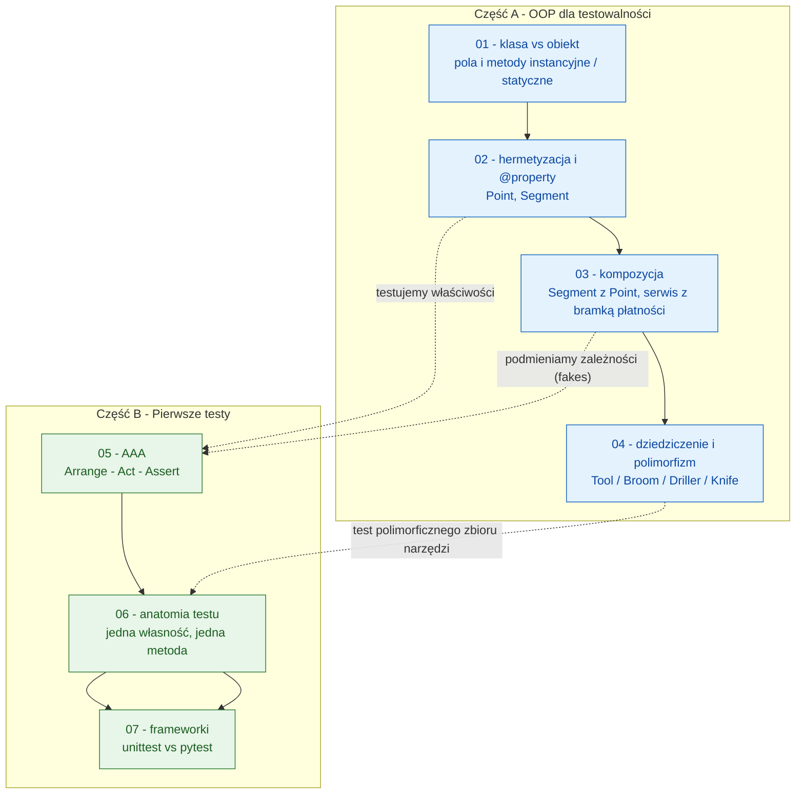

# Moduł 01 - OOP w kontekście testowalności i pierwsze testy jednostkowe

Ten moduł przypomina kluczowe konstrukcje programowania obiektowego w Pythonie
i pokazuje **dlaczego** mają one znaczenie dla automatyzacji testów. Kolejne
tematy prowadzą od pojęcia obiektu, przez hermetyzację i kompozycję, aż do
polimorfizmu, a następnie — na tym samym kodzie — do pierwszych testów
jednostkowych w `unittest` i `pytest`.

## Cele dydaktyczne

Po przerobieniu modułu student powinien:

- wyjaśniać różnicę między klasą a obiektem (instancją) oraz wiedzieć, kiedy
  użyć pola/metody instancyjnej, klasowej (`@classmethod`) i statycznej
  (`@staticmethod`),
- stosować hermetyzację w Pythonie: konwencja `_`/`__`, `@property`, walidację
  w `setter` i właściwości wyliczane (`@property` bez settera),
- budować obiekty przez **kompozycję** i rozumieć, jak kompozycja umożliwia
  *wstrzykiwanie zależności* (dependency injection) i podmianę obiektów
  na *test doubles* (stubs, fakes, mocks),
- modelować hierarchie klas, używać dziedziczenia i polimorfizmu oraz świadomie
  wybierać między dziedziczeniem, `ABC`/`Protocol` a kompozycją,
- zapisywać test według struktury **Arrange - Act - Assert**,
- sformułować test jednostkowy badający **jedną własność jednej metody**
  (nazwa, zakres, izolacja, determinizm),
- porównać `unittest` i `pytest`: styl klasowy vs funkcyjny, `assertEqual` vs
  `assert`, `setUp` vs fixture'y, `subTest` vs `parametrize`,
- uruchamiać, filtrować i debugować testy z poziomu Visual Studio Code.

## Struktura każdego tematu

Każdy katalog tematyczny zawiera:

- `README.md` - teoria, przykłady kodu, diagramy Mermaid, mini-lab i literatura,
- `diagrams/` - pliki `.mmd` (Mermaid) z diagramami objaśniającymi kod i pojęcia,
- `examples/` - uruchamialny kod demonstrujący koncepcje (część plików to testy),
- `exercises/` - zadania (`tasks_XX.py`), przykładowe rozwiązania
  (`solutions_XX.py`) i testy rozwiązań.

Wyjątek dotyczy tematów 05-07, w których **zadaniem studenta jest napisanie
testów**: tam `exercises/` zawiera gotowy kod produkcyjny (`shopping_cart.py`,
`string_utils.py`), treść zadania (`tasks_XX.py`) oraz **wzorcowy zestaw testów**
(`test_solutions_XX.py`) - to on jest rozwiązaniem.

## Spis tematów

### Część A - Konstrukcje OOP w kontekście testowalności

1. [01-class-vs-object](01-class-vs-object/README.md) - klasa a obiekt/instancja;
   pola i metody instancyjne, klasowe i statyczne.
2. [02-encapsulation-property](02-encapsulation-property/README.md) - hermetyzacja
   i `@property` (klasy `Point` i `Segment`).
3. [03-composition](03-composition/README.md) - kompozycja: klasy zawierające
   instancje innych klas; wstrzykiwanie zależności.
4. [04-inheritance-polymorphism](04-inheritance-polymorphism/README.md) -
   dziedziczenie i polimorfizm (interfejs narzędzi: `Tool`, `Broom`, `Driller`,
   `Knife`).

### Część B - Wprowadzenie do pisania pierwszych testów

5. [05-aaa-pattern](05-aaa-pattern/README.md) - struktura
   **Arrange - Act - Assert**.
6. [06-unit-test-anatomy](06-unit-test-anatomy/README.md) - sformułowanie testu
   jednostkowego: jedna własność, jedna metoda.
7. [07-testing-frameworks](07-testing-frameworks/README.md) - porównanie
   `unittest` i `pytest` na tym samym kodzie.

## Mapa modułu

Diagram pokazuje, jak tematy łączą się w jedną opowieść: od modelu obiektowego
do automatycznych testów.



## Uruchamianie

```bash
# Cały moduł (z katalogu głównego repozytorium)
python -m pytest src/01-OOP -c src/01-OOP/pytest.ini -v

# Wybrany temat
python -m pytest src/01-OOP/05-aaa-pattern -c src/01-OOP/pytest.ini -v

# Wybrany plik i wybrany test (filtr po nazwie)
python -m pytest src/01-OOP/07-testing-frameworks/exercises/test_solutions_07.py -k "aaa" -v

# Pojedynczy przykład (każdy plik examples/ ma sekcję __main__)
python src/01-OOP/04-inheritance-polymorphism/examples/02_tools_polymorphism.py

# Z pokryciem kodu
python -m pytest src/01-OOP -c src/01-OOP/pytest.ini --cov=src/01-OOP --cov-report=term-missing
```

W systemie Windows z katalogu głównego projektu używaj interpretera z venv:
`.venv\Scripts\python.exe -m pytest src\01-OOP -c src\01-OOP\pytest.ini -v`.

## Scenariusz 90-minutowych zajęć

| Czas   | Etap                                          | Temat                                                     |
|--------|-----------------------------------------------|-----------------------------------------------------------|
| 0-10   | Kontekst i motywacja                          | Po co OOP w testowaniu? Koszt regresji i refaktoryzacji    |
| 10-25  | Klasa vs obiekt + pola statyczne              | `Hero`, licznik instancji, `@staticmethod`                 |
| 25-40  | Hermetyzacja i `@property`                    | `Point`, `Segment`, walidacja, właściwości wyliczane        |
| 40-55  | Kompozycja i wstrzykiwanie zależności         | `Segment(Point, Point)`, `OrderService(PaymentGateway)`     |
| 55-70  | Dziedziczenie i polimorfizm                   | `Tool`, `Broom`, `Driller`, `Knife`, `ToolKit`              |
| 70-80  | Pierwszy test: AAA                            | `test_solutions_05.py` na żywo w VS Code                    |
| 80-87  | `unittest` vs `pytest`                        | Ten sam test w dwóch frameworkach                           |
| 87-90  | Podsumowanie                                  | Pytania kontrolne, praca domowa z `exercises/`              |

## Jak pracować z modułem na ćwiczeniach

Rekomendowany rytm pracy dla każdego tematu:

1. przeczytaj sekcje *Cel* i *Teoria* w README tematu,
2. uruchom kod z `examples/` i zmodyfikuj 1-2 elementy,
3. rozwiąż zadanie z `exercises/tasks_XX.py`,
4. porównaj z `exercises/solutions_XX.py`,
5. uruchom `exercises/test_solutions_XX.py` i sprawdź, czy Twoje rozwiązanie
   przechodzi te same przypadki brzegowe,
6. odpowiedz pisemnie na pytania kontrolne.

## Kryteria oceny prac studenckich

- poprawność działania i przejście testów (`pytest -v`),
- czytelność kodu (nazwy, podział odpowiedzialności, brak duplikacji),
- adekwatne użycie mechanizmów OOP (a nie „OOP dla samego OOP”),
- umiejętność uzasadnienia wyborów projektowych (np. kompozycja vs dziedziczenie),
- jakość testów: jedna własność na test, nazwy opisujące zachowanie, brak
  zależności między testami,
- jakość refaktoryzacji po informacji zwrotnej.

## Typowe pułapki poruszane w module

- mutowalny atrybut klasowy użyty jako „domyślna wartość” dla instancji,
- `@property` bez settera = atrybut tylko do odczytu (i to jest zaleta),
- setter, który nie waliduje - zaproszenie do niespójnego stanu obiektu,
- dziedziczenie tam, gdzie właściwa jest kompozycja,
- test sprawdzający kilka własności naraz (trudno ustalić przyczynę porażki),
- testy zależne od kolejności wykonania lub od zegara/systemu plików,
- porównywanie `float` operatorem `==` zamiast `pytest.approx`.

## Literatura przekrojowa

- Python Docs - *Classes*: <https://docs.python.org/3/tutorial/classes.html>
- Python Docs - *Data model*: <https://docs.python.org/3/reference/datamodel.html>
- Python Docs - `property`: <https://docs.python.org/3/library/functions.html#property>
- Python Docs - `abc`: <https://docs.python.org/3/library/abc.html>
- Python Docs - `typing.Protocol`: <https://docs.python.org/3/library/typing.html#typing.Protocol>
- Python Docs - `unittest`: <https://docs.python.org/3/library/unittest.html>
- pytest Docs: <https://docs.pytest.org/en/stable/>
- Real Python - *Python's property()*: <https://realpython.com/python-property/>
- Real Python - *Inheritance and Composition*: <https://realpython.com/inheritance-composition-python/>
- Kent Beck, *Test-Driven Development: By Example*, Addison-Wesley, 2002.
- Martin Fowler, *Mocks Aren't Stubs*: <https://martinfowler.com/articles/mocksArentStubs.html>
- E. Gamma, R. Helm, R. Johnson, J. Vlissides, *Design Patterns*, Addison-Wesley, 1994.
