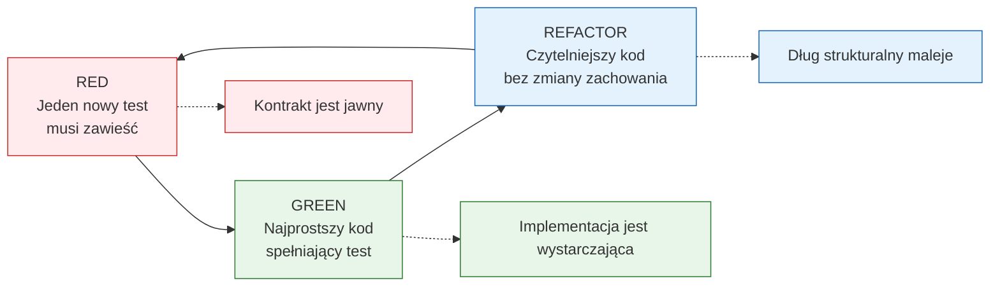
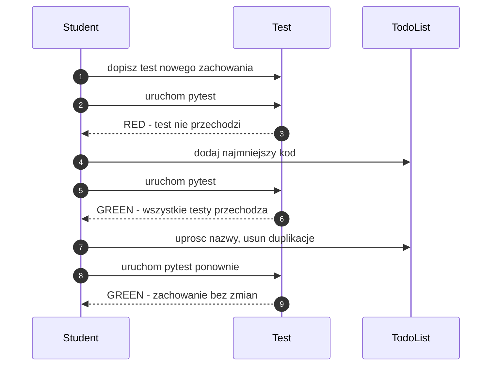

# Temat 01 - Cykl Red-Green-Refactor i filozofia TDD

> Moduł: [02-TDD](../README.md) · Następny: [02-test-pyramid-quadrants](../02-test-pyramid-quadrants/README.md)

## Cel

Zrozumieć TDD jako krótką pętlę projektową:

1. **Red** - zapisujemy jeden test opisujący brakujące zachowanie; test ma
   zakończyć się niepowodzeniem z właściwego powodu.
2. **Green** - implementujemy najprostszy kod, który spełnia test.
3. **Refactor** - poprawiamy strukturę kodu i testów bez zmiany zachowania.

TDD nie jest synonimem „napisaliśmy testy po kodzie”. To sposób podejmowania
decyzji projektowych na podstawie małych, wykonywalnych przykładów zachowania.

## Teoria

### Pętla informacji zwrotnej



Najważniejsze ograniczenie: w fazie Refactor **nie dodajemy nowego zachowania**.
Jeśli potrzebujemy nowego zachowania, wracamy do Red i najpierw zapisujemy test.

### Co powinien zawierać dobry krok Red?

- jedno małe zachowanie,
- nazwę testu będącą zdaniem o systemie,
- dane wejściowe i oczekiwany wynik,
- brak wiedzy o prywatnych polach implementacji.

Zły krok:

```python
# Za dużo wymagań naraz: filtrowanie, sortowanie, walidacja i formatowanie.
def test_todo_list_everything():
    ...
```

Dobry krok:

```python
def test_new_list_has_no_pending_items():
    todos = TodoList()

    assert todos.pending() == []
```

### Red musi być prawdziwy

Test, który od razu przechodzi przed implementacją, nie potwierdza cyklu TDD.
Może oznaczać, że:

- test nie ma asercji,
- test sprawdza przypadek już obsługiwany,
- test jest napisany względem implementacji zamiast zachowania,
- dane testowe nie trafiają do testowanej ścieżki.

### TDD a Test-First Development

| TDD | Test-First Development |
|---|---|
| mały test, implementacja, refaktoryzacja | często cały zestaw testów przed kodem |
| test wpływa na API i projekt | API bywa ustalone wcześniej |
| szybka informacja zwrotna | duży koszt zanim zobaczymy pierwszy wynik |
| testy rozwijają się razem z rozumieniem domeny | testy mogą odzwierciedlać początkowe, błędne założenia |
| wymaga dyscypliny małych kroków | łatwiej skończyć z dużą specyfikacją bez implementacji |

Test-First nie jest zawsze błędem. Antywzorzec pojawia się wtedy, gdy piszemy
cały test suite z góry, nie uruchamiamy go iteracyjnie i traktujemy testy jako
sztywny plan zamiast jako narzędzie uczenia się domeny.

## Przykład: `TodoList` rozwijany krok po kroku

Kod końcowy znajduje się w [examples/red_green_refactor_demo.py](examples/red_green_refactor_demo.py),
a testy w [examples/test_todo_list.py](examples/test_todo_list.py).

| Iteracja | Red - wymaganie | Green - minimalna implementacja | Refactor |
|---|---|---|---|
| 1 | nowa lista ma zero zadań oczekujących | `pending()` zwraca `[]` | nazwa `pending` opisuje zapytanie |
| 2 | dodanie tekstu tworzy zadanie | lista przechowuje tekst | wydzielamy `_items` |
| 3 | ukończenie zadania usuwa je z pending | zmiana flagi `done` | helper `_find` centralizuje wyszukiwanie |
| 4 | nie można ukończyć nieistniejącego zadania | `KeyError` | komunikat wyjątku zawiera identyfikator |
| 5 | zadanie nie może być puste | `ValueError` | walidacja na wejściu |

Diagram przepływu jednej iteracji:



## Zadania do samodzielnego wykonania

Pliki: [tasks_01.py](exercises/tasks_01.py), [tdd_solutions_01.py](exercises/tdd_solutions_01.py),
[test_tdd_solutions_01.py](exercises/test_tdd_solutions_01.py).

### Zadanie 1 - cykl dla `TodoList` *(3 pkt)*

Dopisz w kolejności testy dla pustej listy, dodawania zadania i oznaczania go
jako ukończone.

**Podpowiedzi:**

- przed każdą implementacją uruchom test i zapisz, dlaczego jest Red,
- w Green nie dodawaj sortowania ani funkcji, których test jeszcze nie wymaga,
- po Refactor uruchom cały plik, nie tylko ostatni test.

### Zadanie 2 - przypadki błędów *(2 pkt)*

Dodaj testy pustego tekstu oraz nieistniejącego identyfikatora.

**Podpowiedzi:**

- `pytest.raises(ValueError, match="empty")`,
- `pytest.raises(KeyError, match="missing")`,
- po błędzie sprawdź, że stan listy nie zmienił się.

### Zadanie 3 - własna reguła *(2 pkt)*

Dodaj filtrowanie po statusie albo priorytet zadania. Wybierz tylko jedną
regułę i przeprowadź pełne Red-Green-Refactor.

### Zadanie 4 - analiza procesu *(1 pkt)*

W komentarzu opisz, który test zmienił projekt API i dlaczego napisanie go
wcześniej niż implementacji było użyteczne.

## Uruchomienie i debugowanie

```bash
python -m compileall src/02-TDD/01-red-green-refactor
python src/02-TDD/01-red-green-refactor/examples/red_green_refactor_demo.py
python -m pytest src/02-TDD/01-red-green-refactor -v
```

W VS Code ustaw breakpoint w `complete()` i uruchom `Python: pytest (bieżący plik)`.
Podczas debugowania obserwuj zmianę statusu elementu po jednym wywołaniu.

## Pytania kontrolne

1. Dlaczego Red powinien pojawić się przed implementacją?
2. Czym różni się minimalny Green od „dobrego kodu produkcyjnego”?
3. Dlaczego Refactor nie może dodawać nowej funkcjonalności?
4. Kiedy Test-First Development staje się antywzorcem?
5. Jak rozpoznać test, który przechodzi z niewłaściwego powodu?

## Literatura

- Kent Beck, *Test-Driven Development: By Example*, Addison-Wesley, 2002.
- Martin Fowler, *Test Driven Development*: <https://martinfowler.com/bliki/TestDrivenDevelopment.html>
- pytest Docs - assertions: <https://docs.pytest.org/en/stable/how-to/assert.html>
- pytest Docs - test discovery: <https://docs.pytest.org/en/stable/explanation/goodpractices.html#test-discovery>
