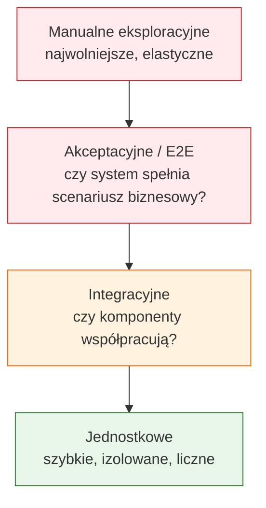
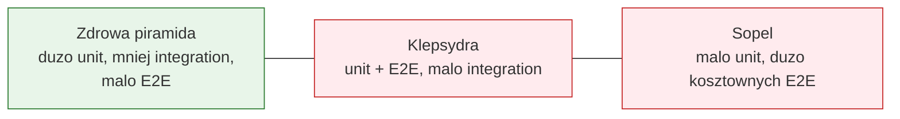

# Temat 02 - Piramida testów i kwadranty testów

> Moduł: [02-TDD](../README.md) · Poprzedni: [01-red-green-refactor](../01-red-green-refactor/README.md) · Następny: [03-technical-debt](../03-technical-debt/README.md)

## Cel

Nauczyć się dobierać poziom testu do pytania, na które chcemy odpowiedzieć.
Piramida przypomina o koszcie i szybkości testów, a kwadranty rozszerzają
perspektywę o cel testu: wsparcie zespołu albo ocena produktu oraz perspektywę
technologiczną albo biznesową.

## Piramida testów



Piramida nie oznacza „nigdy nie pisz E2E”. Oznacza, że większość reguł
powinna być sprawdzana tanio i lokalnie, a testy wyższych poziomów powinny
potwierdzać integrację i najważniejsze ścieżki użytkownika.

### Antywzorce

- **Klepsydra** - dużo testów jednostkowych i E2E, mało integracyjnych.
  Zespół ma luki w sprawdzaniu połączeń między komponentami.
- **Sopel** - prawie same testy E2E/manualne, mało szybkich testów jednostkowych.
  Każda informacja zwrotna jest droga i opóźniona.



## Kwadranty testów

| | Technologiczne | Biznesowe |
|---|---|---|
| **Wspierające zespół** | testy jednostkowe, komponentowe, narzędzia diagnostyczne | przykłady akceptacyjne, testy scenariuszy pomagające doprecyzować wymagania |
| **Sprawdzające produkt** | testy wydajności, bezpieczeństwa, kompatybilności | testy akceptacyjne, E2E, manualne eksploracyjne |

Kwadranty nie są ścisłą klasyfikacją plików. Pomagają zadać pytanie:
„Czy ten test pomaga nam budować produkt, czy przede wszystkim ocenia gotowy
produkt?” oraz „Czy patrzymy przez pryzmat technologii, czy wartości biznesowej?”.

## Jak wybrać poziom?

| Pytanie | Najlepszy pierwszy wybór |
|---|---|
| Czy rabat 10% daje poprawną kwotę? | test jednostkowy funkcji rabatowej |
| Czy koszyk zapisuje się w repozytorium? | test integracyjny serwisu i repozytorium |
| Czy klient może kupić produkt od początku do końca? | test akceptacyjny/E2E |
| Czy interfejs jest wygodny dla użytkownika? | test manualny/eksploracyjny |

Kod w [examples/layered_system.py](examples/layered_system.py) pokazuje tę
samą regułę rozbitą na jednostkę, integrację i scenariusz akceptacyjny.

## Zadania

Pliki: [tasks_02.py](exercises/tasks_02.py), [tdd_solutions_02.py](exercises/tdd_solutions_02.py),
[test_tdd_solutions_02.py](exercises/test_tdd_solutions_02.py).

1. Przyporządkuj dziesięć opisów testów do poziomów piramidy.
2. Napisz test integracyjny dla `CatalogService` z `MemoryCatalog`.
3. Zaprojektuj jeden test akceptacyjny dla scenariusza „kup produkt”.
4. Narysuj własną piramidę dla aplikacji webowej i wskaż antywzorzec sopla.

**Podpowiedzi:**

- test jednostkowy nie powinien wymagać pliku ani sieci,
- test integracyjny powinien sprawdzać rzeczywiste połączenie dwóch elementów,
- test akceptacyjny opisuj językiem użytkownika, nie nazwą prywatnej metody.

## Uruchomienie i debugowanie

```bash
python -m pytest src/02-TDD/02-test-pyramid-quadrants -v
python src/02-TDD/02-test-pyramid-quadrants/examples/layered_system.py
```

Ustaw breakpoint w `CatalogService.buy()` i porównaj, które obiekty widzi test
jednostkowy, a które test integracyjny.

## Pytania kontrolne

1. Dlaczego testy jednostkowe powinny stanowić podstawę piramidy?
2. Co jest ryzykiem antywzorca klepsydry?
3. Czym różni się test integracyjny od akceptacyjnego?
4. Do którego kwadrantu należy test wydajności API?
5. Czy test E2E może zastąpić test jednostkowy? Uzasadnij.

## Literatura

- Martin Fowler, *Test Pyramid*: <https://martinfowler.com/bliki/TestPyramid.html>
- Wikipedia, *Software testing*: <https://en.wikipedia.org/wiki/Software_testing>
- Lisa Crispin, Janet Gregory, *Agile Testing*, Addison-Wesley, 2009.
