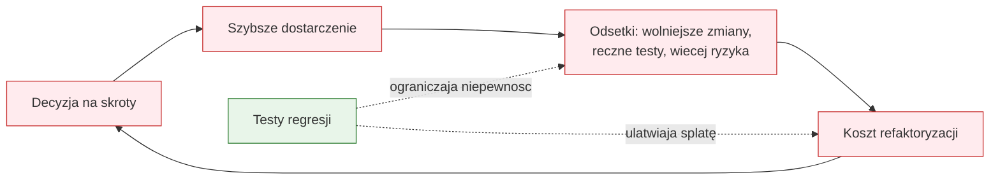

# Temat 03 - Dług technologiczny i koszt braku testów

> Moduł: [02-TDD](../README.md) · Poprzedni: [02-test-pyramid-quadrants](../02-test-pyramid-quadrants/README.md) · Następny: [04-first-and-test-scope](../04-first-and-test-scope/README.md)

## Cel

Zrozumieć, że brak testów nie jest neutralny. Każda niepewność przy zmianie
kodu zwiększa koszt kolejnych zmian: trzeba więcej ręcznie sprawdzać, trudniej
odróżnić regresję od nowej funkcji, a refaktoryzacja staje się ryzykowna.

## Definicja długu

Ward Cunningham opisywał dług jako koszt wynikający z decyzji, która pozwala
szybciej dostarczyć pierwszą wersję, ale utrudnia późniejsze zmiany. Dług nie
jest automatycznie zły: może być świadomym kredytem, jeśli znamy odsetki,
termin spłaty i powód zaciągnięcia.



### Kwadrant Martina Fowlera

| | Zamierzony | Niezamierzony |
|---|---|---|
| **Lekkomyślny** | „Nie mamy czasu na testy” | „Nie wiedzieliśmy, że kod będzie tak trudny” |
| **Rozważny** | „Dostarczymy wersję bez testów, ale spłacimy dług w tym sprincie” | „Testy były, ale nie chroniły publicznego zachowania” |

TDD nie eliminuje wszystkich rodzajów długu. Ogranicza przede wszystkim dług
wynikający z niepewności zachowania i zwiększa bezpieczeństwo refaktoryzacji.

## Brak testów a refaktoryzacja

Bez testów programista boi się zmieniać kod, więc często:

1. dopisuje kolejny warunek zamiast uprościć istniejący,
2. kopiuje fragment, bo wspólny helper jest ryzykowny,
3. zostawia martwy kod „na wszelki wypadek”,
4. przenosi testowanie na ręczną kontrolę po integracji,
5. odkłada poprawki i zwiększa odsetki długu.

Z testami regresji można zmienić strukturę wewnętrzną i natychmiast zobaczyć,
czy publiczne zachowanie pozostało bez zmian.

## Przykład kodu

[examples/debt_interest.py](examples/debt_interest.py) pokazuje funkcję napisaną
w pośpiechu oraz wersję refaktoryzowaną. Testy sprawdzają zachowanie faktury,
a nie kolejność instrukcji w środku.

```python
# Dług: logika cen, rabatu i podatku wymieszana w jednej funkcji.
def total_legacy(items, discount):
    value = 0
    for item in items:
        value += item["price"] * item["quantity"]
    if discount > 0:
        value = value - value * discount / 100
    return round(value * 1.23)
```

Refaktoryzacja wydziela obiekty i reguły, ale testy kontraktu pozostają takie same.

## Zadania

1. Zmierz, ile miejsc trzeba zmienić, gdy rabat z 10% staje się 15% w wersji
   proceduralnej i w wersji z `Invoice`.
2. Dopisz test regresji na kwotę ujemną.
3. Wskaż w kodzie trzy decyzje będące długiem lekkomyślnym i trzy rozważnym.
4. Napisz plan spłaty długu: test, refaktoryzacja, obserwowalność i kryterium
   zakończenia.

**Podpowiedzi:**

- mierz liczbę zmian i czas diagnozy, nie tylko liczbę linii,
- test powinien uruchamiać publiczną metodę `total()`;
- dług rozważny musi mieć właściciela i termin powrotu.

## Uruchomienie i debugowanie

```bash
python -m pytest src/02-TDD/03-technical-debt -v
python src/02-TDD/03-technical-debt/examples/debt_interest.py
```

Ustaw breakpoint w `Invoice.total()` i prześledź, jak test chroni wynik podczas
zmiany implementacji.

## Pytania kontrolne

1. Czym różni się dług zamierzony od niezamierzonego?
2. Dlaczego brak testów zwiększa odsetki długu?
3. Czy każdy kompromis techniczny jest długiem? Uzasadnij.
4. Jak test regresji zmienia koszt refaktoryzacji?
5. Jak poznać, że test jest zbyt związany z implementacją?

## Literatura

- Martin Fowler, *Technical Debt*: <https://martinfowler.com/bliki/TechnicalDebt.html>
- Ward Cunningham, *The WyCash Portfolio Management System*: <https://wiki.c2.com/?WardCunningham>
- Martin Fowler, *Refactoring*: <https://martinfowler.com/books/refactoring.html>
- Michael Feathers, *Working Effectively with Legacy Code*, Prentice Hall, 2004.
