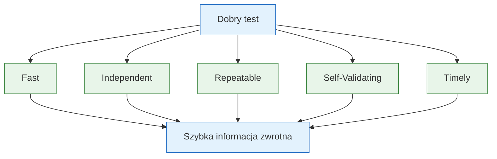
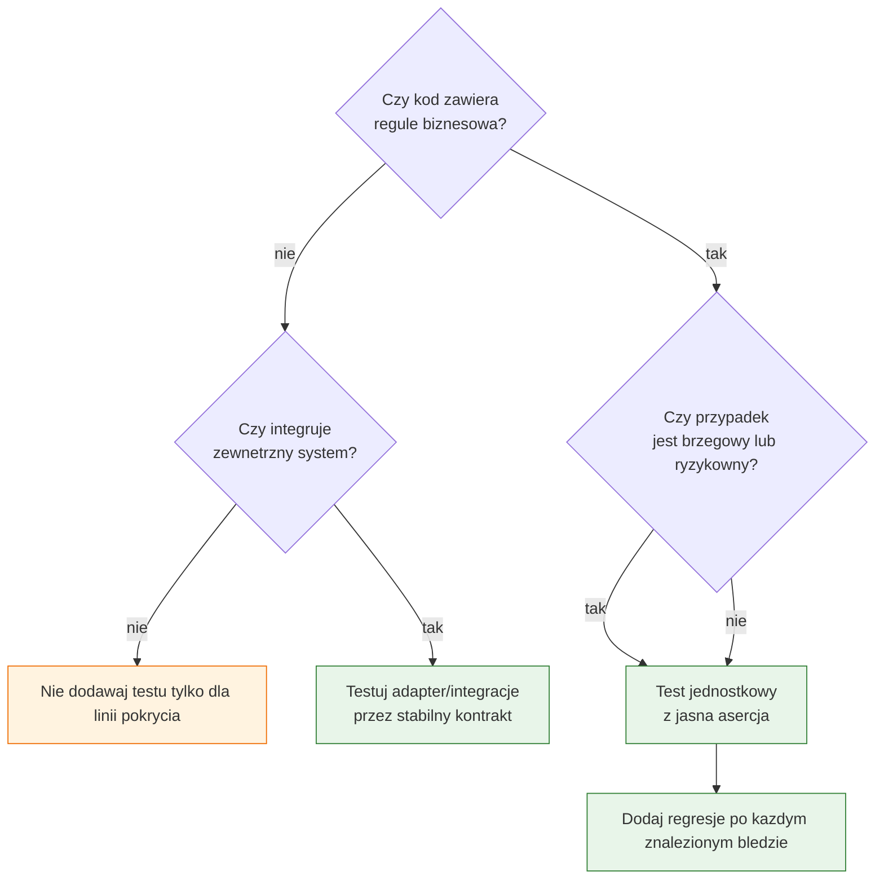

# Temat 04 - F.I.R.S.T. i zakres testowania

> Moduł: [02-TDD](../README.md) · Poprzedni: [03-technical-debt](../03-technical-debt/README.md) · Następny: [05-tdd-string-calculator](../05-tdd-string-calculator/README.md)

## Cel

Umieć ocenić, czy test jest dobrym testem jednostkowym oraz zdecydować,
co powinno być objęte testem. Testujemy zachowanie i ryzyko biznesowe,
a nie każdą linię kodu.

## F.I.R.S.T.

| Zasada | Znaczenie | Sygnał ostrzegawczy |
|---|---|---|
| **Fast** | test wykonuje się bardzo szybko | sieć, prawdziwa baza, `sleep()` |
| **Independent** | test nie zależy od innego testu | globalny stan, kolejność, wspólny plik |
| **Repeatable** | ten sam wynik wszędzie | zegar, losowość, system operacyjny |
| **Self-Validating** | wynik to Pass/Fail | konieczność czytania logów ręcznie |
| **Timely** | test powstaje przed kodem lub razem z nim | test dopisywany po regresji |



## Co testować?

### Testować

- reguły biznesowe i obliczenia,
- warunki brzegowe,
- wyjątki i komunikaty domenowe,
- przejścia stanu,
- kontrakt publicznego API,
- integrację z własnymi adapterami i repozytoriami.

### Zwykle unikać

- prostych getterów i setterów bez logiki,
- zewnętrznych bibliotek - testujemy własne użycie biblioteki,
- prywatnych szczegółów, jeśli są pokryte przez publiczne API,
- kolejności wywołań, jeśli nie jest częścią kontraktu,
- testów osiągających wysokie pokrycie, ale nie sprawdzających zachowania.

### Decyzja według ryzyka



## Przykład

[examples/first_rules.py](examples/first_rules.py) pokazuje kod deterministyczny,
który można testować bez sieci i bez zegara. W [test_first_rules.py](examples/test_first_rules.py)
każda asercja odpowiada konkretnej regule.

## Zadania

1. Oceń pięć podanych testów według F.I.R.S.T.
2. Zamień test zależny od `datetime.now()` na test z zamrożonym zegarem.
3. Napisz test regresji dla błędnego zaokrąglenia ceny.
4. Wskaż getter, którego nie należy testować osobno, oraz property, które
   zawiera logikę i powinno mieć test.

**Podpowiedzi:**

- `monkeypatch` izoluje środowisko, ale nie naprawia złej architektury,
- testuj przez API publiczne,
- jedna asercja może dokumentować kilka pól jednego wyniku, jeśli są jedną
  własnością kontraktu.

## Uruchomienie i debugowanie

```bash
python -m pytest src/02-TDD/04-first-and-test-scope -v
python src/02-TDD/04-first-and-test-scope/examples/first_rules.py
```

## Pytania kontrolne

1. Dlaczego test korzystający z prawdziwej sieci nie jest szybki i niezależny?
2. Co oznacza „self-validating”?
3. Czy 100% pokrycia oznacza dobrą jakość testów?
4. Kiedy prywatny szczegół może być uzasadnionym celem testu?
5. Dlaczego Timely łączy się z TDD?

## Literatura

- Robert C. Martin, *Clean Code*, rozdział o testach.
- Roy Osherove, *The Art of Unit Testing*, Manning.
- pytest Docs - monkeypatch: <https://docs.pytest.org/en/stable/how-to/monkeypatch.html>
- pytest Docs - temporary paths: <https://docs.pytest.org/en/stable/how-to/tmp_path.html>
