# Temat 05 - TDD: String Calculator

> Moduł: [02-TDD](../README.md) · Poprzedni: [04-first-and-test-scope](../04-first-and-test-scope/README.md) · Następny: [06-tdd-shopping-cart](../06-tdd-shopping-cart/README.md)

## Cel

Przeprowadzić pełny cykl TDD dla małej funkcji tekstowej. Każdy krok dodaje
jedno zachowanie i utrzymuje poprzednie testy.

## Kontrakt

`add(numbers: str) -> int`:

1. pusty tekst zwraca `0`,
2. jeden numer zwraca jego wartość,
3. dwa numery rozdzielone przecinkiem zwracają sumę,
4. działa dowolna liczba elementów,
5. nowa linia jest separatorem obok przecinka,
6. liczby ujemne powodują `NegativeNumberError` z listą wartości.

## Historia Red-Green-Refactor

```mermaid
flowchart LR
    R1["Red 1<br/>'' -> 0"] --> G1["Green 1<br/>if not text: 0"]
    G1 --> R2["Red 2<br/>'7' -> 7"]
    R2 --> G2["Green 2<br/>parse int"]
    G2 --> R3["Red 3<br/>'1,2' -> 3"]
    R3 --> G3["Green 3<br/>split comma"]
    G3 --> R4["Red 4<br/>newline + wiele"]
    R4 --> G4["Green 4<br/>regex separator"]
    G4 --> R5["Red 5<br/>ujemne -> wyjatek"]
    R5 --> G5["Green 5<br/>walidacja domenowa"]
    G5 --> F["Refactor<br/>male funkcje pomocnicze"]
    F --> R5
    classDef red fill:#ffebee,stroke:#c62828
    classDef green fill:#e8f5e9,stroke:#2e7d32
    class R1,R2,R3,R4,R5 red
    class G1,G2,G3,G4,G5,F green
```



### Iteracje

| Krok | Test | Minimalny Green | Refactor |
|---|---|---|---|
| 1 | `add("") == 0` | zwróć 0 dla pustego wejścia | nazwa `add` opisuje kontrakt |
| 2 | `add("7") == 7` | `int(numbers)` | wydziel `parse_numbers` |
| 3 | `add("1,2") == 3` | `split(",")` | generator liczb |
| 4 | `add("1,2,3\n4") == 10` | normalizacja separatorów | stała wzorca separatora |
| 5 | `add("1,-2")` rzuca wyjątek | sprawdź ujemne przed sumą | własny wyjątek i czytelny komunikat |

## Kod i testy

Kod końcowy: [examples/string_calculator.py](examples/string_calculator.py).
Testy: [examples/test_string_calculator.py](examples/test_string_calculator.py).

```python
class NegativeNumberError(ValueError):
    def __init__(self, numbers: list[int]) -> None:
        self.numbers = numbers
        super().__init__(f"negative numbers are not allowed: {numbers}")


def add(numbers: str) -> int:
    if not numbers:
        return 0
    values = [int(value.strip()) for value in re.split(r",|\n", numbers)]
    negatives = [value for value in values if value < 0]
    if negatives:
        raise NegativeNumberError(negatives)
    return sum(values)
```

Refactor nie zmienił kontraktu. Testy opisują zachowanie i nie wiedzą, czy użyto
`re`, pętli czy generatora.

## Zadania

1. Dodaj separator deklarowany przez tekst `//[;]\n1;2`.
2. Obsłuż kilka deklarowanych separatorów, np. `//[***][%]\n1***2%3`.
3. Dodaj regułę ignorowania liczb większych niż 1000.
4. Każdą zmianę wprowadzaj przez osobny Red-Green-Refactor.

**Podpowiedzi:**

- najpierw napisz test dla separatora, dopiero potem parser,
- testuj listę wszystkich liczb ujemnych, nie tylko pierwszą,
- nie modyfikuj wcześniejszych testów, jeśli stare zachowanie nadal jest wymagane.

## Uruchomienie i debugowanie

```bash
python -m compileall src/02-TDD/05-tdd-string-calculator
python src/02-TDD/05-tdd-string-calculator/examples/string_calculator.py
python -m pytest src/02-TDD/05-tdd-string-calculator -v
```

Ustaw breakpoint po zbudowaniu listy `values`. W debuggerze sprawdź, czy Red
wynika z braku implementacji, czy z błędnych danych testowych.

## Pytania kontrolne

1. Dlaczego krok „dowolna liczba elementów” powinien powstać po dwóch liczbach?
2. Gdzie powinien być sprawdzany wyjątek dla liczb ujemnych?
3. Czy parser separatorów należy testować jako osobny komponent?
4. Jak refaktoryzacja zmniejsza dług bez zmiany zachowania?

## Literatura

- Roy Osherove, *The String Calculator Kata*: <https://osherove.com/tdd-kata-1>
- Kent Beck, *Test-Driven Development: By Example*, Addison-Wesley, 2002.
- pytest Docs - parametrization: <https://docs.pytest.org/en/stable/how-to/parametrize.html>
