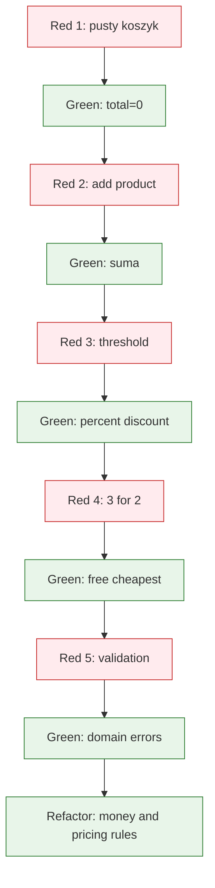

# Temat 06 - TDD: Shopping Cart i system rabatowy

> Moduł: [02-TDD](../README.md) · Poprzedni: [05-tdd-string-calculator](../05-tdd-string-calculator/README.md) · Następny: [07-tdd-bank-account](../07-tdd-bank-account/README.md)

## Cel

Zastosować TDD do reguł biznesowych, w których pojawia się stan, pieniądze,
rabaty progowe i promocja „3 w cenie 2”. Ćwiczenie pokazuje, dlaczego
najpierw warto ustalić kontrakt kwot w groszach, a dopiero później projektować
klasy.

## Kontrakt rozwijany iteracyjnie

1. pusty koszyk ma sumę `0`,
2. dodanie produktu zwiększa sumę,
3. wiele sztuk tego samego produktu zwiększa ilość,
4. próg kwotowy uruchamia rabat procentowy,
5. promocja `3_for_2` nalicza najtańszą sztukę za `0`,
6. usunięcie produktu aktualizuje sumę,
7. ujemna cena i ilość niedodatnia są odrzucane.



## Decyzje projektowe

- pieniądze przechowujemy jako `int` w groszach,
- rabat jest osobną wartością domenową, nie formatowaniem tekstu,
- `CartLine` opisuje produkt i ilość,
- promocja `3_for_2` działa tylko dla wskazanej kategorii,
- testy sprawdzają `total_cents`, a nie prywatny słownik koszyka.

## Kod i testy

Kod: [examples/tdd_shopping_cart.py](examples/tdd_shopping_cart.py).
Testy: [examples/test_tdd_shopping_cart.py](examples/test_tdd_shopping_cart.py).

```python
cart.add(Product("book", "ksiazka", "books", 5000), quantity=3)
cart.add(Product("pen", "dlugopis", "stationery", 100), quantity=2)
cart.apply_threshold_discount(minimum_cents=10_000, percent=10)
assert cart.total_cents() == 13_680
```

Każda linia powyżej może być osobnym krokiem TDD: najpierw test na pusty
koszyk, potem dodawanie, potem reguła rabatowa.

## Zadania

1. Dodaj rabat progowy zależny od kategorii.
2. Dodaj promocję „drugi produkt 50% taniej”.
3. Dodaj kupon kwotowy, ale nie pozwól, aby suma spadła poniżej zera.
4. Dodaj test regresji, który udowodni, że rabat nie zmienia ceny bazowej
   produktu ani ilości w koszyku.
5. Przeprowadź co najmniej cztery iteracje Red-Green-Refactor i opisz je
   w tabeli w swoim README.

**Podpowiedzi:**

- najpierw testuj jedną pozycję, dopiero potem wiele pozycji,
- w promocji `3_for_2` posortuj ceny lub policz pełne grupy po trzy,
- użyj `pytest.approx` tylko dla współczynników, kwoty trzymaj jako `int`.

## Uruchomienie i debugowanie

```bash
python -m compileall src/02-TDD/06-tdd-shopping-cart
python src/02-TDD/06-tdd-shopping-cart/examples/tdd_shopping_cart.py
python -m pytest src/02-TDD/06-tdd-shopping-cart -v
```

Breakpoint ustaw w `total_cents()` przed zastosowaniem każdej reguły cenowej.

## Pytania kontrolne

1. Dlaczego ceny są przechowywane jako grosze?
2. Czy rabat powinien zmieniać stan produktu?
3. Jak rozbić promocję `3_for_2` na małe testy?
4. Który test powinien powstać pierwszy: próg rabatowy czy wiele produktów?
5. Jak rozpoznać, że test jest związany z prywatną reprezentacją koszyka?

## Literatura

- Kent Beck, *Test-Driven Development: By Example*.
- Martin Fowler, *Test Pyramid*: <https://martinfowler.com/bliki/TestPyramid.html>
- pytest Docs - parametrization: <https://docs.pytest.org/en/stable/how-to/parametrize.html>
