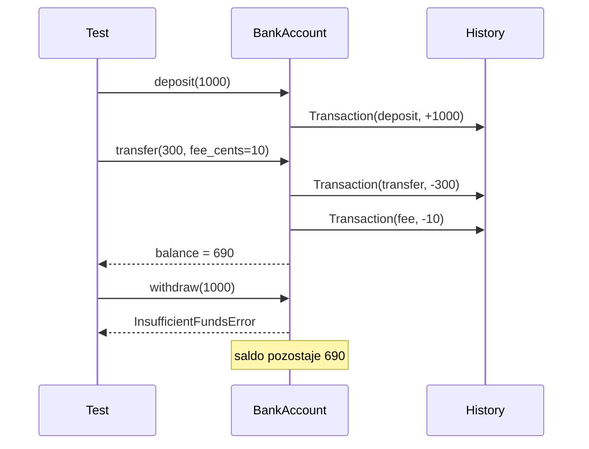

# Temat 07 - TDD: konto bankowe i rejestr transakcji

> Moduł: [02-TDD](../README.md) · Poprzedni: [06-tdd-shopping-cart](../06-tdd-shopping-cart/README.md) · Następny: [08-tdd-review-and-practice](../08-tdd-review-and-practice/README.md)

## Cel

Przećwiczyć TDD dla obiektu ze stanem, wyjątkami domenowymi, historią zdarzeń
i regułami pobierania opłat. To przykład, w którym kolejność operacji ma
znaczenie, ale test nadal powinien mówić o zachowaniu publicznym.

## Kontrakt rozwijany iteracyjnie

1. nowe konto ma saldo `0`,
2. wpłata zwiększa saldo,
3. wypłata zmniejsza saldo,
4. wypłata powyżej salda rzuca `InsufficientFundsError` i nie zmienia stanu,
5. historia przechowuje transakcje w kolejności,
6. przelew pobiera opłatę i rejestruje ją jako osobną transakcję,
7. kwoty niedodatnie są odrzucane.



## Reguły projektowe

- kwoty są całkowite i wyrażone w groszach,
- własny wyjątek opisuje błąd domenowy,
- nieudana operacja nie zapisuje częściowej transakcji,
- historia jest zwracana jako kopia, aby klient nie mógł zmienić stanu konta,
- testy nie sprawdzają prywatnej listy, tylko `history`.

## Kod i testy

Kod: [examples/bank_account.py](examples/bank_account.py).
Testy: [examples/test_bank_account.py](examples/test_bank_account.py).

```python
with pytest.raises(InsufficientFundsError):
    account.withdraw(10_001)
assert account.balance_cents == 10_000
```

To jest ważny test regresji: wyjątek nie może być tylko komunikatem; musi też
pozostawić obiekt w spójnym stanie.

## Zadania

1. Dodaj limit dzienny wypłat.
2. Dodaj przelew między dwoma kontami i test atomowości: jeśli konto źródłowe
   nie ma środków, konto docelowe nie dostaje pieniędzy.
3. Dodaj opłatę procentową z minimalną kwotą.
4. Dodaj test historii po nieudanej operacji i uzasadnij, czy błąd powinien
   pojawić się w historii audytowej.
5. Przeprowadź minimum trzy iteracje Red-Green-Refactor.

**Podpowiedzi:**

- najpierw zapisuj oczekiwane saldo, potem sprawdzaj historię,
- opłatę pobierz dopiero po sprawdzeniu dostępności środków,
- nieudany przelew wymaga testu stanu obu kont.

## Uruchomienie i debugowanie

```bash
python -m compileall src/02-TDD/07-tdd-bank-account
python src/02-TDD/07-tdd-bank-account/examples/bank_account.py
python -m pytest src/02-TDD/07-tdd-bank-account -v
```

Breakpoint ustaw w `transfer()`: obserwuj moment walidacji, zmianę salda
oraz dopisanie transakcji.

## Pytania kontrolne

1. Dlaczego wyjątek domenowy jest lepszy od zwykłego `ValueError`?
2. Jak zapewnić brak częściowej zmiany stanu po błędzie?
3. Czy opłata powinna być osobną transakcją w historii?
4. Jak przetestować atomowość przelewu?
5. Które testy są jednostkowe, a które integracyjne?

## Literatura

- Kent Beck, *Test-Driven Development: By Example*.
- Martin Fowler, *Mocks Aren't Stubs*: <https://martinfowler.com/articles/mocksArentStubs.html>
- Python Docs - exceptions: <https://docs.python.org/3/tutorial/errors.html>
- pytest Docs - `raises`: <https://docs.pytest.org/en/stable/how-to/assert.html#assertions-about-expected-exceptions>
