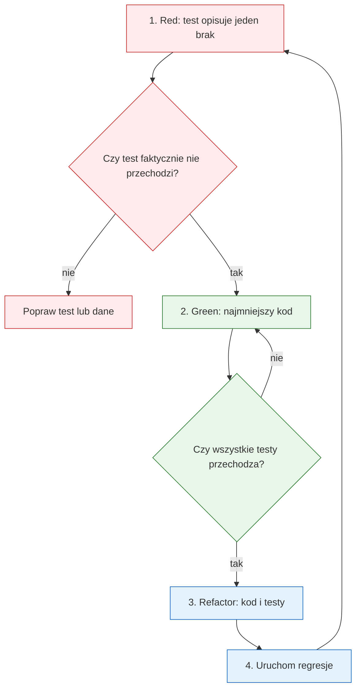

# Temat 08 - Podsumowanie TDD i laboratorium

> Moduł: [02-TDD](../README.md) · Poprzedni: [07-tdd-bank-account](../07-tdd-bank-account/README.md)

## Cel

Połączyć filozofię, dobór poziomu testu, F.I.R.S.T. i dług technologiczny
w jednym zadaniu projektowym. Student powinien umieć zaplanować małą serię
iteracji TDD i uzasadnić, dlaczego każdy test powstał właśnie w tym momencie.

## Checklista jednej iteracji



## Laboratorium końcowe

Wybierz jedną domenę: biblioteka, rezerwacja sal albo lista zakupów.
Zaimplementuj minimum pięć iteracji:

1. pusty stan,
2. podstawowa operacja,
3. drugi przypadek danych,
4. warunek brzegowy lub wyjątek,
5. refaktoryzacja i test regresji.

W sprawozdaniu zamieść tabelę:

| Iteracja | Red - test | Green - implementacja | Refactor | Poziom testu |
|---|---|---|---|---|
| 1 | ... | ... | ... | unit |
| 2 | ... | ... | ... | unit/integration |

## Zadania

1. Przejrzyj trzy projekty z tematów 05-07 i wskaż po jednym przykładzie
   Red, Green i Refactor.
2. Wybierz jeden test integracyjny i spróbuj zastąpić zależność fake'em.
3. Znajdź dług technologiczny w swoim projekcie i dopisz test, który zmniejsza
   ryzyko jego spłaty.
4. Oceń pięć własnych testów według F.I.R.S.T.
5. Napisz krótką notatkę: „Jak rozpoznam, że mój test jest zbyt duży?”.

## Uruchomienie i debugowanie

```bash
python -m pytest src/02-TDD -v
python -m ruff check src/02-TDD
python -m compileall src/02-TDD
```

W VS Code uruchamiaj test pojedynczo, używając breakpointów w fazie Act.

## Kryteria oceny

- pięć małych, sensownych iteracji,
- każdy Red ma uzasadnienie,
- Green nie zawiera niepotrzebnej generalizacji,
- Refactor zachowuje przechodzenie regresji,
- testy publicznego zachowania są niezależne,
- student umie wskazać koszt i sposób spłaty długu.

## Literatura

- Kent Beck, *Test-Driven Development: By Example*.
- Martin Fowler, *Test Pyramid*: <https://martinfowler.com/bliki/TestPyramid.html>
- Martin Fowler, *Technical Debt*: <https://martinfowler.com/bliki/TechnicalDebt.html>
