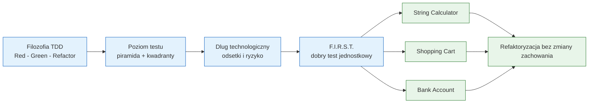

# Moduł 02 - TDD w Pythonie

Moduł pokazuje rozwijanie oprogramowania sterowane testami: od filozofii
Red-Green-Refactor, przez dobór poziomu testu i ocenę długu technologicznego,
do trzech kompletnych przykładów rozwijanych iteracyjnie.

## Cel zajęć

Po przerobieniu modułu student powinien:

- wyjaśnić cykl Red-Green-Refactor i uzasadnić, dlaczego małe iteracje są
  ważniejsze niż samo posiadanie dużego zbioru testów,
- odróżnić TDD od jednorazowego Test-First Development,
- dobierać testy do piramidy testów i kwadrantów testów,
- rozpoznawać dług technologiczny oraz jego koszt odsetek,
- stosować zasady F.I.R.S.T.,
- oceniać, co powinno być testowane przez API publiczne, a czego nie warto
  testować bezpośrednio,
- przeprowadzić pełny cykl TDD dla logiki tekstowej, zakupowej i bankowej.

## Struktura tematów

1. [01-red-green-refactor](01-red-green-refactor/README.md) - cykl TDD i
   różnica między TDD a Test-First Development.
2. [02-test-pyramid-quadrants](02-test-pyramid-quadrants/README.md) - piramida,
   antywzorce klepsydry i sopla oraz kwadranty testów.
3. [03-technical-debt](03-technical-debt/README.md) - dług technologiczny,
   jego odmiany i wpływ braku testów na refaktoryzację.
4. [04-first-and-test-scope](04-first-and-test-scope/README.md) - F.I.R.S.T.,
   zakres testu oraz decyzja, co testować, a czego unikać.
5. [05-tdd-string-calculator](05-tdd-string-calculator/README.md) - String
   Calculator rozwijany krok po kroku.
6. [06-tdd-shopping-cart](06-tdd-shopping-cart/README.md) - koszyk zakupowy
   i reguły rabatowe rozwijane krok po kroku.
7. [07-tdd-bank-account](07-tdd-bank-account/README.md) - konto bankowe i
   rejestr transakcji rozwijane krok po kroku.

## Mapa modułu



## Uruchamianie

```powershell
# Z katalogu głównego repozytorium
.venv\Scripts\python.exe -m pytest src\02-TDD -c src\02-TDD\pytest.ini -v

# Wybrany przykład
.venv\Scripts\python.exe -m pytest src\02-TDD\05-tdd-string-calculator -v

# Tylko testy regresyjne trzech projektów TDD
.venv\Scripts\python.exe -m pytest src\02-TDD -k "string_calculator or shopping_cart or bank_account" -v

# Ruff
.venv\Scripts\python.exe -m ruff check src\02-TDD

# Diagramy
.venv\Scripts\python.exe src\02-TDD\generate_diagrams.py
```

## Scenariusz 90-minutowego wykładu

| Czas | Etap | Treść |
|---|---|---|
| 0-12 min | Filozofia | TDD jako pętla informacji zwrotnej, nie „testowanie po fakcie” |
| 12-25 min | Piramida i kwadranty | Koszt testu, izolacja, klepsydra, sopel |
| 25-35 min | Dług technologiczny | Odsetki długu i rola testów jako zabezpieczenia refaktoryzacji |
| 35-45 min | F.I.R.S.T. | Ocena jakości testu na konkretnych przykładach |
| 45-60 min | Live coding 1 | String Calculator: pięć krótkich iteracji |
| 60-75 min | Live coding 2 | Shopping Cart: logika biznesowa i test regresyjny |
| 75-87 min | Live coding 3 | Bank Account: wyjątki, historia i opłaty |
| 87-90 min | Podsumowanie | Co było Red, co było Green, gdzie nastąpił Refactor? |

## Jak pracować z modułem

1. Przeczytaj README wybranego tematu.
2. Uruchom testy przed zmianą kodu i zapisz wynik.
3. Dla projektów 05-07 wykonuj kroki w README w kolejności: Red, Green, Refactor.
4. Nie przeskakuj od razu do rozwiązania; plik `tasks_XX.py` opisuje kontrakt,
   a `solutions_XX.py` pokazuje jedną z możliwych implementacji.
5. Po każdej iteracji uruchom testy i zapisz, jaki błąd został wykryty.

## Kryteria oceny

- test opisuje zachowanie, a nie szczegół implementacji,
- każda iteracja TDD jest mała i ma jasny cel,
- testy są szybkie, niezależne i powtarzalne,
- refaktoryzacja nie zmienia publicznego kontraktu,
- student potrafi wskazać koszt długu i uzasadnić wybór poziomu testu,
- kod rozwiązania przechodzi testy pozytywne, brzegowe i wyjątków.

## Literatura i źródła

- Kent Beck, *Test-Driven Development: By Example*, Addison-Wesley, 2002.
- Robert C. Martin, *Clean Code*, Prentice Hall, 2008.
- Martin Fowler, *Test Pyramid*: <https://martinfowler.com/bliki/TestPyramid.html>
- Martin Fowler, *Technical Debt*: <https://martinfowler.com/bliki/TechnicalDebt.html>
- Martin Fowler, *Test Driven Development*: <https://martinfowler.com/bliki/TestDrivenDevelopment.html>
- Ward Cunningham, *The WyCash Portfolio Management System*: <https://wiki.c2.com/?WardCunningham>
- Lisa Crispin, Janet Gregory, *Agile Testing*, Addison-Wesley, 2009.
- pytest Docs - assertions: <https://docs.pytest.org/en/stable/how-to/assert.html>
- pytest Docs - fixtures: <https://docs.pytest.org/en/stable/how-to/fixtures.html>
