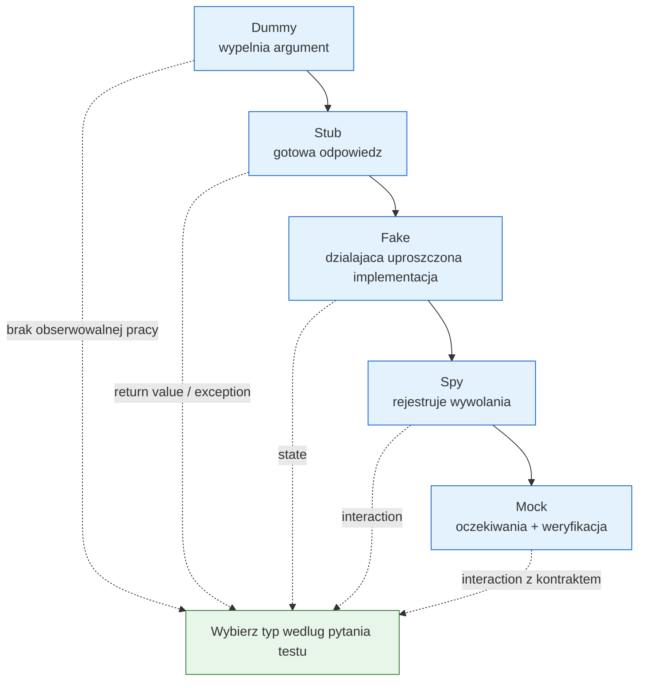

# Temat 01 - Taksonomia Test Doubles

> Moduł: [03-test_double](../README.md) · Następny: [02-verification-and-tools](../02-verification-and-tools/README.md)

## Cel

Rozróżniać pięć typów atrap testowych i umieć odpowiedzieć, czy test sprawdza
wynik, stan czy interakcję.

## Taksonomia

| Typ | Rola | Czy ma działającą logikę? | Co zwykle asercja sprawdza? |
|---|---|---:|---|
| **Dummy** | wypełnia wymagany parametr, ale nie jest używany | nie | testowany komponent nie korzysta z niego |
| **Stub** | zwraca z góry przygotowane odpowiedzi | minimalnie | wynik lub wyjątek komponentu |
| **Fake** | uproszczona, działająca implementacja | tak | stan lub wynik |
| **Spy** | zapisuje wywołania i argumenty | zwykle tak | interakcję po wykonaniu akcji |
| **Mock** | ma oczekiwania i weryfikuje je automatycznie | niekoniecznie | interakcję, często podczas wywołania |



## Przykład jednej zależności

Kod w [examples/taxonomy_examples.py](examples/taxonomy_examples.py) używa
`Notifier`, który wysyła komunikat. Ten sam `AlertService` może dostać:

```python
service = AlertService(notifier)
service.alert("silnik przegrzany")
```

- Dummy: `UnusedNotifier`, gdy test dotyczy tylko walidacji pustego komunikatu.
- Stub: `StubNotifier`, gdy chcemy ustalić, że wysyłka zwróci `"accepted"`.
- Fake: `InMemoryNotifier`, gdy chcemy mieć prostą działającą listę wysłanych
    komunikatów.
- Spy: `RecordingNotifier`, gdy po akcji sprawdzamy argumenty wywołania.
- Mock: `Mock(spec=Notifier)`, gdy oczekiwanie ma być ścisłe i automatycznie
    zweryfikowane przez `assert_called_once_with`.

## Nie mieszaj roli z technologią

`Mock` z `unittest.mock` jest narzędziem, ale nie każdy obiekt typu Mock jest
automatycznie dobrym testem. Można użyć `Mock` jako Stub (`return_value`), Spy
(`mock_calls`) albo Mock z oczekiwaniami. Nazwa roli mówi **po co** obiekt jest
w teście, a nie jak został technicznie utworzony.

## Zadania

1. Napisz Dummy dla `AlertService`, który nie powinien zostać wywołany.
2. Zbuduj Stub zwracający `"accepted"` i przetestuj wynik `alert()`.
3. Zbuduj Fake przechowujący komunikaty w pamięci.
4. Zbuduj Spy i sprawdź listę wywołań oraz argumentów.
5. Zastąp Spy Mockiem ze `spec=Notifier`; dodaj oczekiwanie dokładnej liczby
     wywołań.

**Podpowiedzi:**

- Stub nie musi zapisywać wywołania, jeśli test nie sprawdza interakcji,
- Spy powinien mieć jawne pole `calls`,
- `spec` chroni przed literówką w nazwie metody,
- nie mockuj klasy testowanej; mockuj jej zewnętrzną zależność.

## Uruchomienie i debugowanie

```bash
python -m pytest src/03-test_double/01-test-double-taxonomy -v
python src/03-test_double/01-test-double-taxonomy/examples/taxonomy_examples.py
```

Ustaw breakpoint w `AlertService.alert()` i porównaj obiekt zależności dla
Dummy, Stub, Fake, Spy i Mock.

## Pytania kontrolne

1. Czym różni się Stub od Fake?
2. Dlaczego Spy jest przydatny po wykonaniu akcji?
3. Kiedy Mock może zbyt mocno związać test z implementacją?
4. Czy Dummy powinien mieć działające metody?
5. Jak rozpoznać, że Fake jest zbyt podobny do produkcyjnej bazy danych?

## Literatura

- Gerard Meszaros, *xUnit Test Patterns*: <http://xunitpatterns.com/Test%20Stub.html>
- Martin Fowler, *Mocks Aren't Stubs*: <https://martinfowler.com/articles/mocksArentStubs.html>
- Gerard Meszaros, *Test Double Patterns*: <http://xunitpatterns.com/Test%20Double.html>
- Python Docs - `unittest.mock`: <https://docs.python.org/3/library/unittest.mock.html>
