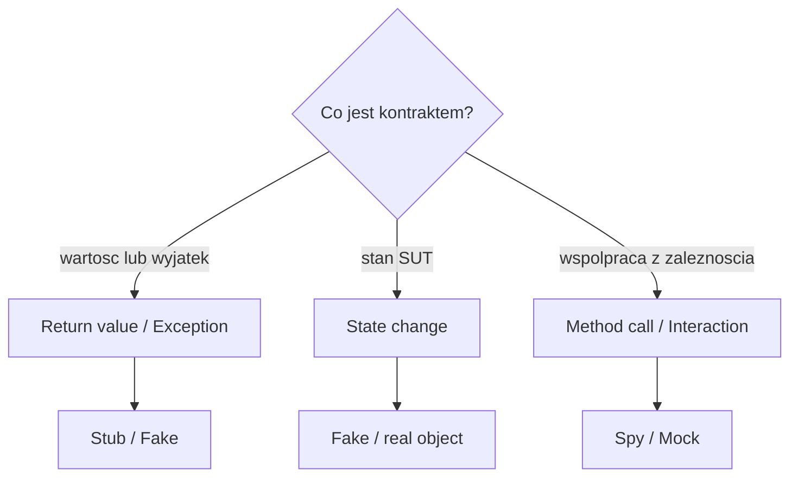
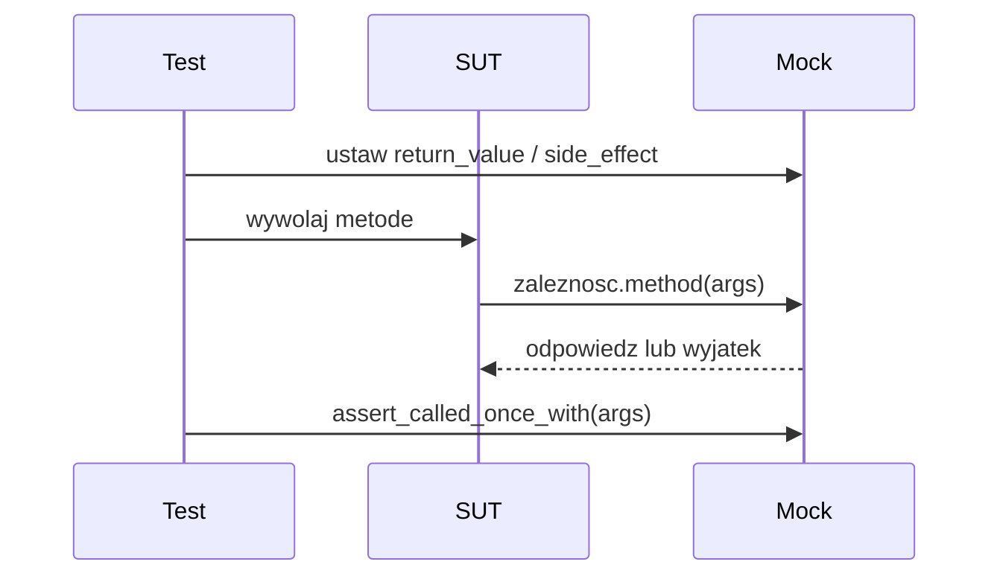

# Temat 02 - Weryfikacja i narzędzia Python

> Moduł: [03-test_double](../README.md) · Poprzedni: [01-test-double-taxonomy](../01-test-double-taxonomy/README.md) · Następny: [03-racing-car-and-html](../03-racing-car-and-html/README.md)

## Trzy kategorie asercji

### 1. Return value / Exception

Pytanie: „co metoda zwróciła albo jaki wyjątek zgłosiła?”

```python
result = service.calculate()
assert result == 42

with pytest.raises(ValueError, match="invalid"):
    service.calculate()
```

### 2. State change

Pytanie: „jak zmienił się stan obiektu?”

```python
account.deposit(100)
assert account.balance == 100
```

### 3. Method call / Interaction

Pytanie: „czy zależność dostała właściwe wywołanie?”

```python
sender.send.assert_called_once_with("alert")
```



## `unittest.mock`

### `Mock`

```python
from unittest.mock import Mock

sender = Mock()
sender.send.return_value = "accepted"
service = AlertService(sender)

assert service.alert("hello") == "accepted"
sender.send.assert_called_once_with("hello")
```

### `MagicMock`

`MagicMock` dodatkowo przygotowuje magiczne metody, np. `__len__`, `__iter__`
i `__enter__`. Używaj go, gdy testowana zależność zachowuje się jak lista,
iterator albo context manager.

### `patch`

Patchuj miejsce, w którym kod **odwołuje się** do symbolu, niekoniecznie miejsce,
w którym symbol został pierwotnie zdefiniowany.

```python
@patch("weather_service.requests.get")
def test_weather(mock_get):
    mock_get.return_value.json.return_value = {"temp": 21}
    assert read_temperature("Warsaw") == 21
    mock_get.assert_called_once()
```



### `side_effect`

Służy do zwracania kolejnych wartości albo rzucania wyjątku:

```python
client.get.side_effect = ["first", TimeoutError("network")]
```

## `monkeypatch` w pytest

`monkeypatch` jest fixture, która po teście przywraca poprzedni stan:

```python
def test_env(monkeypatch):
    monkeypatch.setenv("APP_MODE", "test")
    assert read_mode() == "test"
```

Można podmienić atrybut, funkcję, zmienną środowiskową albo katalog domowy.
W odróżnieniu od Mocka `monkeypatch` sam nie zapisuje oczekiwań interakcji.

## Zadania

1. Zastąp ręcznego Spy obiektem `Mock` i użyj `assert_called_once_with`.
2. Użyj `side_effect` do zasymulowania timeoutu klienta.
3. Podmień `os.environ` przez `monkeypatch` i napisz test dwóch trybów pracy.
4. Napisz test, w którym wynik jest sprawdzany jako return value, a osobno test
   tej samej klasy sprawdzający interakcję.
5. Zidentyfikuj test, w którym Mock jest zbyt szczegółowy i zaproponuj Fake.

**Podpowiedzi:**

- `Mock(spec=Notifier)` odrzuca literówki w API,
- `assert_called_once_with` sprawdza zarówno liczbę, jak i argumenty,
- po `monkeypatch.setattr` nie trzeba ręcznie przywracać oryginału,
- `patch.object(instance, "method")` jest przydatne dla pojedynczego obiektu.

## Uruchomienie i debugowanie

```bash
python -m pytest src/03-test_double/02-verification-and-tools -v
python src/03-test_double/02-verification-and-tools/examples/mock_tools.py
```

Breakpoint ustaw w metodzie SUT przed wywołaniem zależności i obejrzyj
`mock_calls`, `call_args` oraz `return_value`.

## Pytania kontrolne

1. Jaka jest różnica między asercją stanu i interakcji?
2. Kiedy `Mock` jest lepszy od Spy?
3. Dlaczego `patch` w złym miejscu może nie zadziałać?
4. Czym różni się `side_effect` od `return_value`?
5. Czy `monkeypatch` jest Mockiem? Uzasadnij.

## Literatura

- Python Docs - `Mock`: <https://docs.python.org/3/library/unittest.mock.html#unittest.mock.Mock>
- Python Docs - `patch`: <https://docs.python.org/3/library/unittest.mock.html#patch>
- pytest Docs - `monkeypatch`: <https://docs.pytest.org/en/stable/how-to/monkeypatch.html>
