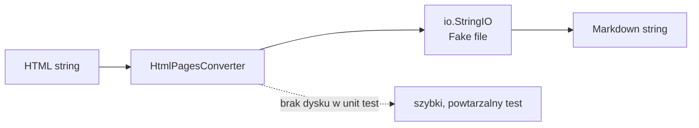
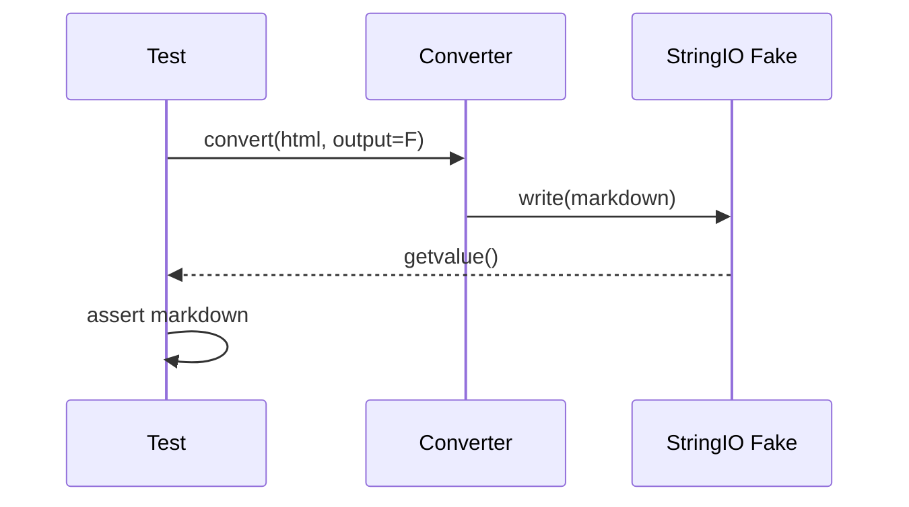

# Temat 03 - Stub czujnika i Fake `StringIO`

> Moduł: [03-test_double](../README.md) · Poprzedni: [02-verification-and-tools](../02-verification-and-tools/README.md) · Następny: [04-sso-registry](../04-sso-registry/README.md)

## Cel

Zastosować Stub i Fake do dwóch różnych problemów: symulowania odczytów
czujnika oraz izolowania operacji plikowych.

## Racing Car: Stub czujnika ciśnienia

Samochód wyścigowy nie powinien ruszyć, jeśli ciśnienie jest poza normą.
W teście nie potrzebujemy prawdziwego czujnika ani samochodu.

```python
sensor = StubPressureSensor([1.2, 1.1, 1.0, 0.7])
car = RacingCar(sensor)
assert car.check_tires() is False
```

Stub kontroluje odpowiedź zależności. Test sprawdza wynik `check_tires()` oraz
wyjątek przy braku odczytu, ale nie sprawdza, ile razy czujnik był wywołany.

## HtmlPagesConverter: Fake `StringIO`

Konwerter powinien zamienić prostą strukturę HTML na tekst Markdown. Zamiast
prawdziwego pliku na dysku używamy `io.StringIO`: obiekt ma działający interfejs
strumienia, ale jest szybki, lokalny i automatycznie sprzątany.



`StringIO` jest Fake, nie Stubem: przechowuje tekst i udostępnia działające
`write()`, `getvalue()` oraz `seek()`.

## Poziom izolacji



## Zadania

1. Dodaj test czujnika z dokładnie trzema odczytami prawidłowymi.
2. Dodaj przypadek, w którym jedno koło ma zbyt niskie ciśnienie.
3. Dodaj Fake strumienia, który rejestruje liczbę zapisów.
4. Rozszerz konwerter o nagłówki `<h1>` i listy `<li>`.
5. Zastąp `StringIO` Mockiem i porównaj, co zyskujesz, a co tracisz.

**Podpowiedzi:**

- Stub powinien zwracać dane przygotowane przez test,
- Fake nie musi implementować całego systemu plików, tylko potrzebny kontrakt,
- użyj `StringIO.getvalue()` zamiast sprawdzać prywatne pola konwertera,
- test błędnego ciśnienia powinien być niezależny od kolejności odczytów.

## Uruchomienie i debugowanie

```bash
python -m pytest src/03-test_double/03-racing-car-and-html -v
python src/03-test_double/03-racing-car-and-html/examples/racing_and_html.py
```

Breakpoint ustaw w `check_tires()` oraz `convert()`. Obejrzyj różnicę między
listą odczytów Stuba a zawartością `StringIO`.

## Pytania kontrolne

1. Dlaczego Stub nie musi zapisywać wywołań?
2. Dlaczego `StringIO` jest Fake, a nie zwykłą zmienną tekstową?
3. Co powinien obejmować kontrakt strumienia dla konwertera?
4. Jak przetestować błąd zapisu bez prawdziwego dysku?
5. Kiedy Fake staje się zbyt rozbudowany?

## Literatura

- Python Docs - `io.StringIO`: <https://docs.python.org/3/library/io.html#io.StringIO>
- Python Docs - `unittest.mock`: <https://docs.python.org/3/library/unittest.mock.html>
- Gerard Meszaros, *Test Double Patterns*: <http://xunitpatterns.com/Test%20Double.html>
