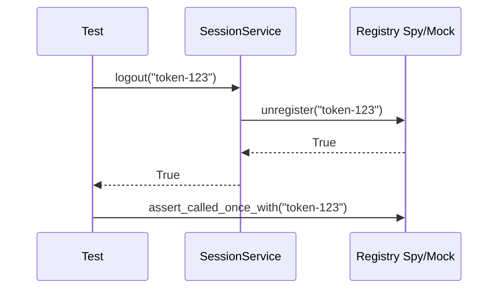

# Temat 04 - SSO Registry: Spy i Mock

> Moduł: [03-test_double](../README.md) · Poprzedni: [03-racing-car-and-html](../03-racing-car-and-html/README.md)

## Cel

Sprawdzić interakcje komponentu z rejestrem Single Sign-On. Student zobaczy
różnicę między Spy, który zapisuje wywołania do późniejszej analizy, a Mockiem,
który ma oczekiwania i potrafi oblać test przy ich niespełnieniu.

## Domena

`SsoRegistry` przechowuje aktywne tokeny. `SessionService.logout()` powinien:

1. sprawdzić token,
2. wywołać `unregister(token)` dokładnie raz,
3. zwrócić `True` po sukcesie,
4. zwrócić `False` dla pustego tokenu bez kontaktu z rejestrem.



## Spy i Mock

### Spy

```python
registry = RecordingRegistry()
service = SessionService(registry)
service.logout("token-123")
assert registry.calls == [("unregister", "token-123")]
```

Spy pozwala analizować interakcje po akcji i może mieć własną uproszczoną logikę.

### Mock

```python
registry = Mock(spec=SsoRegistry)
registry.unregister.return_value = True
assert SessionService(registry).logout("token-123") is True
registry.unregister.assert_called_once_with("token-123")
```

Mock jest wygodny, gdy oczekiwanie jest częścią testu. Należy unikać
sprawdzania kolejności prywatnych wywołań, jeśli nie jest to kontrakt.

## Trzy rodzaje weryfikacji w tym przykładzie

- return value: `logout(...) is True`,
- state: `RecordingRegistry.calls`,
- interaction: `Mock.assert_called_once_with(...)`.

## Zadania

1. Dodaj `register(token)` i test interakcji.
2. Dodaj `logout_all(tokens)` i sprawdź kolejność tylko wtedy, gdy jest częścią
   kontraktu.
3. Zasymuluj błąd rejestru przez `side_effect=ConnectionError`.
4. Napisz ten sam test raz ze Spy, raz z Mockiem i porównaj czytelność.
5. Dodaj `Mock(spec=SsoRegistry)` oraz test literówki w API.

**Podpowiedzi:**

- `Mock(spec=...)` powinien otrzymać klasę/interfejs zależności,
- `assert_not_called()` jest właściwe dla pustego tokenu,
- nie asercjuj `_registry`, jeśli wystarczy publiczne `calls` Spy.

## Uruchomienie i debugowanie

```bash
python -m pytest src/03-test_double/04-sso-registry -v
python src/03-test_double/04-sso-registry/examples/sso_registry.py
```

Breakpoint ustaw w `SessionService.logout()` i obserwuj `call_args` Mocka oraz
`calls` Spy.

## Pytania kontrolne

1. Dlaczego pusty token nie powinien wywołać rejestru?
2. Kiedy Spy jest czytelniejszy od Mocka?
3. Co daje `spec`?
4. Czy test powinien sprawdzać kolejność `validate` i `unregister`?
5. Jak odróżnić istotną interakcję od szczegółu implementacji?

## Literatura

- Python Docs - Mock: <https://docs.python.org/3/library/unittest.mock.html#unittest.mock.Mock>
- Martin Fowler, *Mocks Aren't Stubs*: <https://martinfowler.com/articles/mocksArentStubs.html>
- Gerard Meszaros, *xUnit Test Patterns*: <http://xunitpatterns.com/Test%20Spy.html>
