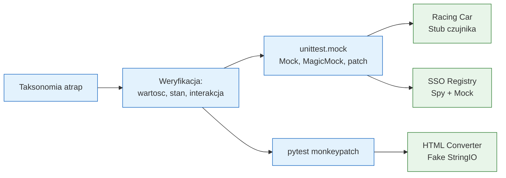

# Moduł 03 - Test Doubles w Pythonie

Moduł opisuje atrapy testowe i izolowanie testowanego komponentu od zewnętrznych
zależności. Przykłady pokazują, kiedy użyć Dummy, Stub, Fake, Spy i Mock oraz
jak odróżnić asercję wyniku, stanu i interakcji.

## Cel zajęć

Po module student powinien:

- rozróżniać pięć typów Test Doubles według xUnit Test Patterns,
- dobrać atrapę do pytania testowego, zamiast automatycznie używać `Mock`,
- stosować `unittest.mock.Mock`, `MagicMock` i `patch`,
- używać fixture `monkeypatch` w pytest,
- odróżniać asercję na wartość/wyjątek, zmianę stanu i interakcję,
- izolować czujnik, plik, zegar, klienta HTTP i rejestr SSO,
- rozpoznać, kiedy test mockujący jest zbyt szczegółowy i kruchy.

## Tematy

1. [01-test-double-taxonomy](01-test-double-taxonomy/README.md) - Dummy,
   Stub, Fake, Spy i Mock.
2. [02-verification-and-tools](02-verification-and-tools/README.md) - trzy
   kategorie weryfikacji oraz `unittest.mock` i `monkeypatch`.
3. [03-racing-car-and-html](03-racing-car-and-html/README.md) - czujnik
   ciśnienia i `io.StringIO` jako praktyczne izolowanie I/O.
4. [04-sso-registry](04-sso-registry/README.md) - Spy i Mock w rejestrze SSO.

## Mapa modułu



## Uruchamianie

```powershell
# Wszystkie testy modułu
.venv\Scripts\python.exe -m pytest src\03-test_double -c src\03-test_double\pytest.ini -v

# Wybrany temat
.venv\Scripts\python.exe -m pytest src\03-test_double\03-racing-car-and-html -v

# Ruff
.venv\Scripts\python.exe -m ruff check src\03-test_double

# Diagramy Mermaid -> PNG
.venv\Scripts\python.exe src\03-test_double\generate_diagrams.py
```

## Scenariusz 90-minutowego wykładu

| Czas | Etap | Treść |
|---|---|---|
| 0-15 min | Taksonomia | Dummy, Stub, Fake, Spy, Mock na jednej zależności |
| 15-30 min | Weryfikacja | Return value/Exception, State, Interaction |
| 30-45 min | Narzędzia | `Mock`, `MagicMock`, `patch`, `monkeypatch` |
| 45-60 min | Live coding 1 | Stub czujnika ciśnienia w samochodzie wyścigowym |
| 60-72 min | Live coding 2 | Fake `StringIO` dla konwertera HTML |
| 72-85 min | Live coding 3 | Spy i Mock w SSO Registry |
| 85-90 min | Podsumowanie | Jak nie przesmockować testów |

## Zasada wyboru atrap

Najpierw nazwij pytanie testu:

- „Jaki wynik otrzymam?” -> Stub/Fake i asercja return value/exception.
- „Jak zmienił się obiekt?” -> Fake lub prawdziwy obiekt i asercja stanu.
- „Czy zależność została wywołana?” -> Spy/Mock i asercja interakcji.

## Literatura

- Gerard Meszaros, *xUnit Test Patterns*: <http://xunitpatterns.com/Test%20Stub.html>
- Martin Fowler, *Mocks Aren't Stubs*: <https://martinfowler.com/articles/mocksArentStubs.html>
- Gerard Meszaros, *Test Double Patterns*: <http://xunitpatterns.com/Test%20Double.html>
- Python Docs - `unittest.mock`: <https://docs.python.org/3/library/unittest.mock.html>
- pytest Docs - `monkeypatch`: <https://docs.pytest.org/en/stable/how-to/monkeypatch.html>
- pytest Docs - fixtures: <https://docs.pytest.org/en/stable/how-to/fixtures.html>
