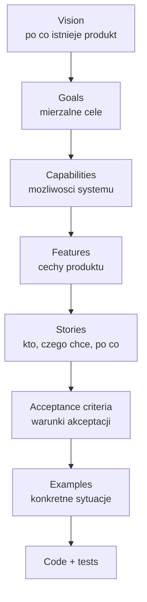
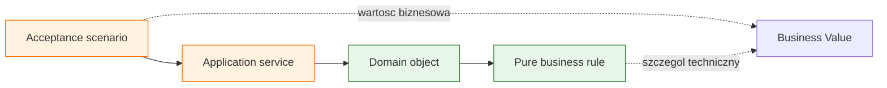

# Temat 01 - BDD i Outside-In

> Moduł: [04-BDD](../README.md) · Następny: [02-gherkin-language](../02-gherkin-language/README.md)

## Cel

Zrozumieć BDD jako praktykę rozmowy o wartości biznesowej i przykładach,
a nie jako alternatywną nazwę dla testów jednostkowych.

## Od techniki do wartości

Hierarchia wymagań:



Przykład domeny lotów:

- Vision: pasażerowie mogą bezpiecznie i przejrzyście zarządzać podróżą.
- Goal: VIP otrzymuje usługę premium i punkty lojalnościowe.
- Capability: system rozpoznaje typ lotu i status pasażera.
- Feature: Premium Flight przyjmuje tylko VIP.
- Story: „Jako operator chcę zablokować dodanie pasażera standardowego,
  aby oferta premium nie była naruszana”.
- Acceptance criterion: `Given` lot premium, `When` dodaję pasażera standardowego,
  `Then` system odrzuca operację.
- Example: konkretny pasażer `Alice`, `VIP = False`.

## Outside-In

Outside-In zaczyna od zachowania widocznego dla użytkownika lub biznesu,
a następnie schodzi do współpracujących komponentów. Acceptance test jest
zewnętrznym kontraktem; testy jednostkowe powstają wtedy, gdy implementacja
wydziela wewnętrzne reguły.



## Pętla współpracy

- **Customer** opisuje problem, cel i wartość.
- **Business Analyst** doprecyzowuje reguły i przykłady.
- **Developer** pyta o niejednoznaczności i implementuje zachowanie.
- **Tester** pomaga znaleźć przypadki brzegowe oraz automatyzuje przykłady.

BDD działa najlepiej, gdy scenariusz jest wspólnym artefaktem rozmowy, a nie
kodem napisanym wyłącznie przez jedną osobę.

## Zadania

1. Przepisz wymaganie „lot premium dla VIP” na story i trzy kryteria akceptacji.
2. Zorganizuj spotkanie Three Amigos: zapisz pytanie Customer, BA, Developera
   i Testera.
3. Wskaż, które zdanie opisuje wartość biznesową, a które implementację.
4. Dopisz scenariusz blokady duplikatu pasażera.

**Podpowiedzi:**

- używaj przykładów z konkretnymi wartościami,
- unikaj nazw klas i prywatnych metod w kryteriach biznesowych,
- każde kryterium powinno mieć jeden oczekiwany rezultat.

## Uruchomienie i debugowanie

```bash
python -m compileall src/04-BDD/01-bdd-outside-in
python -m pytest src/04-BDD/01-bdd-outside-in -v
```

## Pytania kontrolne

1. Czym różni się Feature od Capability?
2. Dlaczego przykład jest lepszy niż ogólne „system ma obsługiwać VIP”?
3. Co oznacza Outside-In?
4. Kiedy tester powinien wejść do rozmowy o wymaganiu?

## Literatura

- Dan North, *Introducing BDD*: <https://dannorth.net/introducing-bdd/>
- Martin Fowler, *Specification by Example*: <https://martinfowler.com/bliki/SpecificationByExample.html>
- Liz Keogh, *Behavior Driven Development*: <https://lizkeogh.com/behavior-driven-development/>
