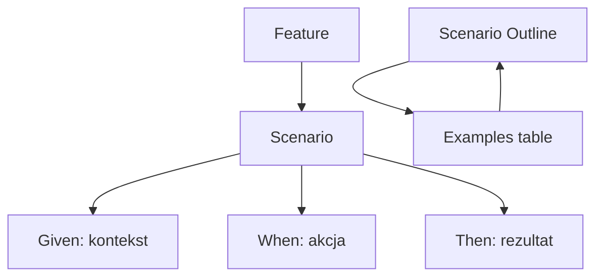

# Temat 02 - Język Gherkin

> Moduł: [04-BDD](../README.md) · Poprzedni: [01-bdd-outside-in](../01-bdd-outside-in/README.md) · Następny: [03-behave-structure](../03-behave-structure/README.md)

## Cel

Nauczyć się zapisywać wymagania jako wykonywalne przykłady zrozumiałe dla
biznesu i zespołu technicznego.

## Składnia

```gherkin
Feature: Lot premium
  Aby chronić ofertę premium
  Jako operator lotu
  Chcę wpuszczać tylko pasażerów VIP

  Scenario: Standardowy pasażer nie może wejść na lot premium
    Given istnieje lot premium o numerze "PR100"
    And istnieje standardowy pasażer "Alice"
    When dodaję pasażera "Alice" do lotu
    Then operacja jest odrzucona komunikatem "only VIP passengers"
```

### Elementy

- `Feature` - nazwa i cel funkcji biznesowej,
- `Scenario` - jeden przykład zachowania,
- `Given` - kontekst początkowy,
- `When` - akcja użytkownika/systemu,
- `Then` - obserwowalny rezultat,
- `And` - kolejny krok tej samej fazy,
- `Scenario Outline` + `Examples` - ten sam scenariusz dla wielu danych.

```gherkin
Scenario Outline: Punkty promocyjne zależą od statusu
  Given pasażer ma status "<status>"
  And lot ma przebieg <mileage> km
  When naliczam punkty
  Then pasażer otrzymuje <points> punktów

  Examples:
    | status   | mileage | points |
    | VIP      | 1000    | 100    |
    | STANDARD | 1000    | 50     |
```



## Dobre scenariusze

- opisują zachowanie, nie strukturę klas,
- mają jedną intencję biznesową,
- używają języka domeny,
- mają konkretny rezultat,
- nie ukrywają wielu akcji w jednym `When`.

Zły scenariusz:

```gherkin
When wywołuję metodę add_passenger z obiektem Passenger
Then pole _passengers ma długość 1
```

Dobry scenariusz:

```gherkin
When dodaję pasażera do lotu
Then pasażer jest na liście pasażerów lotu
```

## Zadania

1. Napisz Feature dla lotu ekonomicznego.
2. Przepisz trzy testy parametryczne na `Scenario Outline`.
3. Znajdź w swoim scenariuszu krok zawierający szczegół implementacyjny i usuń go.
4. Dodaj scenariusz negatywny z komunikatem błędu.

**Podpowiedzi:**

- `When` powinien opisywać akcję, nie wywołanie Pythona,
- `Then` powinien być możliwy do zaobserwowania przez użytkownika,
- tabela `Examples` powinna zawierać tylko dane zmieniające wynik.

## Uruchomienie

```bash
python -m behave src/04-BDD/04-passenger-flights/features --dry-run
```

## Pytania kontrolne

1. Kiedy użyć `Scenario Outline`?
2. Czym różni się `Given` od `When`?
3. Dlaczego prywatne pole w `Then` łamie ideę BDD?
4. Jak scenariusz pomaga BA i developerowi rozmawiać o tym samym wymaganiu?

## Literatura

- Cucumber Docs - Gherkin Reference: <https://cucumber.io/docs/gherkin/reference>
- Behave Docs - Gherkin: <https://behave.readthedocs.io/en/latest/gherkin/>
- Gojko Adzic, *Specification by Example*, Manning, 2011.
