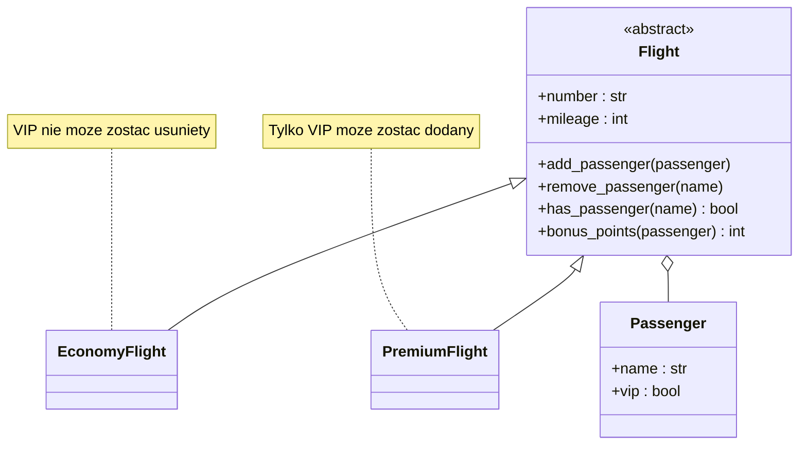

# Temat 04 - Polityka pasażerów i lotów

> Moduł: [04-BDD](../README.md) · Poprzedni: [03-behave-structure](../03-behave-structure/README.md)

## Cel

Przeprowadzić kompletne Outside-In dla domeny lotów. Scenariusze opisują
wartość biznesową, a step definitions tłumaczą Gherkin na wywołania modelu
Python.

## Features domenowe

- **Economy Flight**
  - dodawanie zwykłego pasażera,
  - usuwanie zwykłego pasażera,
  - VIP nie może zostać usunięty z lotu ekonomicznego,
  - ten sam pasażer nie może być dodany ponownie.
- **Premium Flight**
  - tylko VIP może zostać dodany.
- **Bonus Points**
  - VIP: `mileage / 10`,
  - standard: `mileage / 20`.



## Outside-In: scenariusz do domeny

```gherkin
Scenario: VIP nie może zostać usunięty z lotu ekonomicznego
  Given istnieje lot ekonomiczny o numerze "EC100"
  And istnieje pasażer VIP "Victor"
  And pasażer "Victor" jest na locie
  When usuwam pasażera "Victor" z lotu
  Then operacja jest odrzucona komunikatem "VIP passengers cannot be removed"
```

Scenariusz nie zna klasy `EconomyFlight` ani pola `_passengers`. Zna regułę,
która ma znaczenie dla biznesu. Dopiero step definition wybiera implementację.

## Pliki Behave

- `features/economy_flight.feature` - scenariusze Economy,
- `features/premium_flight.feature` - scenariusze Premium,
- `features/bonus_points.feature` - `Scenario Outline`,
- `features/steps/passenger_steps.py` - mapowanie kroków,
- `features/environment.py` - ścieżka do kodu domeny,
- `src/flight_domain.py` - implementacja niezależna od Behave.

## Zadania

1. Dodaj scenariusz usunięcia standardowego pasażera z lotu ekonomicznego.
2. Dodaj scenariusz duplikatu dla lotu premium.
3. Dodaj nowy status `STUDENT` i ustal jego punkty promocyjne.
4. Dodaj tabelę pasażerów w Gherkinie i krok tworzący dane z tabeli.
5. Wydziel wspólny krok `pasażer jest na locie` tak, aby nie duplikować logiki.
6. Dodaj test jednostkowy modelu dla każdej reguły i porównaj go ze scenariuszem
   akceptacyjnym Behave.

**Podpowiedzi:**

- najpierw dopisz scenariusz, uruchom `behave` i zobacz undefined step,
- potem zaimplementuj krok, a następnie regułę domenową,
- wyjątki domenowe powinny mieć komunikaty zrozumiałe dla scenariusza,
- `Scenario Outline` jest dobry dla wzoru punktów, ale nie dla różnych reguł.

## Uruchomienie i debugowanie

```bash
# Z katalogu głównego
python -m pytest src/04-BDD/04-passenger-flights -v

# Behave
cd src/04-BDD/04-passenger-flights
python -m behave -f pretty
python -m behave --format=progress
python -m behave features/bonus_points.feature
cd ../../..
```

W VS Code ustaw breakpoint w `features/steps/passenger_steps.py` albo
`src/flight_domain.py`. Dla nieudanego scenariusza użyj `python -m behave -f pretty`
i sprawdź ostatni krok wykonany przez context.

## Pytania kontrolne

1. Dlaczego reguła VIP jest w modelu domeny, a nie tylko w step definition?
2. Co chroni scenariusz „duplikat pasażera”?
3. Dlaczego `Scenario Outline` pasuje do bonus points?
4. Czy scenariusz powinien znać nazwę klasy `PremiumFlight`?
5. Jak odróżnić test akceptacyjny Behave od testu jednostkowego domeny?

## Literatura

- Cucumber Docs - Gherkin: <https://cucumber.io/docs/gherkin/reference>
- Behave Docs: <https://behave.readthedocs.io/en/latest/>
- Dan North, *Introducing BDD*: <https://dannorth.net/introducing-bdd/>
- Gojko Adzic, *Specification by Example*, Manning, 2011.
