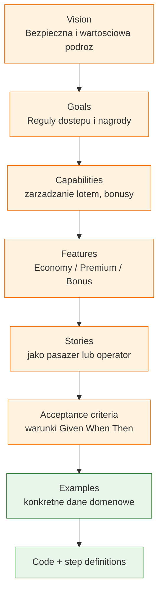
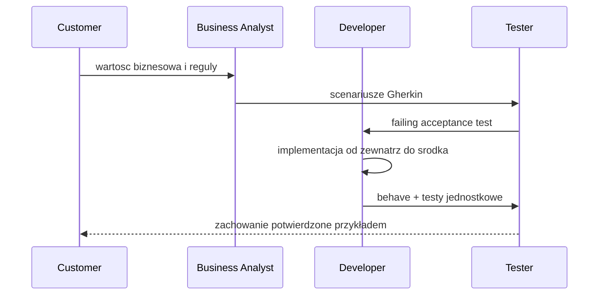

# Moduł 04 - BDD w Pythonie

Moduł pokazuje Behavior-Driven Development jako metodykę komunikacji
biznesu, analityka, dewelopera i testera. Gherkin opisuje przykłady językiem
bliskim domenie, a `behave` wykonuje je jako automatyzowane scenariusze.

## Cele dydaktyczne

Po module student powinien:

- przejść od Vision do Examples i kodu,
- wyjaśnić Outside-In jako rozwijanie systemu od zachowania użytkownika do
  współpracujących komponentów,
- pisać Feature, Scenario, Scenario Outline, Given, When, Then i And,
- organizować pliki `.feature` oraz step definitions w `features/steps/`,
- używać tabel Gherkina i parametrów scenariusza,
- budować domenowe kroki dla lotów ekonomicznych i premium,
- rozdzielać język biznesowy od technicznych szczegółów implementacji.

## Tematy

1. [01-bdd-outside-in](01-bdd-outside-in/README.md) - Business Value,
   Outside-In i współpraca Customer–BA–Developer–Tester.
2. [02-gherkin-language](02-gherkin-language/README.md) - składnia Feature,
   Scenario, Scenario Outline, Given, When, Then, And.
3. [03-behave-structure](03-behave-structure/README.md) - układ Behave,
   `environment.py`, `steps/`, kontekst i dane scenariusza.
4. [04-passenger-flights](04-passenger-flights/README.md) - kompletna domena
   lotów: Economy, Premium, VIP, unikalność i bonus points.

## Hierarchia wymagań



## Pętla Outside-In



## Uruchamianie

```powershell
# Wszystkie testy pytest i testy BDD można uruchamiać osobno:
.venv\Scripts\python.exe -m pytest src\04-BDD -c src\04-BDD\pytest.ini -v

# Behave dla przykładu domenowego:
cd src\04-BDD\04-passenger-flights
python -m behave -f pretty
cd ..\..

# Ruff:
.venv\Scripts\python.exe -m ruff check src\04-BDD
```

## Scenariusz wykładu

| Czas | Etap | Treść |
|---|---|---|
| 0-15 min | BDD | różnica między wymaganiem, przykładem i testem |
| 15-30 min | Outside-In | hierarchia Vision → Code i współpraca ról |
| 30-45 min | Gherkin | czytelne Feature/Scenario/Examples |
| 45-60 min | Behave | mapowanie kroków do Python `steps/` |
| 60-82 min | Live coding | lot ekonomiczny i premium |
| 82-90 min | Podsumowanie | jakość scenariusza, refaktoryzacja kroków |

## Zadania

- dla każdego tematu wykonaj zadania z `exercises/`,
- dopisz co najmniej jeden scenariusz Gherkin przed implementacją,
- wyjaśnij, jaka wartość biznesowa jest chroniona przez scenariusz,
- uruchom zarówno `behave`, jak i testy jednostkowe domeny.

## Literatura

- Dan North, *Introducing BDD*: <https://dannorth.net/introducing-bdd/>
- Cucumber Docs - Gherkin: <https://cucumber.io/docs/gherkin/reference>
- Behave Documentation: <https://behave.readthedocs.io/en/latest/>
- Martin Fowler, *Specification by Example*: <https://martinfowler.com/bliki/SpecificationByExample.html>
- Gojko Adzic, *Specification by Example*, Manning, 2011.
- Liz Keogh, *Behavior Driven Development*: <https://lizkeogh.com/behavior-driven-development/>
