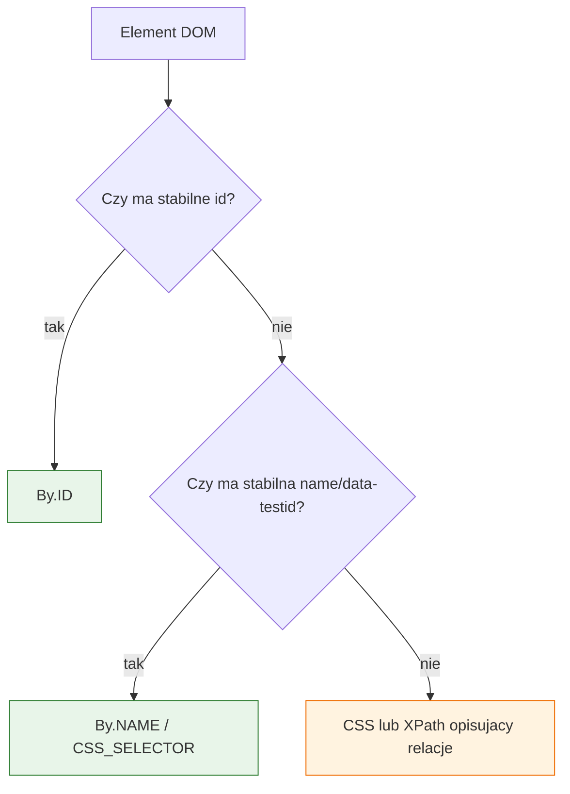

# Temat 01 - WebDriver i lokalizatory

> Moduł: [05-Selenium](../README.md) · Następny: [02-waits-and-flaky-tests](../02-waits-and-flaky-tests/README.md)

## Cel

Uruchomić przeglądarkę headless i nauczyć się wybierać lokalizatory odporne
na zmiany layoutu.

## Konfiguracja drivera

Selenium 4 używa Selenium Manager. Nie trzeba ręcznie pobierać `chromedriver`,
jeśli przeglądarka jest zainstalowana.

```python
from selenium import webdriver

options = webdriver.ChromeOptions()
options.add_argument("--headless=new")
options.add_argument("--window-size=1280,900")
driver = webdriver.Chrome(options=options)
try:
    driver.get("http://127.0.0.1:8000/login.html")
finally:
    driver.quit()
```

Firefox:

```python
options = webdriver.FirefoxOptions()
options.add_argument("-headless")
driver = webdriver.Firefox(options=options)
```

## Lokalizatory

| Lokalizator | Przykład | Kiedy użyć |
|---|---|---|
| `By.ID` | `By.ID, "username"` | stabilne, unikalne id |
| `By.NAME` | `By.NAME, "password"` | formularze z semantyczną nazwą |
| `By.CSS_SELECTOR` | `By.CSS_SELECTOR, "#login-button"` | klasy, atrybuty, relacje CSS |
| `By.XPATH` | `By.XPATH, "//button[@type='submit']"` | relacje i tekst, gdy CSS nie wystarcza |

Preferuj lokalizatory stabilne i opisujące element. Unikaj XPath opartych na
pozycji, np. `(//button)[3]`, oraz klas generowanych przez framework.



## Zadania

1. Znajdź pole username przez `By.ID`, password przez `By.NAME`, przycisk przez
   `By.CSS_SELECTOR`, a komunikat przez `By.XPATH`.
2. Zamień XPath pozycyjny na lokalizator oparty na atrybucie.
3. Uruchom ten sam test w Chrome i Firefox przez `SELENIUM_BROWSER`.
4. Dodaj lokalizator do artykułu produktu z `data-sku`.

**Podpowiedzi:**

- sprawdzaj lokalizator w DevTools,
- CSS `[data-sku='book-1']` jest stabilniejszy niż indeks artykułu,
- lokalizator powinien zwracać dokładnie jeden element.

## Uruchomienie i debugowanie

```powershell
.venv\Scripts\python.exe -m pytest src\05-Selenium\01-webdriver-and-locators -v
```

## Literatura

- Selenium - WebDriver: <https://www.selenium.dev/documentation/webdriver/>
- Selenium - locators: <https://www.selenium.dev/documentation/webdriver/elements/locators/>
