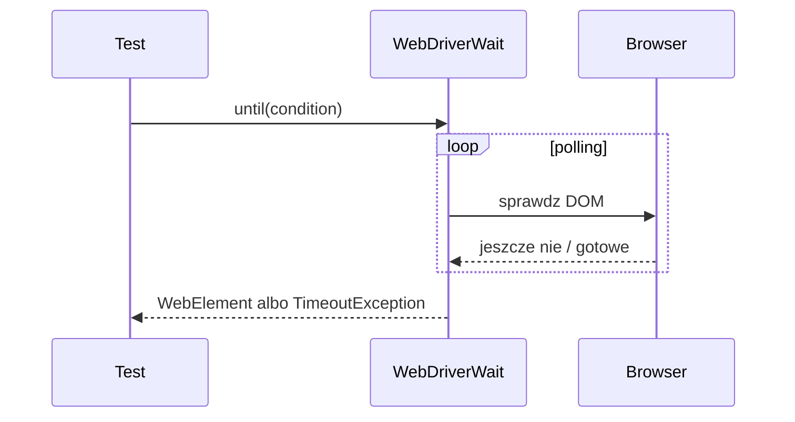

# Temat 02 - Waits i flaky tests

> Moduł: [05-Selenium](../README.md) · Poprzedni: [01-webdriver-and-locators](../01-webdriver-and-locators/README.md) · Następny: [03-page-object-model](../03-page-object-model/README.md)

## Cel

Zrozumieć, że przeglądarka i aplikacja działają asynchronicznie. Test powinien
czekać na warunek, a nie na arbitralny czas.

## Implicit Wait

```python
driver.implicitly_wait(2)
```

Driver będzie czekał przy wyszukiwaniu elementu. To ustawienie globalne może
ukrywać problemy i utrudniać diagnozę, dlatego w materiałach fixture ustawia
`0` i używamy explicit wait.

## Explicit Wait

```python
from selenium.webdriver.support import expected_conditions as EC
from selenium.webdriver.support.ui import WebDriverWait

wait = WebDriverWait(driver, 5)
button = wait.until(EC.element_to_be_clickable((By.ID, "load-button")))
button.click()
result = wait.until(EC.visibility_of_element_located((By.ID, "result")))
assert result.text == "Loaded"
```

`WebDriverWait` odpytuje warunek do timeoutu. To jest synchronizacja z
obserwowalnym stanem aplikacji.



## Flaky tests

Typowe przyczyny:

- `time.sleep(1)` zamiast warunku,
- element istnieje, ale nie jest klikalny,
- test zależy od sieci lub kolejności testów,
- animacja i zmiana DOM występują po znalezieniu elementu.

Nie rób:

```python
time.sleep(1)
driver.find_element(By.ID, "result")
```

Rób:

```python
WebDriverWait(driver, 5).until(
    EC.text_to_be_present_in_element((By.ID, "result"), "Loaded")
)
```

## Zadania

1. Napisz test dynamicznej strony bez `sleep()`.
2. Zastąp implicit wait explicit waitem i opisz różnicę.
3. Dodaj warunek `element_to_be_clickable`.
4. Zasymuluj timeout i sprawdź, czy komunikat błędu wskazuje lokalizator.
5. Porównaj czas i stabilność testu z `sleep()` oraz `WebDriverWait`.

**Podpowiedzi:**

- czekaj na stan, który jest kontraktem użytkownika,
- dobierz timeout większy niż normalne opóźnienie, ale ograniczony,
- `presence_of_element_located` nie oznacza, że element jest widoczny.

## Uruchomienie

```powershell
.venv\Scripts\python.exe -m pytest src\05-Selenium\02-waits-and-flaky-tests -v
```

## Literatura

- Selenium - waits: <https://www.selenium.dev/documentation/webdriver/waits/>
- Selenium Python API - expected conditions: <https://selenium-python.readthedocs.io/waits.html>
