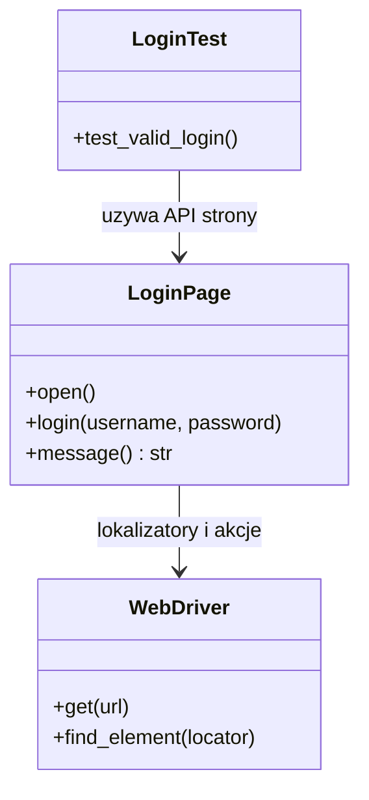

# Temat 03 - Page Object Model

> Moduł: [05-Selenium](../README.md) · Poprzedni: [02-waits-and-flaky-tests](../02-waits-and-flaky-tests/README.md) · Następny: [04-pytest-integration](../04-pytest-integration/README.md)

## Cel

Oddzielić reprezentację strony i lokalizatory od logiki testu. Page Object
udostępnia metody opisujące czynności użytkownika, a test opisuje zachowanie.



## Zasady POM

- lokalizatory należą do Page Object,
- test nie powinien znać CSS/XPath strony,
- metoda strony może zwracać nowy Page Object po nawigacji,
- asercje biznesowe zwykle pozostają w teście,
- wspólne akcje są wielokrotnego użytku.

```python
class LoginPage:
    USERNAME = (By.ID, "username")

    def login(self, username: str, password: str) -> None:
        self.driver.find_element(*self.USERNAME).send_keys(username)
```

## Zadania

1. Dodaj `CatalogPage` z metodą `add_product(sku)`.
2. Przenieś lokalizatory loginu z testu do Page Object.
3. Dodaj metodę `is_logged_in()` i test poprawnego komunikatu.
4. Zaprojektuj Page Object tak, aby zmiana id przycisku wymagała edycji jednego pliku.
5. Wskaż, których asercji nie należy przenosić do Page Object.

**Podpowiedzi:**

- Page Object nie powinien ukrywać tego, co test biznesowy ma sprawdzić,
- nie twórz metody `assert_everything()` w Page Object,
- zwracaj wartości obserwowalne, np. tekst komunikatu.

## Uruchomienie i debugowanie

```powershell
.venv\Scripts\python.exe -m pytest src\05-Selenium\03-page-object-model -v
```

Breakpointy ustaw w `pages.py` oraz na linii testu wywołującej akcję.

## Literatura

- Selenium - Page Object Models: <https://www.selenium.dev/documentation/test_practices/encouraged/page_object_models/>
- Martin Fowler, *Page Object*: <https://martinfowler.com/bliki/PageObject.html>
