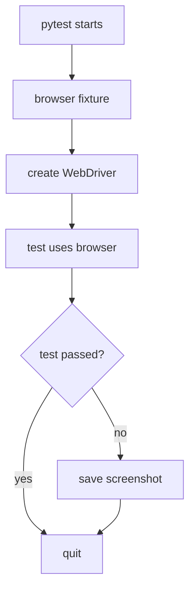

# Temat 04 - Integracja z pytest

> Moduł: [05-Selenium](../README.md) · Poprzedni: [03-page-object-model](../03-page-object-model/README.md)

## Cel

Zarządzać cyklem życia przeglądarki, środowiskiem testowym, raportem i
artefaktami po niepowodzeniu.

## Fixture

Wspólna fixture `browser`:

1. wybiera Chrome lub Firefox przez `SELENIUM_BROWSER`,
2. uruchamia headless browser,
3. ustawia bezpieczne implicit wait `0`,
4. zwraca driver testowi,
5. wykonuje screenshot po niepowodzeniu,
6. zawsze wywołuje `quit()`.



## Raport pytest-html

```powershell
.venv\Scripts\python.exe -m pytest src\05-Selenium `
  --html=src\05-Selenium\artifacts\report.html --self-contained-html
```

Raport zawiera statusy, czas i standardowe informacje pytest. Screenshot jest
artefaktem lokalnym fixture; można go dołączyć do raportu przez plugin hook,
jeśli projekt tego wymaga.

## Zadania

1. Dodaj fixture `mobile_browser` z rozmiarem 390x844.
2. Dodaj parametr `SELENIUM_BROWSER` do dokumentacji uruchamiania CI.
3. Dopisz hook pytest-html, który dołącza screenshot do raportu.
4. Dodaj tag/marker dla testów wymagających przeglądarki.
5. Wymuś błąd testu i odszukaj screenshot oraz raport.

**Podpowiedzi:**

- fixture z `yield` gwarantuje cleanup,
- nie współdziel drivera między testami funkcjonalnymi bez wyraźnej potrzeby,
- screenshot powinien mieć nazwę zawierającą `nodeid` testu,
- raport HTML trzymaj w katalogu `artifacts/`, a nie w kodzie źródłowym.

## Uruchomienie i debugowanie

```powershell
.venv\Scripts\python.exe -m pytest src\05-Selenium\04-pytest-integration -v
.venv\Scripts\python.exe -m pytest src\05-Selenium --html=src\05-Selenium\artifacts\report.html --self-contained-html
```

## Literatura

- pytest Docs - fixtures: <https://docs.pytest.org/en/stable/how-to/fixtures.html>
- pytest-html: <https://pytest-html.readthedocs.io/en/latest/>
- Selenium WebDriver: <https://www.selenium.dev/documentation/webdriver/>
