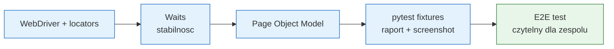

# Moduł 05 - Selenium WebDriver w Pythonie

Moduł pokazuje automatyzację testów przeglądarkowych End-to-End w Pythonie:
konfigurację przeglądarki, lokalizatory, waits, Page Object Model i integrację
z pytest.

## Cele dydaktyczne

Po module student powinien:

- uruchomić Chrome lub Firefox w trybie headless przez Selenium Manager,
- dobrać stabilny lokalizator `By.ID`, `By.NAME`, `By.CSS_SELECTOR` lub `By.XPATH`,
- wyjaśnić różnicę między implicit i explicit wait,
- unikać `time.sleep()` i niestabilnych testów,
- zaprojektować Page Object oddzielający reprezentację strony od asercji,
- zarządzać cyklem życia przeglądarki fixture pytest,
- generować raport `pytest-html` i screenshot po niepowodzeniu.

## Tematy

1. [01-webdriver-and-locators](01-webdriver-and-locators/README.md) - konfiguracja
   drivera, headless Chrome/Firefox i lokalizatory.
2. [02-waits-and-flaky-tests](02-waits-and-flaky-tests/README.md) - implicit,
   explicit `WebDriverWait`, expected conditions i flaky tests.
3. [03-page-object-model](03-page-object-model/README.md) - POM i wielokrotnego
   użytku metody stron.
4. [04-pytest-integration](04-pytest-integration/README.md) - fixture, screenshoty
   i raport HTML.

## Tutorial: uruchomienie krok po kroku

### 1. Środowisko

```powershell
cd C:\home\gitHub\python-test
.venv\Scripts\python.exe -m pip install -r requirements.txt
```

Selenium 4 używa Selenium Manager do pobrania/doboru sterownika. Komputer musi
mieć zainstalowaną przeglądarkę Chrome albo Firefox. Testy nie korzystają z
Internetu: uruchamiają lokalny serwer HTTP z katalogu `web/`.

### 2. Pierwszy test

```powershell
.venv\Scripts\python.exe -m pytest src\05-Selenium\01-webdriver-and-locators -v
```

Jeśli przeglądarka nie jest dostępna, testy otrzymają status `SKIPPED` z opisem,
a pozostałe testy repozytorium nadal mogą działać.

### 3. Wybrana przeglądarka

```powershell
$env:SELENIUM_BROWSER = "chrome"
.venv\Scripts\python.exe -m pytest src\05-Selenium -m selenium -v

$env:SELENIUM_BROWSER = "firefox"
.venv\Scripts\python.exe -m pytest src\05-Selenium -m selenium -v
```

### 4. Raport HTML

```powershell
.venv\Scripts\python.exe -m pytest src\05-Selenium -v `
  --html=src\05-Selenium\artifacts\report.html --self-contained-html
```

Fixture zapisuje screenshot po niepowodzeniu do `src/05-Selenium/artifacts/`.

## Mapa modułu



## Materiał inspiracyjny

Struktura przykładów nawiązuje do katalogu Selenium w repozytorium:
<https://github.com/tborzyszkowski/TestAutomationInPython/tree/master/src/selenium>

## Kryteria oceny zadań

- lokalizatory są stabilne i nie opierają się na przypadkowych indeksach,
- test nie używa `sleep()` jako synchronizacji,
- Page Object nie zawiera asercji testu biznesowego,
- fixture zamyka przeglądarkę również po błędzie,
- scenariusz jest powtarzalny i działa na lokalnej stronie testowej.

## Literatura

- Selenium Docs - Python: <https://www.selenium.dev/documentation/webdriver/>
- Selenium Docs - waits: <https://www.selenium.dev/documentation/webdriver/waits/>
- Selenium Docs - locators: <https://www.selenium.dev/documentation/webdriver/elements/locators/>
- Selenium Docs - Page Object Models: <https://www.selenium.dev/documentation/test_practices/encouraged/page_object_models/>
- pytest Docs - fixtures: <https://docs.pytest.org/en/stable/how-to/fixtures.html>
- pytest-html: <https://pytest-html.readthedocs.io/en/latest/>
