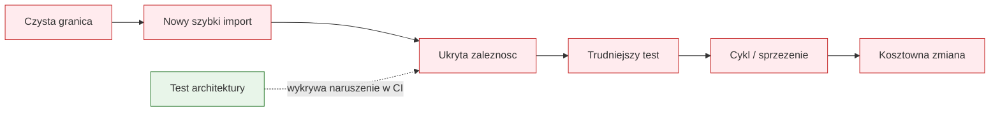

# Temat 01 - Dlaczego testować architekturę?

> Moduł: [06-ArchTest](../README.md) · Następny: [02-tools-and-contracts](../02-tools-and-contracts/README.md)

## Cel

Zobaczyć, że architektura również ma reguły, które mogą ulec regresji.
Testy jednostkowe mogą przechodzić, mimo że domena zacznie importować bazę
danych albo interfejs webowy.

## Erozja architektury



## Reguły projektowe jako kontrakty

Przykładowa architektura:

```text
web -> services -> domain
infrastructure -> services/domain
```

Domena nie powinna importować `web` ani `infrastructure`, ponieważ wtedy:

- reguły biznesowe zależą od technologii,
- test jednostkowy wymaga konfiguracji HTTP lub bazy,
- zmiana frameworka webowego dotyka modelu domeny,
- powstają cykle i niejasna odpowiedzialność.

## Zadania

1. Narysuj graf zależności istniejącej aplikacji.
2. Wskaż trzy zależności, które powinny być zabronione.
3. Napisz test, który wykrywa import `domain -> infrastructure`.
4. Opisz, jaki koszt powstanie po sześciu miesiącach bez tej reguły.

**Podpowiedzi:**

- zacznij od importów modułów, nie od klas,
- reguła powinna być niezależna od kolejności testów,
- nazwa kontraktu powinna mówić, czego broni.

## Uruchomienie

```bash
python -m pytest src/06-ArchTest/01-why-architecture-tests -v
```

## Pytania kontrolne

1. Dlaczego poprawne testy jednostkowe nie gwarantują poprawnej architektury?
2. Czym różni się błąd funkcjonalny od naruszenia architektury?
3. Kiedy reguła architektoniczna powinna być blokująca w CI?

## Literatura

- Robert C. Martin, *Clean Architecture*, Prentice Hall, 2017.
- Martin Fowler, *Software Architecture Guide*: <https://martinfowler.com/architecture/>
