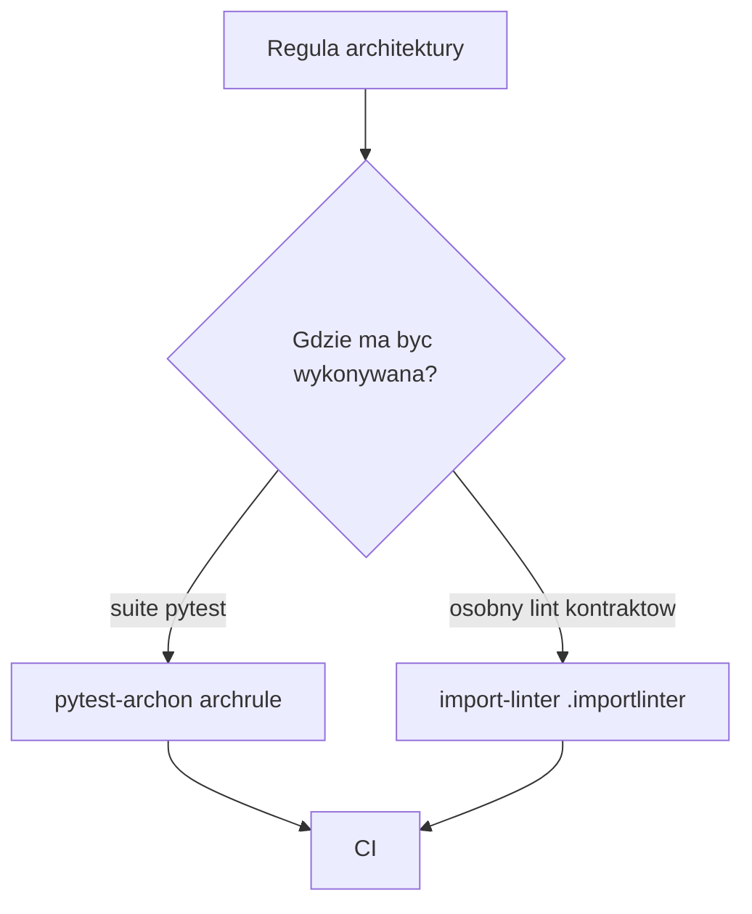

# Temat 02 - Narzędzia i kontrakty architektoniczne

> Moduł: [06-ArchTest](../README.md) · Poprzedni: [01-why-architecture-tests](../01-why-architecture-tests/README.md) · Następny: [03-architecture-rules](../03-architecture-rules/README.md)

## `pytest-archon`

`pytest-archon` pozwala opisać granicę jako test:

```python
from pytest_archon import archrule


def test_domain_is_independent():
    (
        archrule("domain", comment="domain does not import adapters")
        .match("arch_sample.domain*")
        .should_not_import("arch_sample.infrastructure*")
        .should_not_import("arch_sample.web*")
        .check("arch_sample")
    )
```

Reguła jest częścią suite pytest i może być uruchamiana razem z innymi testami.

## `import-linter`

Plik `.importlinter` deklaruje kontrakty poza kodem testowym:

```ini
[importlinter]
root_package = arch_sample

[importlinter:contract:domain-isolation]
name = Domain must not import outer layers
type = forbidden
source_modules = arch_sample.domain
forbidden_modules = arch_sample.infrastructure, arch_sample.web
```

Uruchomienie:

```bash
lint-imports --config .importlinter
```

### Kiedy wybrać które narzędzie?

| Potrzeba | Narzędzie |
|---|---|
| reguła blisko testów i fixture | `pytest-archon` |
| deklaratywny kontrakt architektury | `import-linter` |
| raport w zwykłym pytest | `pytest-archon` |
| kontrakt layers/independence/acyclic siblings | `import-linter` |



## Zadania

1. Napisz `archrule` blokujący import web do domeny.
2. Dodaj kontrakt `layers` w Import Linter.
3. Uruchom oba narzędzia lokalnie i porównaj komunikaty błędów.
4. Dodaj regułę do CI i uzasadnij, dlaczego ma być blokująca.

**Podpowiedzi:**

- `pytest-archon` korzysta z wzorców `fnmatch`,
- Import Linter wymaga poprawnego `root_package`,
- testuj regułę również na celowo złamanej gałęzi.

## Literatura

- pytest-archon: <https://pypi.org/project/pytest-archon/>
- Import Linter: <https://import-linter.readthedocs.io/en/stable/>
- Import Linter contract types: <https://import-linter.readthedocs.io/en/stable/contract_types/>
