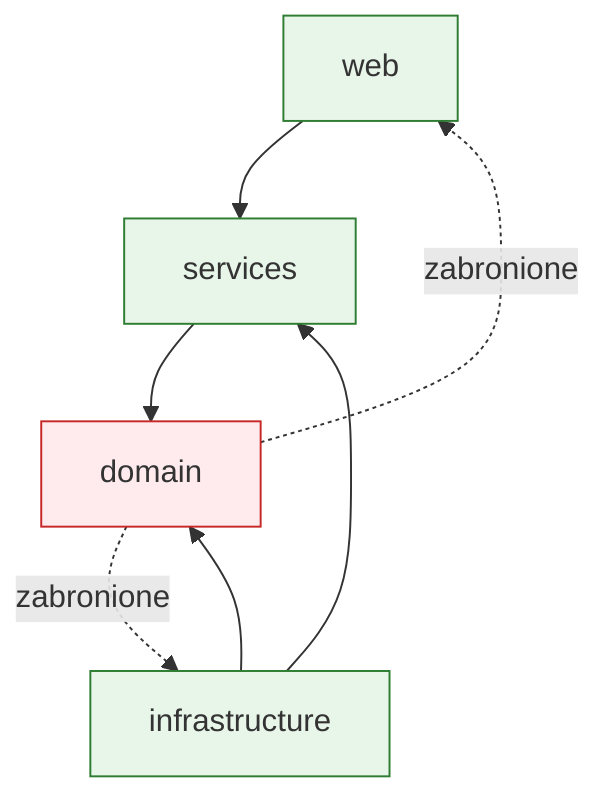
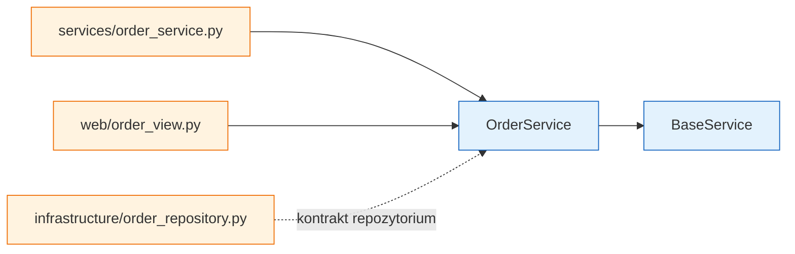

# Temat 03 - Reguły architektoniczne

> Moduł: [06-ArchTest](../README.md) · Poprzedni: [02-tools-and-contracts](../02-tools-and-contracts/README.md) · Następny: [04-architecture-lab](../04-architecture-lab/README.md)

## Przykładowa struktura

```text
arch_sample/
├── domain/
├── services/
├── infrastructure/
└── web/
```

## Izolacja domenowa

Domena może używać standardowej biblioteki i własnych obiektów domenowych, ale
nie zna adapterów infrastruktury ani frameworka webowego.

## Warstwowość



## Wykrywanie cykli

Jeśli `domain` importuje `services`, `services` importuje `infrastructure`,
a `infrastructure` importuje `domain`, zmiana jednego modułu może łamać cały
graf. Import Linter oferuje kontrakty `independence` i `acyclic siblings`.

## Konwencje strukturalne

Reguła może sprawdzić, że:

- klasy `*Service` leżą w `services/`,
- dziedziczą po `BaseService`,
- klasy adapterów leżą w `infrastructure/`,
- warstwa web nie zawiera logiki domenowej.



## Zadania

1. Uruchom test izolacji domeny.
2. Dodaj zależność domeny do infrastruktury i zobacz porażkę reguły.
3. Utwórz dwa moduły z cyklem w katalogu ćwiczeń i napisz test wykrywający cykl.
4. Dodaj test sprawdzający nazwę i bazę `PaymentService`.
5. Zdefiniuj warstwowość dla własnej aplikacji.

**Podpowiedzi:**

- reguły architektury testują importy, nie wykonanie endpointów,
- do konwencji nazw użyj `inspect` lub `pkgutil`,
- nie importuj celowo złego przykładu do głównego pakietu testowanego przez lint.

## Uruchomienie

```bash
python -m pytest src/06-ArchTest/03-architecture-rules -v
cd src/06-ArchTest/03-architecture-rules
lint-imports --config .importlinter
cd ../../..
```

## Literatura

- Import Linter - forbidden: <https://import-linter.readthedocs.io/en/stable/contract_types/forbidden/>
- Import Linter - layers: <https://import-linter.readthedocs.io/en/stable/contract_types/layers/>
- Import Linter - independence: <https://import-linter.readthedocs.io/en/stable/contract_types/independence/>
