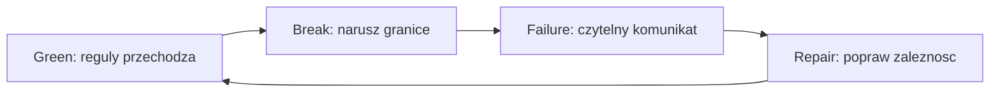

# Temat 04 - Laboratorium ArchTest

> Moduł: [06-ArchTest](../README.md) · Poprzedni: [03-architecture-rules](../03-architecture-rules/README.md)

## Cel

Przejść pełny cykl: zobaczyć regułę, celowo złamać architekturę, odczytać
komunikat, naprawić zależność i ponownie uruchomić kontrakty.

## Przebieg laboratorium

1. Uruchom zielone testy architektoniczne.
2. Dodaj import `arch_sample.infrastructure` do modułu domenowego.
3. Uruchom `pytest-archon` i `lint-imports`.
4. Usuń niedozwolony import albo przenieś zależność za port/interfejs.
5. Dodaj test na nową klasę serwisową.
6. Udokumentuj, jak reguła chroni architekturę.



## Zadania

1. Wprowadź cykl `domain -> infrastructure -> domain` w kopii przykładu.
2. Zdefiniuj kontrakt, który blokuje import web do domain.
3. Dodaj klasę `InvoiceService` w złym katalogu i napisz regułę strukturalną.
4. Przygotuj checklistę code review dla architektury.

**Podpowiedzi:**

- naprawa często oznacza dependency inversion, nie usunięcie funkcjonalności,
- interfejs/Protocol może być w domenie, a implementacja w infrastrukturze,
- kontrakt powinien być prosty do uruchomienia w CI.

## Uruchomienie i debugowanie

```bash
python -m pytest src/06-ArchTest/04-architecture-lab -v
python -m ruff check src/06-ArchTest
```

Debuguj regułę jako zwykły test pytest; w przypadku Import Linter użyj pełnego
raportu `lint-imports --config .importlinter`.

## Pytania kontrolne

1. Co jest sygnałem erozji architektury?
2. Dlaczego cykl importów zwiększa koszt zmian?
3. Jak reguła nazewnicza wspiera czytelność struktury?
4. Jak odróżnić poprawkę architektury od obejścia testu?

## Literatura

- Robert C. Martin, *Clean Architecture*.
- Martin Fowler, *Dependency Inversion Principle*: <https://martinfowler.com/articles/dipInTheWild.html>
- Import Linter: <https://import-linter.readthedocs.io/en/stable/>
