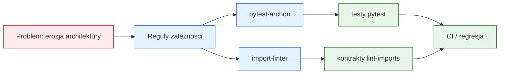

# Moduł 06 - Testowanie architektury w Pythonie

Moduł pokazuje, jak automatycznie chronić reguły architektoniczne: granice
warstw, kierunek zależności, brak cykli oraz konwencje strukturalne.

## Cele dydaktyczne

Po module student powinien:

- wyjaśnić, dlaczego architektura również potrzebuje testów regresji,
- rozróżniać zależność dozwoloną od zależności przypadkowej,
- napisać regułę w `pytest-archon`,
- skonfigurować kontrakt `import-linter`,
- wykrywać cykle importów,
- automatycznie sprawdzać nazwy i położenie klas serwisowych,
- rozumieć, że test architektury chroni granice, a nie implementację pojedynczej funkcji.

## Tematy

1. [01-why-architecture-tests](01-why-architecture-tests/README.md) - erozja
   architektury, dependency direction i koszt późnej diagnozy.
2. [02-tools-and-contracts](02-tools-and-contracts/README.md) - `pytest-archon`
   oraz `import-linter`.
3. [03-architecture-rules](03-architecture-rules/README.md) - izolacja domeny,
   warstwowość, cykle i konwencje klas serwisowych.
4. [04-architecture-lab](04-architecture-lab/README.md) - laboratorium:
   celowe zepsucie reguły i naprawa na podstawie komunikatu testu.

## Mapa modułu



## Uruchamianie

```powershell
# Testy pytest modułu
.venv\Scripts\python.exe -m pytest src\06-ArchTest -c src\06-ArchTest\pytest.ini -v

# Reguły pytest-archon
.venv\Scripts\python.exe -m pytest src\06-ArchTest\03-architecture-rules -v

# Kontrakty import-linter
cd src\06-ArchTest\03-architecture-rules
$env:PYTHONPATH = (Join-Path (Get-Location) "src")
..\..\..\.venv\Scripts\lint-imports.exe --config .importlinter
Remove-Item Env:PYTHONPATH
cd ..\..

# Ruff
.venv\Scripts\python.exe -m ruff check src\06-ArchTest
```

## Kryteria oceny

- reguła architektoniczna jest zapisana jako wykonywalny kontrakt,
- test nie zależy od przypadkowej kolejności importów,
- komunikat porażki wskazuje naruszoną granicę,
- student potrafi uzasadnić, dlaczego granica istnieje,
- zmiana architektury wymaga świadomej zmiany reguły i code review.

## Literatura i źródła

- pytest-archon: <https://pypi.org/project/pytest-archon/>
- Import Linter: <https://import-linter.readthedocs.io/en/stable/>
- Import Linter - contract types: <https://import-linter.readthedocs.io/en/stable/contract_types/>
- Robert C. Martin, *Clean Architecture*, Prentice Hall, 2017.
- Martin Fowler, *Software Architecture Guide*: <https://martinfowler.com/architecture/>
- Python Docs - import system: <https://docs.python.org/3/reference/import.html>
